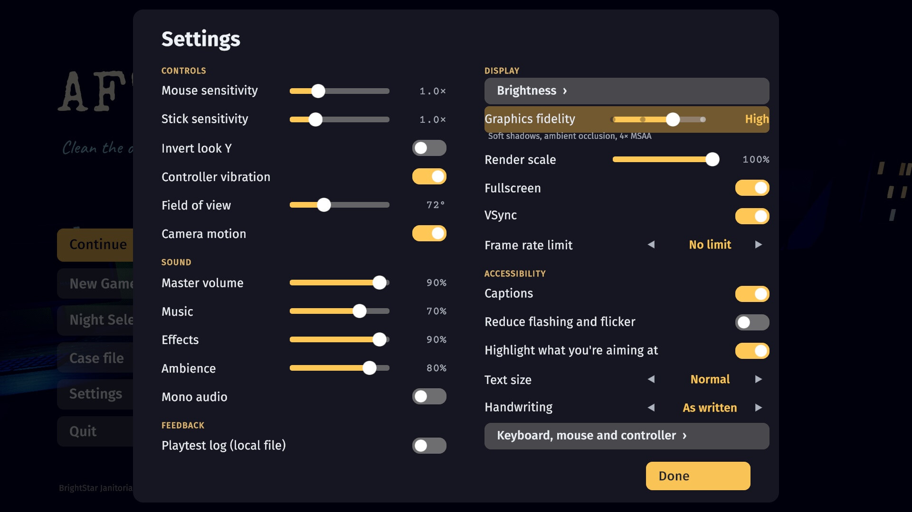
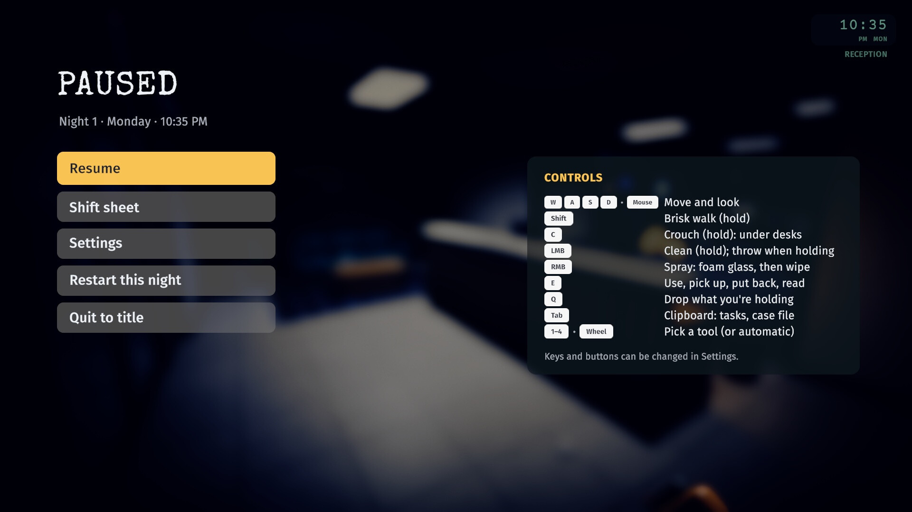

<p align="center">
  
</p>

<h1 align="center">After Hours</h1>

<p align="center">
  <b>A first-person cleaning game with a mystery underneath.</b><br>
  You're the new night cleaner on the 14th floor. Over seven nights, the grime you scrub away shows
  what the day shift is hiding, and you decide which evidence survives until morning.
</p>

<p align="center">
  
  
  
  
  
  
</p>

<p align="center">
  <a href="https://nearbycoder.github.io/AfterHours/"><b>Play in your browser</b></a> ·
  <a href="https://github.com/nearbycoder/AfterHours/releases/latest"><b>Download for Linux</b></a> ·
  <a href="docs/media/AfterHours-trailer.mp4"><b>Watch the trailer</b></a> ·
  <a href="#screenshots"><b>Screenshots</b></a> ·
  <a href="#build-from-source"><b>Build from source</b></a>
</p>

> **The download is older than this page.** The published build is v0.1.0 from 4 October 2026.
> This README, the trailer and the screenshots show the game on `main`, which has twelve rounds of
> changes since then (Graphics fidelity up to Ultra, the case file, key and button remapping, text
> size, captions and more; see [`docs/IMPROVEMENTS.md`](docs/IMPROVEMENTS.md)). None of them is in a
> release yet: to play them, [build from source](#build-from-source), or
> [play in your browser](#play-in-your-browser) (a web build of `main`, about 44 MB to download).

## Trailer

<p align="center">
  <a href="docs/media/AfterHours-trailer.mp4">
    
  </a>
</p>

<p align="center"><sub>2 min · 1920×1080 at 30 fps · H.264 and AAC with the game's own music and sound · 38 MB.<br>
Filmed on <code>main</code> at Graphics fidelity Ultra. Every shot was filmed by the game itself from scripted input
(the Low and Ultra halves of the split shot too); the cut is made by <a href="Tools/trailer"><code>Tools/trailer</code></a>.</sub></p>

## About

It's 10 PM at Halvorsen Freight, Suite 1408 of Meridian Tower. The day shift has gone home and left
the usual mess: coffee rings, confetti from somebody's birthday, a crumpled note under a desk.
You've got a cart, a clipboard and the whole floor to yourself.

The cleaning is the toy. Every surface has its own tool and its own feel: a cloth that lifts coffee
rings, a vacuum that leaves stripes in the carpet, foam and a squeegee for the glass, a mop that
leaves a wet sheen. Rubbish gets sorted and thrown, things go back where they belong, and when a
surface is clean it gleams and dings.

But grime hides things. Erase the brainstorm on the conference-room whiteboard and something
older shows through. Foam a window and someone's finger-writing appears. A notepad gives up its
last page to a pencil. Everything you find is yours to keep, put back, throw away, shred, or
leave in someone's inbox tray, and the office remembers what you did. The next morning's office
chat reacts, the next night has changed, and on the seventh night you decide what survives.

- **Seven nights** in one office that changes around you, each designed to take five to eight minutes.
- **Four endings**, plus personal epilogues that depend on what you took and what you left.
- **No fail state and no timer pressure.** The wristwatch runs from 10 PM towards dawn, but it
  never ends your shift for you.

## How to play

| Keyboard and mouse | Gamepad | Action |
|---|---|---|
| <kbd>W</kbd><kbd>A</kbd><kbd>S</kbd><kbd>D</kbd>, mouse | left stick, right stick | move, look |
| <kbd>Shift</kbd> | right bumper | brisk walk |
| <kbd>C</kbd> or <kbd>Ctrl</kbd> | left stick click | crouch (reach under desks) |
| left mouse (hold) | right trigger | clean with the current tool; with something in hand, hold to charge a throw (can be set to toggle) |
| right mouse | left trigger | spray (squeegee and cloth) |
| <kbd>E</kbd> | A | interact: pick up, put back, tuck a chair, light switch, door, monitor, inbox tray, read (doors, switches and chairs work with your hands full) |
| <kbd>Q</kbd> | B | drop what you're holding |
| <kbd>F</kbd> | d-pad up | UV torch (from Night 2) |
| <kbd>Tab</kbd> | Select / View | clipboard: tonight's tasks, secrets, leads and what's in your pocket; <kbd>A</kbd>/<kbd>D</kbd> (d-pad ◀ ▶) turns to the case file (what you've read, and each morning's chat) |
| <kbd>1</kbd>–<kbd>4</kbd>, mouse wheel | d-pad left / right | pin a tool (otherwise the right tool comes up for the surface); the wheel and d-pad also step back to automatic |
| <kbd>Esc</kbd> | Start / Menu | pause |

When a document is open: <kbd>Tab</kbd> (pad Y) keeps it, <kbd>E</kbd> (pad A) puts it back,
<kbd>X</kbd> (pad X) throws it away. On a monitor, <kbd>Q</kbd> (pad X) switches it off. Menus
and choices take <kbd>W</kbd><kbd>S</kbd><kbd>A</kbd><kbd>D</kbd> or the arrow keys,
<kbd>E</kbd>/<kbd>Enter</kbd> and <kbd>Esc</kbd>, or the d-pad, A and B. On-screen prompts switch
between keys and pad buttons depending on what you touched last, and show PlayStation symbols
(✕ ○ □ △, R2, L2) on a DualShock or DualSense pad and Xbox letters on other pads.

**Keys, mouse buttons and pad buttons can be changed** in Settings → Keyboard, mouse and
controller, which has a page for each: pick an action and press the new key or button. One that's
already in use swaps over. Esc, Enter and 1–4 stay fixed; on a pad, Start, the d-pad's left and
right, and A, B, X and Y inside menus and documents. Crouch, brisk walk, and clean and spray
can be set to **toggle** instead of hold: one press starts, the next stops (and a throw charges
on one press and flies on the next). Prompts and hints show your keys by their names on your keyboard
layout, so on AZERTY they read Z Q S D rather than W A S D, and your pad buttons as bound.

**Input:** keyboard and mouse, or a gamepad (Xbox-style pads, and DualShock or DualSense with
PlayStation symbols); you can switch between them at any time. There's no touch input. The game
pauses itself if its window loses focus or the controller you're using disconnects mid-night, and
the pause menu has a card listing your controls, drawn as keycaps and pad buttons for whichever you
used last.

**A night, start to finish:** clock in at the cleaning closet and check the shift sheet on your
clipboard. Switch the lights on, clean room by room, sort the rubbish, put things back, decide what
to do with whatever you find. Lights off, clock out at the punch clock, and read the shift report
and the next morning's chat.

## Features

### Cleaning that feels good on its own


- **Smart tools.** Look at a dirty surface and the right tool comes up: cloth for desks and
  counters, squeegee for glass, vacuum for carpet, mop for hard floors. The reticle turns into a
  progress ring, and a surface that's nearly clean finishes itself with a gleam, a sparkle and a
  ding whose pitch climbs if you clean several in a row.
- **Every tool is different.** The cloth rewards scrubbing. The vacuum leaves light and dark stripes
  in the carpet nap and pulls confetti into the nozzle. Glass needs foam first, then a squeegee.
  Mopped floors stay wet for a few seconds, then dry.
- **Rubbish and throwing.** Food and wrappers go in the black bins, cans and bottles in blue
  recycling, paper in either. While you hold something, the label under the reticle says which
  bin it goes in, and whether the bin you're aiming at takes it. Hold the button to charge a
  throw and follow the arc; long shots get a swish and a "Nice shot!". The wrong bin bounces the
  item back out, so nothing is ever lost.
- **See what you can use.** Whatever the reticle is on (a paper ball, a light switch, a chair)
  gets a soft warm outline, so small things in dark rooms read as usable. It can be turned off
  in Settings.
- **Putting things back.** Moved objects have home spots: a ghost shows where something belongs and
  it snaps into place. Chairs tuck in, monitors switch off, lights go out when you leave. Doors,
  light switches and chairs work with your hands full, so a can doesn't have to be put down to
  reach a switch in the dark.
- **Never stuck on the last can.** The shift sheet says which rooms still have work on each task,
  and a line under the wristwatch names the room you're in, in the same words. After a minute
  with no progress, whatever's left glints and the nearest few chime, so you can find them by
  ear, and a caption says which rooms the chimes come from and which way they are ("behind
  you in reception"). Anything thrown out of reach (on top of something tall, wedged out of sight or
  out of the building) turns up at your feet.

 

### Grime hides things


Clues turn up *because* you clean. Erasing a whiteboard leaves the ghost of what was written there
before. Window foam shows letters someone traced on the glass. The vacuum knocks something loose
from under a desk. A pencil rubbing brings back the last page torn from a notepad. From Night 2,
a UV torch shows invisible-ink marks left by the cleaner before you, and any grime you missed.

 

### Your hands decide


- **Evidence.** Notes, emails, ledgers and printouts open in an inspect view. Keep them in your
  pocket, put them back, or throw them away. The clipboard's second page, the **case file**,
  lists everything you've read, night by night, with what became of it, and each morning's
  office chat, so you can read any of it again before you decide. The title's **Case file**
  shows the same list for your saved story, so you can look back over it between sessions and
  after the ending, when it also holds the ending itself to read again.
- **Deliveries.** Leave a document in someone's inbox tray and they find it in the morning. Feed it
  to a shredder. Or write an anonymous sticky note from the leads you've pieced together.
- **Suspicion.** One office belongs to someone who notices when things move. Anything you take or
  fail to put back changes what she writes to you and how your story ends. It never stops you
  finishing a night.
- **Puzzles.** Tape a bag of shredded strips back into a page; open a locked cabinet; follow a
  trail only the UV torch can see.

### The end of every shift


Clocking out brings up the shift report: a grade from S to C with what it's made of (the
shift sheet, the bonus tasks and how clean every surface is) and, below S, what would have
made it one; the secrets you found; and before-and-after polaroids of every room you cleaned. Then comes the next morning's office chat,
where the people whose desks you cleaned react to what you left for them, or to what went
missing.

### Settings and accessibility



Settings (from the title or the pause menu) has:

- **Controls:** mouse and stick sensitivity, invert Y, controller vibration, field of view, and
  Camera motion (head bob, and the kick of a throw or a reveal; off keeps the camera still).
  Keyboard, mouse and controller pages rebind keys, mouse buttons and pad buttons (see
  [How to play](#how-to-play)), with hold or toggle for crouch, brisk walk, and clean and spray.
- **Sound:** master, music, effects and ambience volume, and **Mono audio**.
- **Display:** brightness (the game also offers it on first launch, over the dark office),
  [**Graphics fidelity**](#graphics-fidelity), render scale, fullscreen, VSync and a frame-rate limit.
- **Accessibility:** captions (for story sounds, the thunder, and where the leftovers chime),
  **Reduce flashing and flicker** (Night 7's storm then dims the lights to half and back instead of
  dropping them out), the highlight on whatever you're aiming at, **Text size** and **Handwriting**.
- **Feedback:** an opt-in local playtest log (see [`docs/PLAYTEST.md`](docs/PLAYTEST.md)).

**Handwriting** (Settings → Accessibility: As written or Plain) sets the handwritten notes,
letters, sticky notes, the shift sheet, the case file and the report's task list in the plain
UI font instead, for anyone who finds handwriting hard to read. **Text size** (Normal, Large or
Largest) scales the HUD and everything you read: documents (the paper grows with the text), the clipboard, choices, the shift report and
the morning chat. At Large and Largest the clipboard becomes one wide sheet with three pages
(shift sheet, notes, case file); <kbd>W</kbd>/<kbd>S</kbd> or the wheel show the rest of a long
page. The morning chat scrolls back with <kbd>W</kbd>/<kbd>S</kbd>, the arrows, the wheel or the
d-pad at any size. The menus follow it too: the title, the pause menu (and its controls card),
Night Select, the brightness page and the ending grow, and at Large and Largest Settings and the
controls pages become one list that scrolls, keeping the row you're on in view (the wheel
scrolls it too). Changing Text size lays Settings out again straight away.

If a night runs slowly (under about 28 frames a second), the game offers the next lower Graphics
fidelity step once (Ultra, High, Medium, Low, then render scale); Keep means it won't ask again.
Menus fade in and out, the selection is lit whether the pad, the arrow keys or the mouse is moving
it, and buttons dip when pressed.

### Graphics fidelity

Settings → Display has a **Graphics fidelity** slider with four steps. High is the default and the
game as it was built; Ultra goes past it. Mouse, arrow keys and d-pad all move it, and a line under
it says what the step does.

| Step | What it renders |
|---|---|
| **Low** | For weak GPUs: shadows from the moon only (hard, 1024 px), no ambient occlusion, FXAA instead of MSAA, no film grain, bloom at quarter resolution, half-size textures (the clue lettering stays full size), half the particles |
| **Medium** | Hard shadows from every room light, ambient occlusion, 2× MSAA with SMAA, three quarters of the particles |
| **High** (default) | Soft shadows, ambient occlusion, 4× MSAA with high-quality SMAA, full particles: unchanged from before round 12 |
| **Ultra** | Everything on High, plus a reflection probe in every room (metal, glass and glossy surfaces reflect the lit room; rendered again when its lights change), soft shadows from the desk lamps, 2048 px room-light shadows in an 8192 atlas, a 4096 px moon shadow in four cascades to 40 m, ambient occlusion at its most samples, 16× anisotropic filtering, half as many particles again |


How much each step costs was measured on the development machine; see
[Round 12 results](docs/IMPROVEMENTS.md#round-12-results-8-october-2026).

## Content overview

One floor of one office (reception, bullpen, break room, conference room, the corner office and
the cleaning closet) over seven nights. Spoiler-light:

| Night | Title | What's new |
|---|---|---|
| 1 · Monday | **First Shift** | The tutorial night: reception and the bullpen, wiping, vacuuming, throwing, tidying. Something under a desk, and a monitor that wakes up on its own. |
| 2 · Tuesday | **Glass** | The break room. Spray and squeegee, the mop, and the UV torch. |
| 3 · Wednesday | **The Whiteboard** | The conference room, and what's underneath the marker. |
| 4 · Thursday | **The Corner Office** | You get the key to the finance director's office. Put everything back exactly. |
| 5 · Friday | **Pieces** | After the office party: the heaviest clean of the week, and a shredded page to rebuild. |
| 6 · Sunday | **Prep** | The auditors arrive Tuesday. Boxes marked for destruction, and a new inbox tray. |
| 7 · Monday | **Audit Eve** | A storm, flickering power, a jammed shredder, and the last decision. |

There are four endings, **The Audit**, **Clean Books**, **Loose Threads** and a secret one, each with
personal epilogue variations. **Night Select** replays any night you've reached from the state you
started it in, so you can try another road. In the middle of a story it asks before taking you
back to an earlier night, since Continue then picks up from there (the later nights stay in
Night Select). Your records are kept apart from the story save: the
best grade and most secrets for each night, and the endings you've found (shown on the title
screen and in Night Select, unnamed until you reach them), survive replays and New Game.

Menus: the title (Continue, New Game, Night Select, Case file once you've read something, Settings,
Quit) and the pause menu (Resume, Shift sheet, Settings, Restart this night, Quit to title, and the
controls card). Restart, Quit to title and closing the game in the middle of a night all ask first,
because a night is only saved when it ends. Progress and settings save automatically. Saves are
written to a temporary file and swapped in, keeping the previous one as a backup, so a crash or
power cut mid-save can't lose a game.

## Screenshots

<table>
  <tr>
    <td width="50%"></td>
    <td width="50%"></td>
  </tr>
  <tr>
    <td></td>
    <td></td>
  </tr>
  <tr>
    <td></td>
    <td></td>
  </tr>
  <tr>
    <td></td>
    <td></td>
  </tr>
  <tr>
    <td></td>
    <td></td>
  </tr>
  <tr>
    <td></td>
    <td></td>
  </tr>
</table>

## Play it

1. Download `AfterHours-v0.1.0-linux-x86_64.zip` from the
   [latest release](https://github.com/nearbycoder/AfterHours/releases/latest).
2. Unzip it and run `./AfterHours.x86_64`.

That release is the 4 October 2026 build: it doesn't have the changes made since (see the note at
the top). To play the game as this page describes it, [build it from source](#build-from-source).

**System requirements**

- 64-bit Linux (x86-64). It's developed on CachyOS under KDE Plasma (Wayland).
- A GPU with OpenGL 3.2 or later (the player uses OpenGL Core). Only one GPU has been tried, the AMD
  Radeon 8060S integrated GPU of the development machine, where every Graphics fidelity step runs
  at about 4–10 ms a frame at 1600×900 on a busy shared machine (see [Status](#status-and-known-issues)).
- Keyboard and mouse, or a gamepad.
- About 200 MB of disk space for the game.

It starts fullscreen; switch to windowed in Settings (the window opens at four fifths of the
screen, and can be resized). Saves and settings live in
`~/.config/unity3d/After Hours Team/After Hours/`. If the window never appears under XWayland,
start it with `./AfterHours.x86_64 -force-wayland` to use Unity's native Wayland backend. Zips
made by `Tools/package.py` (below) since v0.1.0 include an `AfterHours.sh` launcher that does this
for you in a Wayland session (`AH_X11=1` forces X11); the v0.1.0 zip doesn't have it.

Only a Linux build is published (v0.1.0). Since then the project also **builds for macOS** as a
universal app (Intel and Apple Silicon, macOS 12 or later), but that build is unsigned and
**untested: nobody has run it on a Mac yet**. It isn't published. To try it, build it from source
(below); first launch needs right-click → Open, or `xattr -dr com.apple.quarantine` on the app.
Windows builds need Unity's Windows Build Support module, which isn't installed on the
development machine, so none has been made.

### Play in your browser

**[nearbycoder.github.io/AfterHours](https://nearbycoder.github.io/AfterHours/)** runs the game
from `main` in a desktop browser with WebGL 2: no install, and the same seven nights, endings,
settings and saves. The first visit downloads about 44 MB (Brotli-compressed; the browser caches
it for later visits).

- **Tested** in headless Chromium 151 and Firefox 157 on Linux, served the way GitHub Pages serves
  it (`node Tools/web/play-test.mjs`): the title loads in 4–7 s from a local server, with no
  console errors. Audio waits for the first click or key, then plays. A Graphics fidelity change
  survives a reload. Night 1 starts, the player walks, and Esc and Tab work. Safari, Edge, Windows,
  macOS and a real mouse, monitor and gamepad haven't been tried; nor has a download over a real
  connection.
- **Click to capture the mouse.** Esc gives it back to the browser and pauses the night (the
  browser keeps Esc for itself, so losing the mouse is what pauses). After Resume, click again to look around.
- **Saves and settings stay in this browser** (IndexedDB), separate from the desktop game's. Clearing
  the site's data deletes them. Closing or reloading the tab mid-night asks first, as Quit does on
  desktop: a night is only saved when it ends.
- **What's different:** no Quit button (close the tab); Fullscreen is the browser's (the Settings
  toggle, the page's button or F11, which needs a click, and Esc leaves it). There's no VSync
  setting (the browser matches the display), and no playtest log (it writes a local file).
  Graphics fidelity starts on **Medium** rather than High, and every step from Low to Ultra is
  there. The page renders at most 2560×1440 pixels; Render scale goes lower. Gamepads work as the
  browser reports them, with Xbox-style button names (no PlayStation symbols), and rumble depends
  on the browser. There are no touch controls: phones and tablets get a notice. Mouse
  sensitivity may feel different from desktop: browsers scale mouse movement in their own way
  (adjustable in Settings).

To make the site yourself: `Tools/build-pages.sh` builds it into `Builds/Pages` (with `index.html`
and `.nojekyll` at its root; every path is relative, so it works under `/AfterHours/`), and
`node Tools/check-pages.mjs <url>` checks that a copy reaches the title (run
`npm install --prefix Tools/web` once first).

## Build from source

**Requirements:** Unity **6000.6.2f1** with Linux Build Support (and Mac or Windows Build Support
for those players; the project uses URP 17.6 and the
Input System 1.20 from the Unity registry), Blender **4.5** on `PATH` for the models, and Python 3
with NumPy, SciPy and Pillow for textures and audio. FFmpeg for the trailer and README media.

```bash
git clone https://github.com/nearbycoder/AfterHours.git && cd AfterHours

# Unity: build, test, open
Tools/unity.sh build-linux      # -> Builds/Linux/AfterHours.x86_64
Tools/unity.sh build-mac        # -> Builds/macOS/After Hours.app (universal, unsigned)
Tools/unity.sh build-windows    # -> Builds/Windows/AfterHours.exe (needs the Windows module)
Tools/build-pages.sh            # browser build -> Builds/Pages (needs the WebGL module)
node Tools/web/play-test.mjs    # play it in headless Chromium and Firefox under /AfterHours/
python3 Tools/package.py        # release zips of whatever is built -> Builds/release/
python3 Tools/playtest_report.py <logs>   # per-night tables from playtest logs (docs/PLAYTEST.md)
Tools/unity.sh test             # EditMode tests -> Logs/test-results.xml
Tools/unity.sh                  # open the project in the editor
Tools/play.sh                   # run the build windowed at 1600x900
Tools/wmtest.sh [out] title|night|window|perf [wayland|x11]   # against a private KWin (below)
Tools/wmtest.sh out run wayland -- <player args>              # any run, in a private KWin
```

`Tools/unity.sh` expects the editor at `~/Unity/Hub/Editor/6000.6.2f1/` (override with `UNITY=`).
On distros that ship only `libxml2.so.16`, the 6000.6 editor exits at start-up because it links
`libxml2.so.2`: install your distro's legacy libxml2 package, or point `AH_UNITY_LIBS` at a
directory containing an older copy.

**Regenerating the assets.** Everything in `Assets/Resources/Models`, `Textures` and `Audio` is
produced by scripts in this repository, and the outputs are committed so the project opens without
them.

```bash
# 3D models (headless Blender) -> Assets/Resources/Models/
blender -b -P ArtSource/office.py -- [--render DIR]          # the office, furniture and layout
blender -b -P ArtSource/props.py  -- [--render DIR] [--only a,b]   # props and tools

# Textures, sound effects, music and the app icon
python -m venv Tools/.venv && Tools/.venv/bin/pip install numpy scipy pillow
Tools/.venv/bin/python Tools/gen_textures.py
Tools/.venv/bin/python Tools/make_icon.py                   # -> Assets/Icons/AppIcon.png
Tools/.venv/bin/python Tools/audio/build_sfx.py
Tools/.venv/bin/python Tools/audio/build_music.py
```

**Testing.**

- `Tools/autopilot.sh [outdir] [nightN|all] [route]` runs the built game with no human, in a
  private KWin on a virtual screen (below), so no window appears on the desktop and its saves
  stay in the run's folder (`AH_DESKTOP=1` runs it on the desktop instead). It starts at the
  title, plays all seven nights through the real components and checks the chosen route reaches
  its ending. Routes: `audit`, `loose`, `cleanbooks`, `spotless` and `marian`, with 578–607 checks
  each. Among them:
  - **Playing:** brush maths on every dirty surface, physics into the bins, a charged throw, real
    mouse-and-key input for a wipe and a pick-up, the label saying which bin, doors, switches and
    chairs with your hands full, props that overlap, sink or float, cans lost out of reach coming
    back, and the leftovers' glint and the caption saying which rooms and which way they chime.
  - **Input:** a virtual keyboard, mouse, Xbox-style pad and DualShock 4 walk the menus, rebind
    Interact on the keyboard and the pad, try hold and toggle, cycle tools, and check the prompts,
    the controls card's keycaps, the keyboard's lit selection and the mouse's hover.
  - **Reading and layout:** every document at Normal and Largest (and with Plain handwriting) stays
    on the paper and on screen; so do the HUD, the menus, Settings and the controls pages, Night
    Select, the report, the morning chat and the ending at each text size; nothing in Settings
    overlaps at Normal.
  - **Settings:** every Graphics fidelity step read back from the engine against the table (and
    on Ultra the rooms' reflection probes), the slow-frames offer stepping down, Camera motion off,
    Mono audio measured on the audio thread, Reduce flashing measured frame by frame in Night 7's
    storm, captions on and off, the brightness page and the menus' fades.
  - **Story and saves:** the case file and the morning chats read again without changing the story,
    Night Select's question before an earlier night, Quit to title and the question on closing,
    the pause on focus loss and on unplugging the pad, every shift report against the numbers its
    grade came from, and the ending in the title's case file.

  Each round's checks are described in [`docs/IMPROVEMENTS.md`](docs/IMPROVEMENTS.md). Automated
  runs keep reading devices while their window isn't focused.
- `Tools/unity.sh test` runs the EditMode tests, including an exhaustive search over the story's
  choices that proves all four endings are reachable, and tests that saves survive interrupted
  writes, that records only ever improve, that key and pad bindings swap, refuse reserved keys and
  buttons and survive a save, the hold-or-toggle logic (including clean and spray), the case
  file's reading list and morning chats (including saves from before they existed, whose chats
  come from the night snapshots) and the title's list for a saved or finished story (the ending
  first), the grading and its hints, the bin label for every kind of rubbish against both bins,
  the window opened on leaving fullscreen, when slow frames call for a lower setting and which,
  the brightness curve, the Graphics fidelity table (every step at least what the one below
  renders, High as authored, old settings files keep their step, slow frames step down from
  Ultra, the particles), which fonts Plain handwriting changes and by how much, the glint's
  caption (and which way it says), the storm's stutter with and without Reduce flashing, the
  mono downmix, the HUD text sizes and how far
  documents grow, and that settings files from earlier versions load.
- `Tools/wmtest.sh` runs the built game against a real window manager without touching the
  desktop: a private KWin on a virtual screen, with its own D-Bus session and config folders
  (the game's saves go there too). `title` and `night` close the game's window the way the title
  bar's close button does (on the title it must exit; mid-night it must ask, Never mind must
  keep the night paused where it was, and Quit the game must end it); `window` switches
  Fullscreen off and on and has KWin report where the window is (it must fit on the screen);
  `perf` runs the perf probe in a window the compositor is showing (and `run ... -ahCapture <dir>
  fidelity -ahNight 2 -ahFresh` the Graphics fidelity capture: four views, every step, same-frame
  screenshots and interleaved frame times, which `Tools/fidelity_report.py` turns into a table
  and a sheet); `run` starts the player with
  any arguments and waits for it to finish (the AutoPilot uses it). Each runs on native Wayland
  or, with `x11`, on the private KWin's Xwayland.
- The AutoPilot keeps the playtest log off through the title (and checks nothing is written),
  then on for the run, and afterwards checks the log: every line is JSON, a night end for each
  night in order, every secret, the ending, clipboard opens, pauses, glints and recovered items.
- After the ending, the AutoPilot replays Night 2 from Night Select and checks that Night 7's best
  result and the ending found are still listed. Runs that share a profile (the optional fourth
  argument to `Tools/autopilot.sh`) carry records over, so two routes in one profile show
  "Endings 2 / 4".

**Trailer and README media.** The trailer is filmed by the game itself and cut by a script:

```bash
Tools/trailer/record.sh [dir]                                       # film every clip at 1920x1080 -> Recordings/trailer/
Tools/.venv/bin/python Tools/trailer/make_trailer.py --clips [dir]  # -> docs/media/AfterHours-trailer.mp4
Tools/.venv/bin/python Tools/trailer/check_trailer.py               # streams, loudness, black or frozen frames, a frame per beat
Tools/.venv/bin/python Tools/trailer/make_media.py --clips [dir]    # screenshots, poster and teaser -> docs/media/
```

`record.sh` first plays the `audit` route with the AutoPilot so every night has a real save to
start from, then films each night's clips from it. Like the AutoPilot it runs in a private KWin,
with its saves and settings in `[dir]/xdg`. The game runs on a fixed 30 fps clock, so it films at
Ultra (`AH_QUALITY=0`–`3` picks another step) without dropping frames, and records the mixed game
audio through Unity's `AudioRenderer`.

## Project structure

```
Assets/
  Scripts/              runtime code, one assembly
    Cleaning/           grime surfaces (render-texture masks with a CPU mirror), brushes, tools
    Core/               boot and game flow, input, settings, tweening, events
    Interaction/        hands (pick up, throw), bins, home spots, doors, switches, story items
    Story/              night definitions, documents, endings, story state and saves
    World/              office builder (reads Office.fbx), furnisher, prop library
    UI/                 HUD, clipboard, inspect view, menus, shift report, chat, endings
    FX/ Audio/ Player/  particles and post-processing, sound and music, first-person controller
    Testing/            AutoPilot (self-test), CaptureDirector, Showcase and Trailer recorders
  Editor/               build script, import rules, project setup, EditMode tests
  Shaders/              grime overlay, UV ink, skyline, particles
  Resources/            generated models, textures, audio; bundled fonts
ArtSource/              Blender generators (office.py, props.py, furniture.py, tools.py) and .blend files
Tools/                  build, play, test and packaging scripts; texture, icon and audio generators;
                        trailer/, release/ (launcher and READMEs for the zips)
docs/                   design plan, original brief, media/
```

The game has a single, almost empty scene. `GameRoot` boots from code, builds the office from the
FBX and runs everything else.

## Tech highlights

- **Grime as paint masks.** Every cleanable surface is an overlay quad with its own 2D space, so
  painting never depends on the model's UVs. Each one has a render-texture mask (dirt, vacuum nap,
  wetness and a reveal channel) plus a quarter-resolution CPU mirror of the dirt channel, which
  gives exact completion percentages without GPU readbacks. Dirt patterns are composed at night
  start from procedural stamps: coffee rings, footprints, smudges, marker, confetti and spills.
- **Secrets in the dirt.** The same masks drive the reveals: ghost text where marker has been
  erased, letters that stay clear in window foam, and a rubbing layer that shading brings back.
- **Blender is the level editor.** `office.py` builds the floor in Python, and object names carry
  the meaning (`GRIME_`, `ANCHOR_`, `LIGHT_`, `DOOR_`, `SWITCH_`, `TRAY_`, `BIN_`, `ROOM_`…).
  `OfficeBuilder` reads the FBX and attaches behaviour by those names.
- **Data-driven nights.** Each night is C# data: dirt specs per surface, spawns with conditions over
  the story state, tasks, secrets, documents and the morning chat. The ending resolver is pure C#,
  and an EditMode test enumerates the choice space to prove every ending is reachable.
- **A game that plays itself.** The AutoPilot drives the shipped build through all seven nights
  along five story routes, with 578–607 checks per route.
- **Procedural audio.** Every sound effect, ambience bed and music track is synthesised in NumPy:
  FM electric piano, brushed hats and vinyl crackle for the lo-fi night jazz, layered and enveloped
  noise for the cloth, squeegee, vacuum and shredder, all rendered as seamless loops. The three
  night tracks (Nights 1–2, 3–4 and 5–7) are arranged in sections (intro, A, B, a drumless
  breakdown) and run 160–169 s before they loop.
- **Deterministic capture.** The trailer recorder runs the game on a fixed 30 fps clock and records
  the mixed game audio through Unity's `AudioRenderer`, so every shot is scripted and repeatable,
  whatever the machine's load.

## Credits and tooling

Designed and built with Unity 6 (URP), Blender 4.5, Python (NumPy, SciPy, Pillow) and FFmpeg. All
code, models, textures, sound effects, music, screenshots and the trailer were made for this
project.

Fonts (licences in `Assets/Fonts-Licenses/`): **Fira Sans**, **Caveat**, **Courier Prime**,
**Patrick Hand**, **Reenie Beanie** and **Liberation Sans** (SIL Open Font License 1.1);
**Permanent Marker** and **Special Elite** (Apache License 2.0); **DejaVu Sans** (Bitstream Vera
licence). TextMesh Pro's essential resources come from Unity under the Unity Companion License.
See [`THIRD_PARTY_NOTICES.md`](THIRD_PARTY_NOTICES.md) for the full list.

The design plan is in [`docs/PLAN.md`](docs/PLAN.md) and the original brief in
[`docs/BRIEF.md`](docs/BRIEF.md).

## Status and known issues

**v0.1.0 is released, complete and playable:** all seven nights, four endings, menus, saves,
keyboard and mouse, and gamepad. Since then twelve rounds of changes have gone into `main`
(everything this page describes, from the case file and remapping to text size, captions and
Graphics fidelity); they're listed in [`docs/IMPROVEMENTS.md`](docs/IMPROVEMENTS.md) and haven't
been released yet. Some things are still rough or untested:

- **No one outside development has played it yet.** Pacing, difficulty, and whether the clues
  are too obvious or too hidden are untested with real players. There's now a kit for the first
  sessions: an opt-in local playtest log (Settings → Feedback, or `-playtest`),
  `Tools/playtest_report.py` to read the logs, and [`docs/PLAYTEST.md`](docs/PLAYTEST.md) with
  questions for testers. The automated runs cover five
  story routes; other mixes of choices are only covered by the ending-logic tests.
- **The audio was tuned by numbers, not by ear.** Levels, loops and rhythm were checked
  numerically. That includes the longer night music: its length, loudness (within 0.2 LU of the
  loops it replaced), loop seam and how much neighbouring four-bar blocks repeat
  (`build_music.py --check`). Nobody has listened to it critically. The trailer (re-cut on
  8 October 2026) uses the longer tracks; its loudness was measured, not judged by ear. Mono audio (round 11) was checked by measuring the
  mix on the audio thread (left and right identical with it on), not by listening on
  headphones or with one ear.
- **No physical gamepad was tested.** Pad support was exercised with a virtual Input System
  gamepad, through the same code path. Rumble (short pulses on throws, the vacuum's clunk, a
  surface coming clean and a made shot; off in Settings) is sent the same way but has never been
  felt on real hardware, and Unity may ignore it for some pads on Linux. The PlayStation
  symbols were checked with a virtual DualShock 4 only. Pad buttons can be rebound, which was
  also only checked with virtual pads. The pause when a pad disconnects was tested by removing a
  virtual pad; a real wireless pad dropping out may report differently.
- **Brightness and text size were set by numbers on one screen.** The brightness slider's range
  (from about 86% of a dark view near-black to about 12%) was chosen by measuring screenshots,
  not by eye on different monitors or TVs. Text size was checked by measuring where text lands
  (on the paper, on screen, at 1.25× or 1.5×) at three window sizes (since round 9 also at the
  Steam Deck's 1280×800 and at 21:9 and 32:9, though not on a Deck), not by people reading it at a
  distance. Since round 6 the menus follow it too, checked the same way; nobody has used the
  scrolling Settings list at Largest with a real pad or mouse. Plain handwriting (round 10) was
  sized by measuring the fonts and checked by where the text lands, and the backing under the
  reticle's label by measuring contrast on one lit wall (5.9:1, from 1.4:1); nobody who finds
  handwriting hard has tried it yet. Reduce flashing's softer storm (round 11: the lights dim to
  half and back instead of going black; the frame keeps about 59% of its brightness rather than
  11–15%) was judged by those numbers, not by anyone sensitive to flashing.
- **Performance was measured on one machine** (AMD Strix Halo integrated GPU, Night 2 at
  1600x900, VSync off, on a busy shared machine). Round 9 measured about 4.9 ms a frame on High,
  2.9 ms on Medium and 2.7 ms on Low. Round 12's Graphics fidelity steps were timed with every
  room lit while other sessions kept the shared GPU about 99% busy, so those frame times are
  mostly other people's work; the main thread's share, which the contention barely touches,
  rises step by step from Low to Ultra. The table in
  [`docs/IMPROVEMENTS.md`](docs/IMPROVEMENTS.md#round-12-results-8-october-2026) gives both.
  Lower-end hardware is untested, and so is Ultra on a strong discrete GPU, which is what it's for. With VSync on, the perf probe measured 11 fps in a window that wasn't in front, which
  looks like the Wayland compositor throttling hidden windows (the AutoPilot runs uncapped for
  that reason). In a window a compositor is actually showing (a private KWin on a virtual 60 Hz
  screen, `Tools/wmtest.sh perf`), VSync held 60 fps (16.8 ms median, against 5.3 ms uncapped)
  with the machine's load at about 9; at a load of about 22, when an uncapped frame took 14 ms,
  it dropped to every second refresh (35 fps). A real monitor at its own refresh rate still
  hasn't been measured. Since round 9 a night that runs under about 28 fps offers the next lower
  setting once; that was tested by holding the frame rate down on this machine, not on slow
  hardware, and the threshold is a guess until playtest logs (which record the offer) say more.
- **Wayland.** On the development machine the player hung at start-up under XWayland, so
  `Tools/play.sh` and the packaged `AfterHours.sh` launcher pass `-force-wayland`. A monitor
  powering off or reconnecting under KDE once crashed the player inside Unity's Wayland code, and
  one unattended AutoPilot run crashed there too (in `wl_display_dispatch_queue_pending`); a re-run
  passed. Closing the game in the middle of a night asks first. That was tested with a real
  window manager closing the window (KWin, the way the title bar's close button does) on native
  Wayland and on X11 (Xwayland), but in a private KWin on a virtual screen rather than on a
  desktop someone is using; Alt+F4 on a real desktop goes through the same request. In that
  private KWin the player also started fine on Xwayland. A monitor going to sleep or being
  unplugged couldn't be tested there: its virtual screens ignore both.
- **The art is stylised and procedural.** Every model is generated in Blender from code: chunky,
  bevelled and flat-shaded. It's consistent, but it isn't hand-modelled or textured to a
  commercial standard. Round 12 raised how it can be rendered without touching the models or
  textures: at the default High the game looks as it did, and Ultra's difference (room
  reflections, lamp shadows, finer shadows and ambient occlusion) is visible but modest, mostly
  in glossy and metal surfaces and shadow edges.
- **Linux first.** The macOS build is made and checked on Linux (universal binary, bundle id
  `com.nearbycoder.afterhours`, icon) but has never been launched on a Mac, and it's unsigned and
  unnotarised. No Windows build has been made; the build entry point is ready for when the
  module is installed.
- **No licence has been chosen yet.** Until one is added, the default copyright applies.
