<p align="center">
  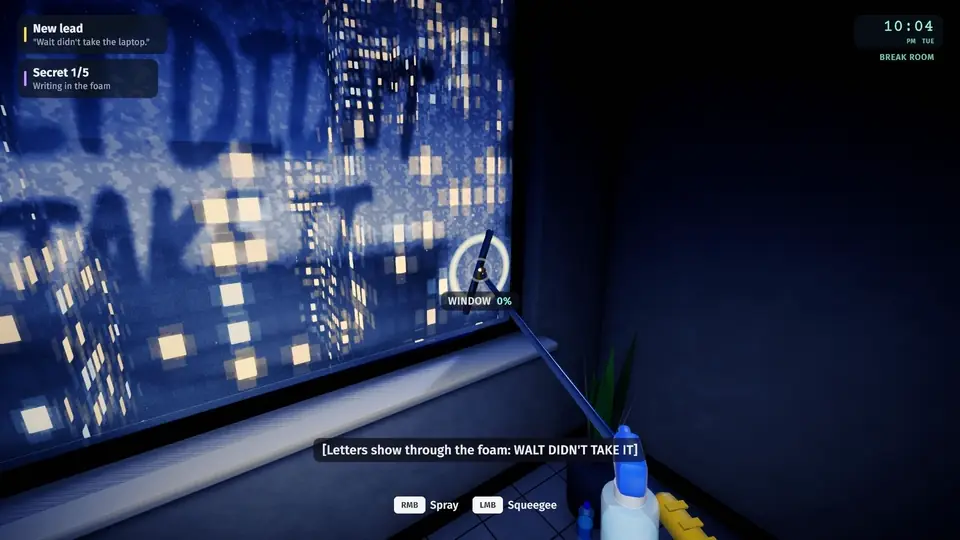
</p>

<h1 align="center">After Hours</h1>

<p align="center">
  <b>A first-person cleaning game with a mystery underneath.</b><br>
  You're the new night cleaner on the 14th floor. Over seven nights, the grime you scrub away shows
  what the day shift is hiding, and you decide which evidence survives until morning.
</p>

<p align="center">
  
  
  
  
  
  
</p>

<p align="center">
  <a href="https://github.com/nearbycoder/AfterHours/releases/latest"><b>Download for Linux</b></a> ·
  <a href="docs/media/AfterHours-trailer.mp4"><b>Watch the trailer</b></a> ·
  <a href="#screenshots"><b>Screenshots</b></a> ·
  <a href="#build-from-source"><b>Build from source</b></a>
</p>

## Trailer

<p align="center">
  <a href="docs/media/AfterHours-trailer.mp4">
    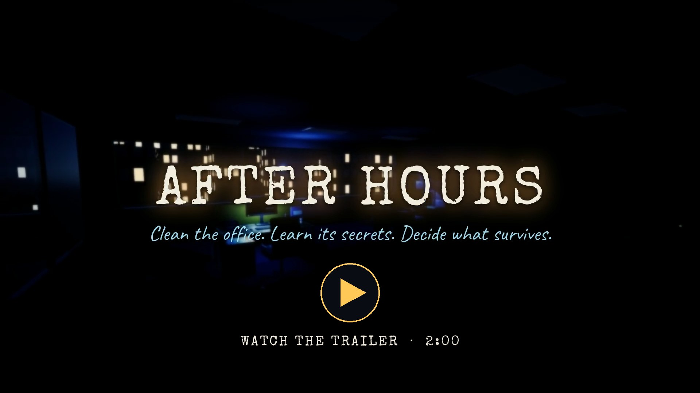
  </a>
</p>

<p align="center"><sub>1 min 54 s · 1920×1080 at 30 fps · H.264 and AAC with the game's own music and sound · 36 MB.<br>
Every shot was filmed by the game itself from scripted input; the cut is made by <a href="Tools/trailer"><code>Tools/trailer</code></a>.</sub></p>

## About

It's 10 PM at Halvorsen Freight, Suite 1408 of Meridian Tower. The day shift has gone home and left
the usual mess: coffee rings, confetti from somebody's birthday, a crumpled note under a desk.
You've got a cart, a clipboard and the whole floor to yourself.

The cleaning is the toy. Every surface has its own tool and its own feel: a cloth that lifts coffee
rings, a vacuum that leaves stripes in the carpet, foam and a squeegee for the glass, a mop that
leaves a wet sheen. Rubbish gets sorted and thrown, things go back where they belong, and when a
surface is clean it gleams and dings.

But grime hides things. Erase the brainstorm on the conference-room whiteboard and something
older shows through. Foam a window and someone's finger-writing appears. A notepad gives up its
last page to a pencil. Everything you find is yours to keep, put back, throw away, shred, or
leave in someone's inbox tray, and the office remembers what you did. The next morning's office
chat reacts, the next night has changed, and on the seventh night you decide what survives.

- **Seven nights** in one office that changes around you, each designed to take five to eight minutes.
- **Four endings**, plus personal epilogues that depend on what you took and what you left.
- **No fail state and no timer pressure.** The wristwatch runs from 10 PM towards dawn, but it
  never ends your shift for you.

## How to play

| Keyboard and mouse | Gamepad | Action |
|---|---|---|
| <kbd>W</kbd><kbd>A</kbd><kbd>S</kbd><kbd>D</kbd>, mouse | left stick, right stick | move, look |
| <kbd>Shift</kbd> | right bumper | brisk walk |
| <kbd>C</kbd> or <kbd>Ctrl</kbd> | left stick click | crouch (reach under desks) |
| left mouse (hold) | right trigger | clean with the current tool; with something in hand, hold to charge a throw |
| right mouse | left trigger | spray (squeegee and cloth) |
| <kbd>E</kbd> | A | interact: pick up, put back, tuck a chair, light switch, door, monitor, inbox tray, read |
| <kbd>Q</kbd> | B | drop what you're holding |
| <kbd>F</kbd> | d-pad up | UV torch (from Night 2) |
| <kbd>Tab</kbd> | Select / View | clipboard: tonight's tasks, secrets, leads and what's in your pocket |
| <kbd>1</kbd>–<kbd>4</kbd>, mouse wheel | d-pad left / right | pin a tool (otherwise the right tool comes up for the surface); the wheel and d-pad also step back to automatic |
| <kbd>Esc</kbd> | Start / Menu | pause |

When a document is open: <kbd>Tab</kbd> (pad Y) keeps it, <kbd>E</kbd> (pad A) puts it back,
<kbd>X</kbd> (pad X) throws it away. On a monitor, <kbd>Q</kbd> (pad X) switches it off. Menus
and choices take <kbd>W</kbd><kbd>S</kbd><kbd>A</kbd><kbd>D</kbd> or the arrow keys,
<kbd>E</kbd>/<kbd>Enter</kbd> and <kbd>Esc</kbd>, or the d-pad, A and B. On-screen prompts switch
between keys and pad buttons depending on what you touched last, and show PlayStation symbols
(✕ ○ □ △, R2, L2) on a DualShock or DualSense pad and Xbox letters on other pads.

**Keys and mouse buttons can be changed** in Settings → Keyboard and mouse controls: pick an
action and press the new key. A key that's already in use swaps over. Esc, Enter and 1–4 stay
fixed, and so do pad buttons. Prompts and hints show your keys by their names on your keyboard
layout, so on AZERTY they read Z Q S D rather than W A S D.

**A night, start to finish:** clock in at the cleaning closet and check the shift sheet on your
clipboard. Switch the lights on, clean room by room, sort the rubbish, put things back, decide what
to do with whatever you find. Lights off, clock out at the punch clock, and read the shift report
and the next morning's chat.

## Features

### Cleaning that feels good on its own

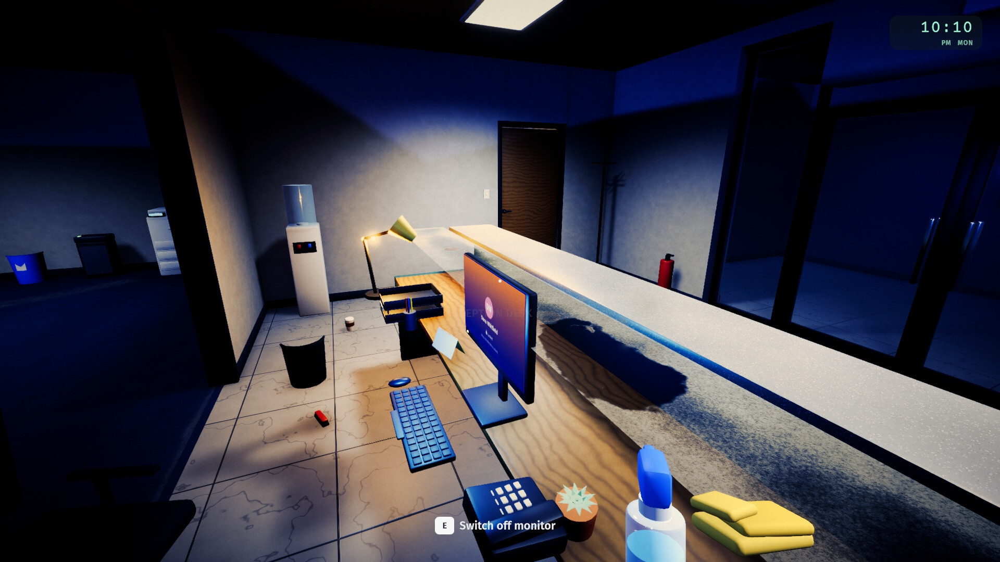

- **Smart tools.** Look at a dirty surface and the right tool comes up: cloth for desks and
  counters, squeegee for glass, vacuum for carpet, mop for hard floors. The reticle turns into a
  progress ring, and a surface that's nearly clean finishes itself with a gleam, a sparkle and a
  ding whose pitch climbs if you clean several in a row.
- **Every tool is different.** The cloth rewards scrubbing. The vacuum leaves light and dark stripes
  in the carpet nap and pulls confetti into the nozzle. Glass needs foam first, then a squeegee.
  Mopped floors stay wet for a few seconds, then dry.
- **Rubbish and throwing.** Food and wrappers go in the black bins, cans and bottles in blue
  recycling, paper in either. Hold the button to charge a throw and follow the arc; long shots get
  a swish and a "Nice shot!". The wrong bin bounces the item back out, so nothing is ever lost.
- **See what you can use.** Whatever the reticle is on (a paper ball, a light switch, a chair)
  gets a soft warm outline, so small things in dark rooms read as usable. It can be turned off
  in Settings.
- **Putting things back.** Moved objects have home spots: a ghost shows where something belongs and
  it snaps into place. Chairs tuck in, monitors switch off, lights go out when you leave.
- **Never stuck on the last can.** The shift sheet says which rooms still have work on each task.
  After a minute with no progress, whatever's left glints and the nearest few chime, so you can
  find them by ear. Anything thrown out of reach (on top of something tall, wedged out of sight or
  out of the building) turns up at your feet.

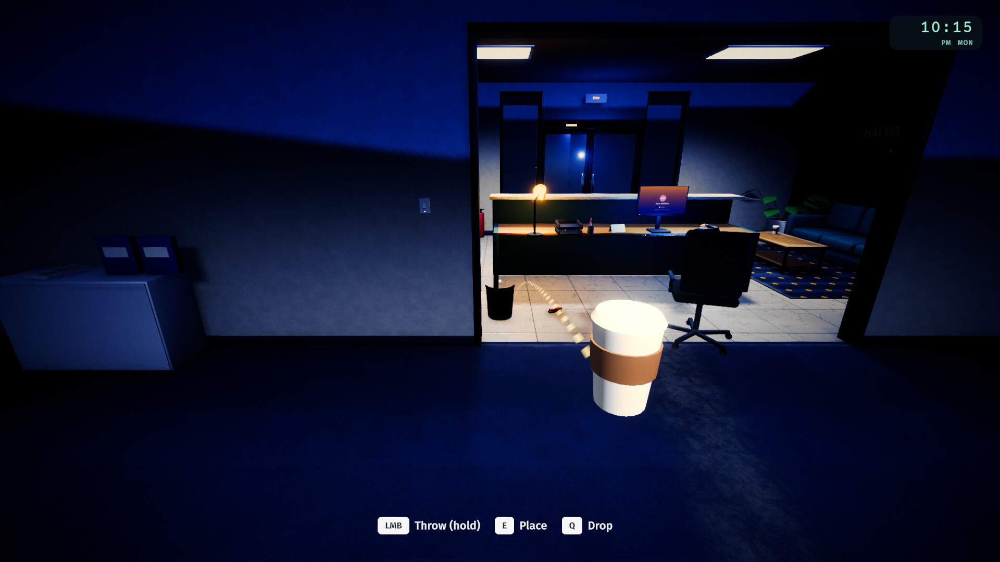 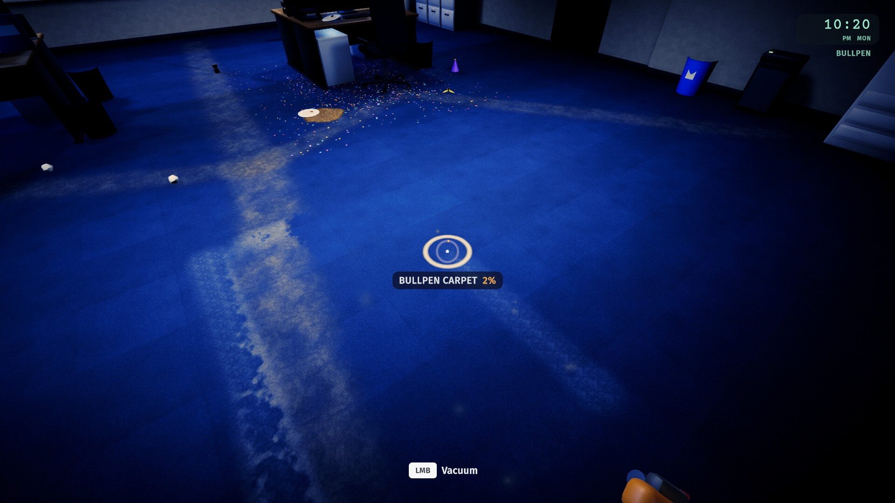

### Grime hides things

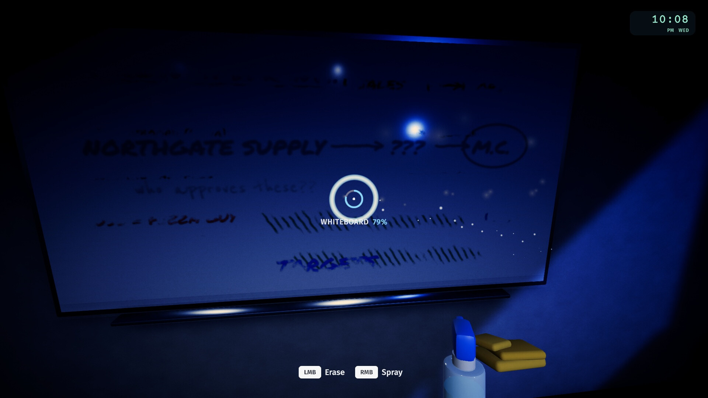

Clues turn up *because* you clean. Erasing a whiteboard leaves the ghost of what was written there
before. Window foam shows letters someone traced on the glass. The vacuum knocks something loose
from under a desk. A pencil rubbing brings back the last page torn from a notepad. From Night 2,
a UV torch shows invisible-ink marks left by the cleaner before you, and any grime you missed.

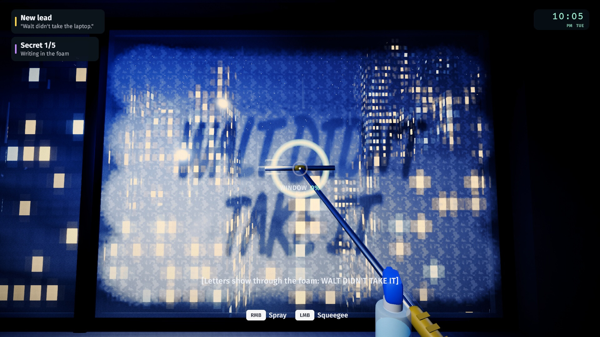 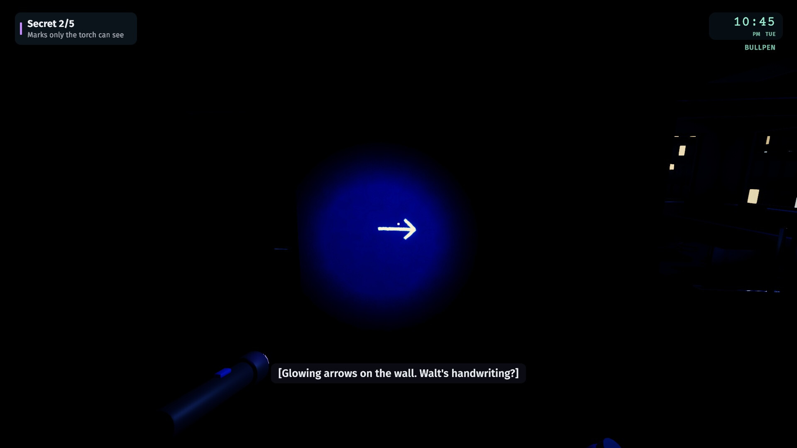

### Your hands decide

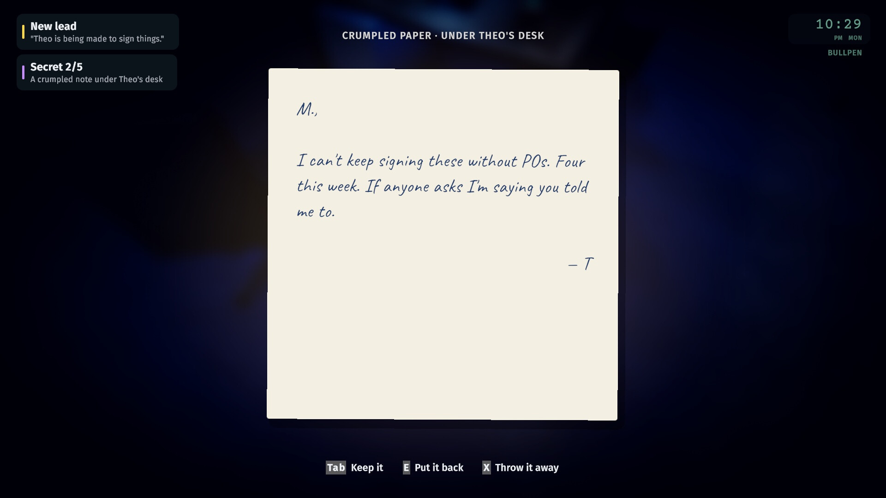

- **Evidence.** Notes, emails, ledgers and printouts open in an inspect view. Keep them in your
  pocket, put them back, or throw them away.
- **Deliveries.** Leave a document in someone's inbox tray and they find it in the morning. Feed it
  to a shredder. Or write an anonymous sticky note from the leads you've pieced together.
- **Suspicion.** One office belongs to someone who notices when things move. Anything you take or
  fail to put back changes what she writes to you and how your story ends. It never stops you
  finishing a night.
- **Puzzles.** Tape a bag of shredded strips back into a page; open a locked cabinet; follow a
  trail only the UV torch can see.

### The end of every shift

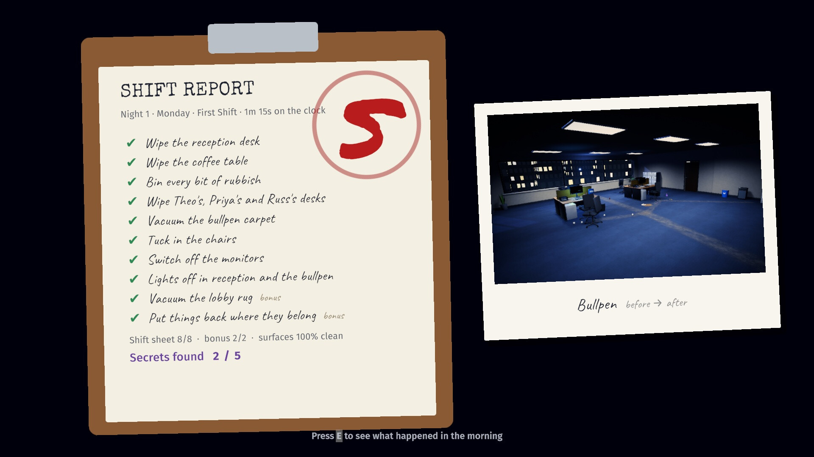

Clocking out brings up the shift report: a grade from S to C, the secrets you found, and
before-and-after polaroids of every room you cleaned. Then comes the next morning's office chat,
where the people whose desks you cleaned react to what you left for them, or to what went
missing.

## Content overview

One floor of one office (reception, bullpen, break room, conference room, the corner office and
the cleaning closet) over seven nights. Spoiler-light:

| Night | Title | What's new |
|---|---|---|
| 1 · Monday | **First Shift** | The tutorial night: reception and the bullpen, wiping, vacuuming, throwing, tidying. Something under a desk, and a monitor that wakes up on its own. |
| 2 · Tuesday | **Glass** | The break room. Spray and squeegee, the mop, and the UV torch. |
| 3 · Wednesday | **The Whiteboard** | The conference room, and what's underneath the marker. |
| 4 · Thursday | **The Corner Office** | You get the key to the finance director's office. Put everything back exactly. |
| 5 · Friday | **Pieces** | After the office party: the heaviest clean of the week, and a shredded page to rebuild. |
| 6 · Sunday | **Prep** | The auditors arrive Tuesday. Boxes marked for destruction, and a new inbox tray. |
| 7 · Monday | **Audit Eve** | A storm, flickering power, a jammed shredder, and the last decision. |

There are four endings, **The Audit**, **Clean Books**, **Loose Threads** and a secret one, each with
personal epilogue variations. **Night Select** replays any night you've reached from the state you
started it in, so you can try another road. Your records are kept apart from the story save: the
best grade and most secrets for each night, and the endings you've found (shown on the title
screen and in Night Select, unnamed until you reach them), survive replays and New Game.

Menus: title (Continue, New Game, Night Select, Settings, Quit), pause (Resume, Shift sheet,
Settings, Restart this night, Quit to title) and settings in two columns: mouse and stick
sensitivity, invert Y, controller vibration, field of view, head bob, four volume sliders, a
graphics preset (Low, Medium, High), render scale, fullscreen, VSync, a frame-rate limit,
captions, reduce flashing, a highlight on whatever you're aiming at, and a page for keyboard and
mouse bindings, and an opt-in playtest log. Progress
and settings save automatically. Saves are written to a temporary file and swapped in, keeping the
previous one as a backup, so a crash or power cut mid-save can't lose a game.

## Screenshots

<table>
  <tr>
    <td width="50%">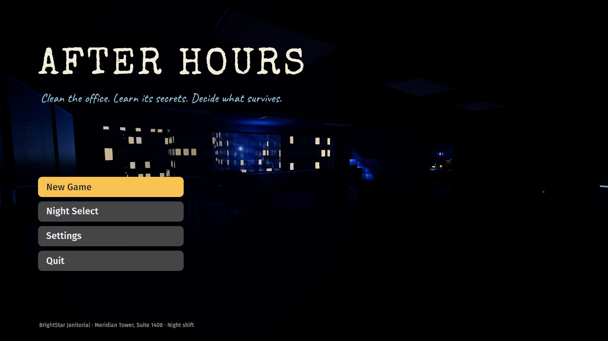</td>
    <td width="50%">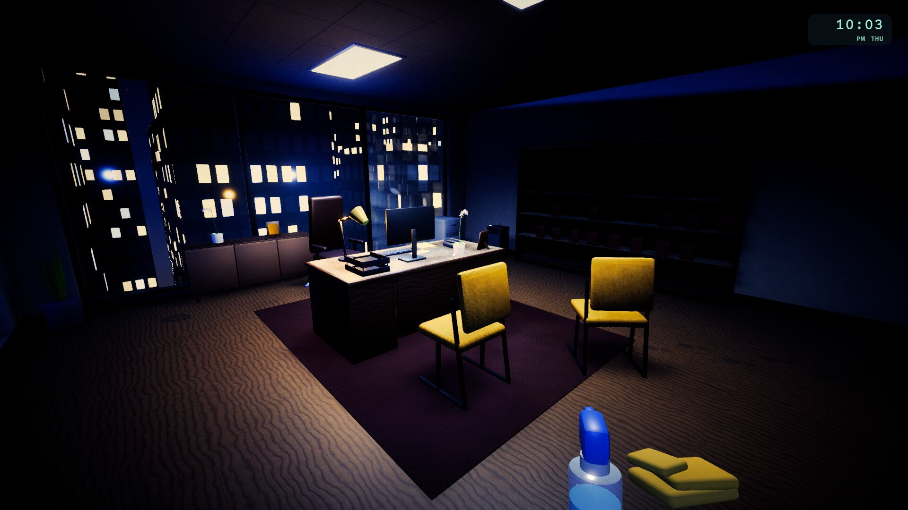</td>
  </tr>
  <tr>
    <td></td>
    <td></td>
  </tr>
  <tr>
    <td></td>
    <td></td>
  </tr>
  <tr>
    <td></td>
    <td></td>
  </tr>
  <tr>
    <td></td>
    <td></td>
  </tr>
</table>

## Play it

1. Download `AfterHours-v0.1.0-linux-x86_64.zip` from the
   [latest release](https://github.com/nearbycoder/AfterHours/releases/latest).
2. Unzip it and run `./AfterHours.x86_64`.

You need 64-bit Linux and a GPU with OpenGL 3.2 or later (the player uses OpenGL Core). It starts
fullscreen; switch to windowed in Settings. Saves and settings live in
`~/.config/unity3d/After Hours Team/After Hours/`. If the window never appears under XWayland, start it
with `./AfterHours.x86_64 -force-wayland` to use Unity's native Wayland backend. Zips made by
`Tools/package.py` (below) include an `AfterHours.sh` launcher that does this for you in a
Wayland session (`AH_X11=1` forces X11).

Only a Linux build is published (v0.1.0). Since then the project also **builds for macOS** as a
universal app (Intel and Apple Silicon, macOS 12 or later), but that build is unsigned and
**untested: nobody has run it on a Mac yet**. It isn't published. To try it, build it from source
(below); first launch needs right-click → Open, or `xattr -dr com.apple.quarantine` on the app.
Windows builds need Unity's Windows Build Support module, which isn't installed on the
development machine, so none has been made.

## Build from source

**Requirements:** Unity **6000.6.2f1** with Linux Build Support (and Mac or Windows Build Support
for those players; the project uses URP 17.6 and the
Input System 1.20 from the Unity registry), Blender **4.5** on `PATH` for the models, and Python 3
with NumPy, SciPy and Pillow for textures and audio. FFmpeg for the trailer and README media.

```bash
git clone https://github.com/nearbycoder/AfterHours.git && cd AfterHours

# Unity: build, test, open
Tools/unity.sh build-linux      # -> Builds/Linux/AfterHours.x86_64
Tools/unity.sh build-mac        # -> Builds/macOS/After Hours.app (universal, unsigned)
Tools/unity.sh build-windows    # -> Builds/Windows/AfterHours.exe (needs the Windows module)
python3 Tools/package.py        # release zips of whatever is built -> Builds/release/
python3 Tools/playtest_report.py <logs>   # per-night tables from playtest logs (docs/PLAYTEST.md)
Tools/unity.sh test             # EditMode tests -> Logs/test-results.xml
Tools/unity.sh                  # open the project in the editor
Tools/play.sh                   # run the build windowed at 1600x900
```

`Tools/unity.sh` expects the editor at `~/Unity/Hub/Editor/6000.6.2f1/` (override with `UNITY=`).
On distros that ship only `libxml2.so.16`, the 6000.6 editor exits at start-up because it links
`libxml2.so.2`: install your distro's legacy libxml2 package, or point `AH_UNITY_LIBS` at a
directory containing an older copy.

**Regenerating the assets.** Everything in `Assets/Resources/Models`, `Textures` and `Audio` is
produced by scripts in this repository, and the outputs are committed so the project opens without
them.

```bash
# 3D models (headless Blender) -> Assets/Resources/Models/
blender -b -P ArtSource/office.py -- [--render DIR]          # the office, furniture and layout
blender -b -P ArtSource/props.py  -- [--render DIR] [--only a,b]   # props and tools

# Textures, sound effects, music and the app icon
python -m venv Tools/.venv && Tools/.venv/bin/pip install numpy scipy pillow
Tools/.venv/bin/python Tools/gen_textures.py
Tools/.venv/bin/python Tools/make_icon.py                   # -> Assets/Icons/AppIcon.png
Tools/.venv/bin/python Tools/audio/build_sfx.py
Tools/.venv/bin/python Tools/audio/build_music.py
```

**Testing.**

- `Tools/autopilot.sh [outdir] [nightN|all] [route]` runs the built game with no human: it starts at
  the title and plays all seven nights through the real components (brush maths on every dirty
  surface, physics into the bins, real mouse-and-key input for a wipe, a pick-up, a charged throw
  and the vacuum, a virtual gamepad for the menus), then checks the chosen route reaches its
  ending. Routes: `audit`, `loose`, `cleanbooks`, `spotless` and `marian`. It also checks every
  night for props overlapping, sunk into furniture or floating. On Night 1 it loses a can out of
  the world, on a high ledge and in a sealed crate (each must come back), leaves one on the open
  floor and one under a desk (both must stay put), then idles for a minute and checks that exactly
  the unfinished things glint. It also checks the aim highlight goes on and off with the reticle
  and the setting, and rebinds Interact to F through the real controls page by pressing F on a
  virtual keyboard, then checks F uses a light switch and E no longer does. With a virtual pad it
  steps through the tools on the d-pad, and with a virtual DualShock 4 it checks the prompts
  switch to ✕.
- `Tools/unity.sh test` runs the EditMode tests, including an exhaustive search over the story's
  choices that proves all four endings are reachable, and tests that saves survive interrupted
  writes, that records only ever improve, and that key bindings swap, refuse reserved keys and
  survive a save.
- The AutoPilot keeps the playtest log off through the title (and checks nothing is written),
  then on for the run, and afterwards checks the log: every line is JSON, a night end for each
  night in order, every secret, the ending, clipboard opens, pauses, glints and recovered items.
- After the ending, the AutoPilot replays Night 2 from Night Select and checks that Night 7's best
  result and the ending found are still listed. Runs that share a profile (the optional fourth
  argument to `Tools/autopilot.sh`) carry records over, so two routes in one profile show
  "Endings 2 / 4".

**Trailer and README media.** The trailer is filmed by the game itself and cut by a script:

```bash
Tools/trailer/record.sh                                   # film every clip at 1920x1080 -> Recordings/trailer/
Tools/.venv/bin/python Tools/trailer/make_trailer.py      # -> docs/media/AfterHours-trailer.mp4
Tools/.venv/bin/python Tools/trailer/make_media.py        # screenshots, poster and teaser -> docs/media/
```

## Project structure

```
Assets/
  Scripts/              runtime code, one assembly
    Cleaning/           grime surfaces (render-texture masks with a CPU mirror), brushes, tools
    Core/               boot and game flow, input, settings, tweening, events
    Interaction/        hands (pick up, throw), bins, home spots, doors, switches, story items
    Story/              night definitions, documents, endings, story state and saves
    World/              office builder (reads Office.fbx), furnisher, prop library
    UI/                 HUD, clipboard, inspect view, menus, shift report, chat, endings
    FX/ Audio/ Player/  particles and post-processing, sound and music, first-person controller
    Testing/            AutoPilot (self-test), CaptureDirector, Showcase and Trailer recorders
  Editor/               build script, import rules, project setup, EditMode tests
  Shaders/              grime overlay, UV ink, skyline, particles
  Resources/            generated models, textures, audio; bundled fonts
ArtSource/              Blender generators (office.py, props.py, furniture.py, tools.py) and .blend files
Tools/                  build, play, test and packaging scripts; texture, icon and audio generators;
                        trailer/, release/ (launcher and READMEs for the zips)
docs/                   design plan, original brief, media/
```

The game has a single, almost empty scene. `GameRoot` boots from code, builds the office from the
FBX and runs everything else.

## Tech highlights

- **Grime as paint masks.** Every cleanable surface is an overlay quad with its own 2D space, so
  painting never depends on the model's UVs. Each one has a render-texture mask (dirt, vacuum nap,
  wetness and a reveal channel) plus a quarter-resolution CPU mirror of the dirt channel, which
  gives exact completion percentages without GPU readbacks. Dirt patterns are composed at night
  start from procedural stamps: coffee rings, footprints, smudges, marker, confetti and spills.
- **Secrets in the dirt.** The same masks drive the reveals: ghost text where marker has been
  erased, letters that stay clear in window foam, and a rubbing layer that shading brings back.
- **Blender is the level editor.** `office.py` builds the floor in Python, and object names carry
  the meaning (`GRIME_`, `ANCHOR_`, `LIGHT_`, `DOOR_`, `SWITCH_`, `TRAY_`, `BIN_`, `ROOM_`…).
  `OfficeBuilder` reads the FBX and attaches behaviour by those names.
- **Data-driven nights.** Each night is C# data: dirt specs per surface, spawns with conditions over
  the story state, tasks, secrets, documents and the morning chat. The ending resolver is pure C#,
  and an EditMode test enumerates the choice space to prove every ending is reachable.
- **A game that plays itself.** The AutoPilot drives the shipped build through all seven nights
  along five story routes, with about 200 checks per route.
- **Procedural audio.** Every sound effect, ambience bed and music track is synthesised in NumPy:
  FM electric piano, brushed hats and vinyl crackle for the lo-fi night jazz, layered and enveloped
  noise for the cloth, squeegee, vacuum and shredder, all rendered as seamless loops. The three
  night tracks (Nights 1–2, 3–4 and 5–7) are arranged in sections (intro, A, B, a drumless
  breakdown) and run 160–169 s before they loop.
- **Deterministic capture.** The trailer recorder runs the game on a fixed 30 fps clock and records
  the mixed game audio through Unity's `AudioRenderer`, so every shot is scripted and repeatable,
  whatever the machine's load.

## Credits and tooling

Designed and built with Unity 6 (URP), Blender 4.5, Python (NumPy, SciPy, Pillow) and FFmpeg. All
code, models, textures, sound effects, music, screenshots and the trailer were made for this
project.

Fonts (licences in `Assets/Fonts-Licenses/`): **Fira Sans**, **Caveat**, **Courier Prime**,
**Patrick Hand**, **Reenie Beanie** and **Liberation Sans** (SIL Open Font License 1.1);
**Permanent Marker** and **Special Elite** (Apache License 2.0); **DejaVu Sans** (Bitstream Vera
licence). TextMesh Pro's essential resources come from Unity under the Unity Companion License.
See [`THIRD_PARTY_NOTICES.md`](THIRD_PARTY_NOTICES.md) for the full list.

The design plan is in [`docs/PLAN.md`](docs/PLAN.md) and the original brief in
[`docs/BRIEF.md`](docs/BRIEF.md).

## Status and known issues

**v0.1.0: complete and playable.** All seven nights, four endings, menus, saves, keyboard and
mouse, and gamepad. Changes made since that release (round 1: the leftover helper, Settings v2,
records, the macOS build and longer night music; round 2: the aim highlight, key remapping, pad
tool cycling and PlayStation glyphs, and a playtest kit) are listed in
[`docs/IMPROVEMENTS.md`](docs/IMPROVEMENTS.md) and haven't been released yet. Some things are
still rough or untested:

- **No one outside development has played it yet.** Pacing, difficulty, and whether the clues
  are too obvious or too hidden are untested with real players. There's now a kit for the first
  sessions: an opt-in local playtest log (Settings → Feedback, or `-playtest`),
  `Tools/playtest_report.py` to read the logs, and [`docs/PLAYTEST.md`](docs/PLAYTEST.md) with
  questions for testers. The automated runs cover five
  story routes; other mixes of choices are only covered by the ending-logic tests.
- **The audio was tuned by numbers, not by ear.** Levels, loops and rhythm were checked
  numerically. That includes the longer night music: its length, loudness (within 0.2 LU of the
  loops it replaced), loop seam and how much neighbouring four-bar blocks repeat
  (`build_music.py --check`). Nobody has listened to it critically. The trailer still uses the
  original loops; it hasn't been re-cut.
- **No physical gamepad was tested.** Pad support was exercised with a virtual Input System
  gamepad, through the same code path. Rumble (short pulses on throws, the vacuum's clunk, a
  surface coming clean and a made shot; off in Settings) is sent the same way but has never been
  felt on real hardware, and Unity may ignore it for some pads on Linux. The PlayStation
  symbols were checked with a virtual DualShock 4 only. Keyboard and mouse
  can be rebound; pad buttons can't.
- **Performance was measured on one machine** (AMD Strix Halo integrated GPU, Night 2 at
  1600x900, VSync off, on a busy shared machine: about 4.9 ms a frame on High, 2.9 ms on Medium
  and 2.7 ms on Low). Lower-end hardware is untested. Low turns off SSAO and room-light shadows,
  uses smaller shadow maps and FXAA instead of MSAA; Medium keeps SSAO with hard shadows and 2x
  MSAA. With VSync on, the perf probe measured 11 fps in a window that wasn't in front, which
  looks like the Wayland compositor throttling hidden windows (the AutoPilot runs uncapped for
  that reason); whether a visible window holds the refresh rate wasn't checked.
- **Wayland.** On the development machine the player hung at start-up under XWayland, so
  `Tools/play.sh` and the packaged `AfterHours.sh` launcher pass `-force-wayland`. A monitor
  powering off or reconnecting under KDE once crashed the player inside Unity's Wayland code, and
  one unattended AutoPilot run crashed there too (in `wl_display_dispatch_queue_pending`); a re-run
  passed.
- **The art is stylised and procedural.** Every model is generated in Blender from code: chunky,
  bevelled and flat-shaded. It's consistent, but it isn't hand-modelled or textured to a
  commercial standard.
- **Linux first.** The macOS build is made and checked on Linux (universal binary, bundle id
  `com.nearbycoder.afterhours`, icon) but has never been launched on a Mac, and it's unsigned and
  unnotarised. No Windows build has been made; the build entry point is ready for when the
  module is installed.
- **No licence has been chosen yet.** Until one is added, the default copyright applies.
