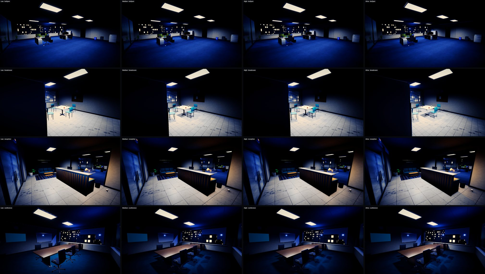
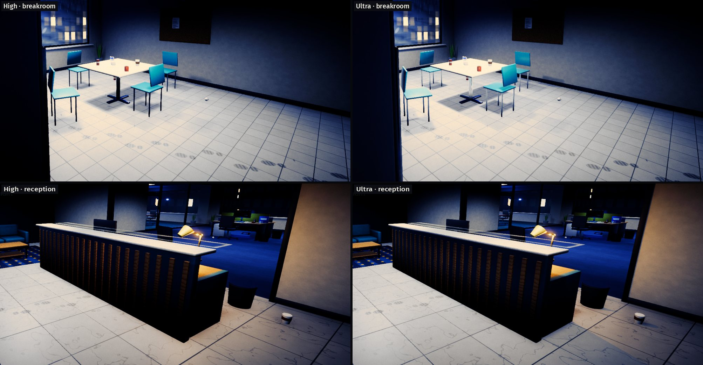
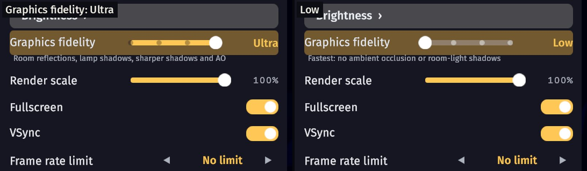
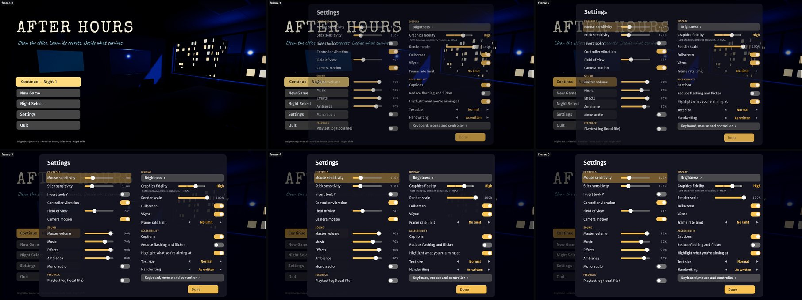
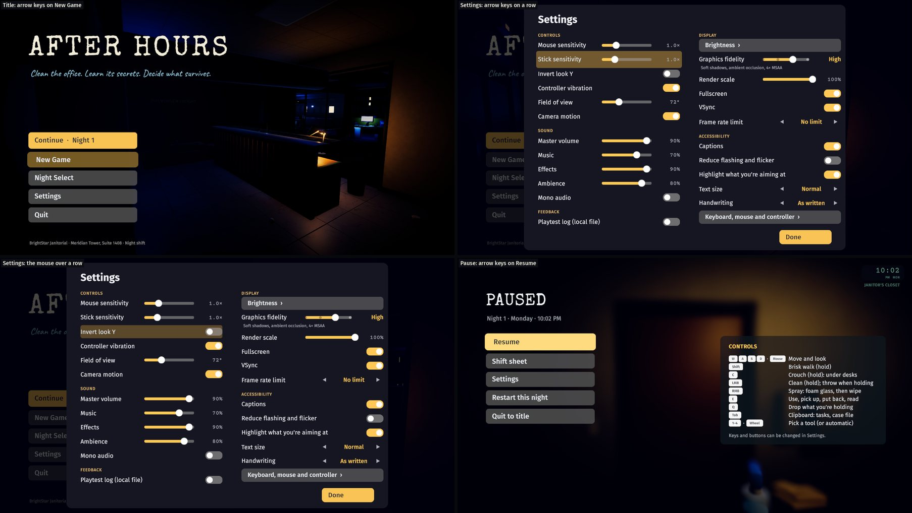
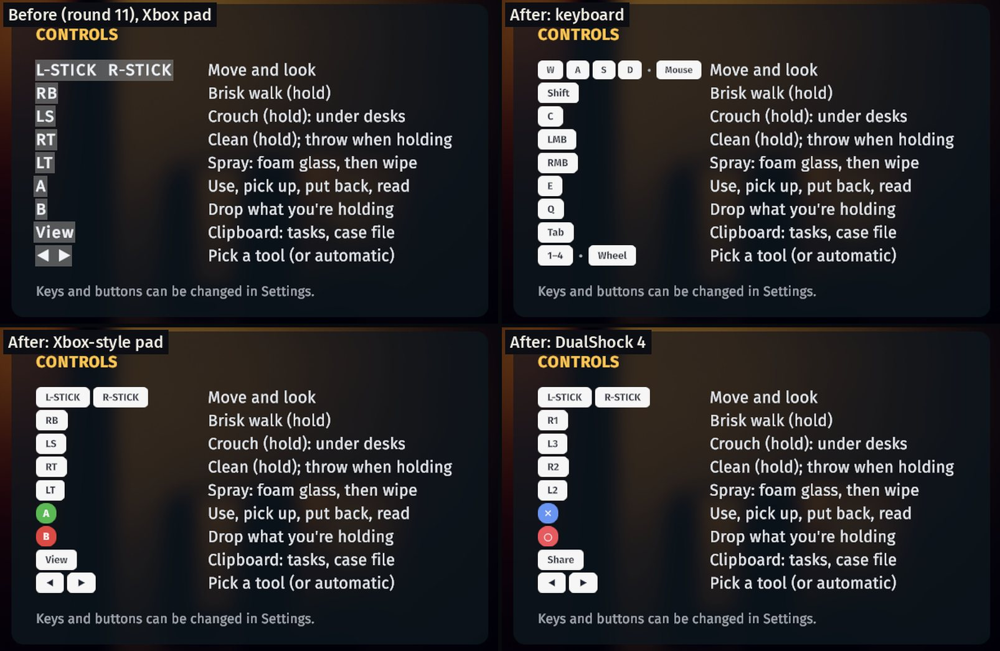

# After Hours: improvement plan (round 1)

This was written on 6 October 2026, two days after v0.1.0 shipped. It ranks what would most improve
the game for a real player, based on the code, a fresh baseline run of the build and its automated
checks, and the README's own known issues. Nothing here is implemented yet. The last section is
the proposed scope for the next round.

## Baseline (branch `improvements`, from `main` at 7e07dc5)

| Check | Result |
|---|---|
| `Tools/unity.sh test` (EditMode) | **13/13 passed** (18 s, includes the ending-reachability search) |
| `Tools/unity.sh build-linux` | **Succeeded**, 182 MB, 0 errors |
| `Tools/autopilot.sh … all audit` | **224 passed, 0 failed**, all seven nights to the audit ending (about 5 min of game time; the other four routes weren't re-run for the baseline) |
| Perf probe (`-ahCapture … perf -ahNight 2`) | VSync off: **4.0 ms** median (p95 6.7 ms) at 1600×900; shadows off 2.6 ms, post off 3.4 ms. VSync on: **91 ms (11 fps)**, see below. Load average was about 57 from other sessions, so the numbers are noisy |
| macOS feasibility build | `-buildTarget OSXUniversal` **succeeded** in 4 min (155 MB `.app`), but the binary is **arm64 only**, and the bundle ID is the template's. Linux rebuilt cleanly afterwards; no tracked files changed |

I read through the autopilot's screenshots: title, settings, Night Select, Night 1 start, the
clipboard, a wipe, the throw arc, inspecting with the pad, the shift report and the morning chat.
Things I saw there and in the code:

- **Settings layout bug.** At 1600×900 the **Done** button covers the last row ("Reduce flashing
  and flicker") in `SettingsPanel` (`Assets/Scripts/UI/TitleScreen.cs`). There is no room for
  another option without changing the layout.
- **A dead setting.** `Settings.Quality` (0–2) is saved but nothing reads it. Render scale is the
  only graphics option, and the URP asset is set up for high-end: soft shadows, 8 shadowed
  additional lights in a 4096 atlas, SSAO, high-quality bloom and MSAA (`ProjectSetup.cs`,
  `PostFx.cs`).
- **Night 1 can trap a stuck player.** On Night 1 you can't clock out until every required task is
  done (`NightDirector.RequestClockOut`), and a task like "Bin every bit of rubbish 0/13" covers two
  rooms. The clipboard shows a count but not where the rest is. The UV torch, the only finder, comes
  on Night 2. Thrown rubbish has no recovery (`Holdable` and `TrashItem` have no out-of-bounds or
  unreachable check). One can lodged somewhere odd means you can't finish the tutorial night.
- **Night Select erases records.** Replaying a night loads that night's start-of-night snapshot as
  the live state (`GameRoot.Start`, `StoryState.LoadSnapshot`). The grades and secrets for later
  nights then disappear from Night Select, and replaying overwrites the previous result. Nothing
  records which endings you've seen, which undercuts the "four endings, replay from Night Select"
  pitch.
- **Saves aren't atomic.** `StoryState.Save`, `SaveSnapshot` and `Settings.Save` call
  `File.WriteAllText` directly. If the game is killed during a write, the save is truncated,
  `Load()` returns null and Continue silently disappears.
- **Music repetition.** Every music track is a single 12–16-bar loop of 41–60 s
  (`Tools/audio/build_music.py`). Nights 1–4 share `music_night` (53 s) and Nights 5–7 share
  `music_night_tense` (60 s). At the planned 5–8 minutes a night, the same loop plays about 30
  times over a full playthrough. Loudness is consistent (−18 to −20 LUFS integrated), so the
  problem is variety, not level.
- **Gamepad gaps.** No way to pin or cycle tools on the pad (only keys 1–4 and the wheel), no
  separate stick sensitivity (the stick reuses the mouse slider at a fixed 160°/s), and no rumble.
  No physical pad is attached to this machine, so pad behaviour can still only be exercised with
  the virtual pad.
- **Release packaging.** The Standalone bundle identifier is still the URP template's
  `com.Unity-Technologies.com.unity.template.urp-blank`. That matters for a macOS `.app`. No script
  makes the release zip; v0.1.0's zip was made by hand. `-force-wayland` appears only in
  `Tools/play.sh` and the README, not in anything a player runs.
- **VSync under native Wayland.** The perf probe's VSync-on baseline ran at 91 ms a frame, while
  the same scene with VSync off ran at 4 ms. The likeliest cause is KDE throttling frame callbacks
  for a window that isn't visible or focused (the probe ran unattended), but I couldn't confirm
  it. If it also happens in a visible window, it's the most serious bug here. The game forces
  `vSyncCount = 1` (`GameRoot.Awake`) and has no way to turn it off.
- **No app icon.** `m_BuildTargetIcons` is empty, so Linux, macOS and Windows builds all get Unity's
  default icon.
- Small things: the shift report's "Press E to see what happened in the morning" uses a plain
  letter where the rest of the UI uses keycaps. The Night 1 "shift sheet is on the clipboard"
  caption shows through at the clipboard's edge. There's no highlight on the object under the
  reticle, only the prompt, which matters in the darker rooms.

## Ranked list

Impact means for a real player. Effort: S is under half a day, M is about a day, L is several days.

| # | Improvement | Impact | Effort | Risk |
|---|---|---|---|---|
| 1 | **Never stuck on the last item**: per-room "what's left" on the shift sheet, a glint on remaining items when you look stuck, recovery for rubbish that ends up out of reach | High: the most likely way a first-time player gets stuck or quits, on the tutorial night | S–M | Low |
| 2 | **Settings v2**: check the Wayland VSync result, fix the overlap, a graphics quality preset that actually works (shadows, SSAO, bloom, MSAA), VSync or frame cap, separate stick sensitivity, vibration toggle | High for anyone not on a strong GPU, and needed before shipping to more platforms | M | Low–Med (layout, URP asset tweaks at runtime) |
| 3 | **macOS build and release packaging**: `BuildMac` (truly Universal), an app icon, a real bundle ID, a packaging script for Linux and macOS zips, a Linux launcher that picks Wayland, and a ready `BuildWindows` once the module is installed | High reach: the blog promises three platforms and the release has one | M | Med: can't be run on a Mac here; unsigned app needs a Gatekeeper workaround |
| 4 | **Records that survive replays**: profile-level best grade and secrets per night, endings seen (x/4) on the title and Night Select, atomic save writes | Med–High: makes replay and the four endings visible and rewarding; removes a data-loss path | S–M | Low |
| 5 | **Longer, varied music**: arranged night tracks with sections and variation (about 3 min), a separate calm track for Nights 3–4 | Med: 53 s loops repeat 30× a playthrough | M | Med: tuned by numbers; nobody can sign it off by ear here |
| 6 | **Playtest kit**: an opt-in local session log (time per task, time without progress, clipboard opens, hints shown, grade) and a `docs/PLAYTEST.md` script for the owner's first testers | High for the owner (the main open question is pacing and clue difficulty) but indirect for players | S | Low |
| 7 | Focus highlight: a soft rim or tint on the interactable under the reticle | Med: readability in dark rooms | S–M | Low (shader or property-block tint) |
| 8 | Pad tool cycling (d-pad left/right), light rumble on throw/clunk/finish, keyboard glyphs from the active layout (AZERTY shows the right letters) | Med for pad and non-US players | S | Med: rumble can't be felt or verified here, and Unity's Linux pad backend may ignore it |
| 9 | Small polish: keycaps in the report and chat hints, caption hidden under the clipboard, best-of grade on Night Select cards | Low–Med | S | Low |
| 10 | Key and button remapping | Med (accessibility) | L | Med: the input layer reads devices directly (`GameInput.ReadDevices`), so this means moving to Input System actions |
| 11 | Windows build | High reach | S once possible | **Blocked**: Windows Build Support isn't installed; the owner must add it in Unity Hub |
| 12 | WebGL build | Potentially large reach | L | High: Forward+, many render-texture masks, 182 MB of content, SSAO and filesystem saves; not a good fit for this game as it stands. Revisit only as a Night 1 demo |
| 13 | Hand-modelled or textured art | Med | L | Out of scope for scripted generation; stays a known limitation |

Not proposed: content additions (an eighth night, new rooms). Seven nights and four endings are
already a complete arc. Until someone has played it, polishing what exists is worth more than
adding more.

## Proposed scope for this round

Five items, in order. If time runs short, item 5 goes first.

### 1. Never stuck on the last item

- The shift sheet lists where unfinished work is, per task ("2 left · bullpen, reception").
- If the night has gone 60 s without progress while required tasks remain, or the player opens the
  shift sheet with everything nearly done, the remaining targets glint (a sparkle and a soft ping
  on rubbish, untucked chairs, monitors left on and unfinished surfaces). It never draws a waypoint
  or an arrow. Reduce flashing tones the glint down.
- Rubbish or a held item that falls below the floor, leaves the office bounds, or comes to rest
  higher than the player can reach is returned to the floor near the closest bin, with a caption.

**Acceptance:** an autopilot check throws a can onto an unreachable spot (and out of the world),
and it comes back within 5 s and can still be binned. A check idles 60 s on Night 1 with rubbish
left and sees the glint fire on exactly the unfinished targets. The existing five routes still
pass. **Verify:** `Tools/autopilot.sh` for all routes, plus a screenshot of the shift sheet's
per-room lines and of the glint.

### 2. Settings v2

- The settings panel gets a layout that fits all rows at 1280×720, 1600×900, 1920×1080 and 16:10
  (two columns or a scrolling list, keeping pad and keyboard navigation).
- **Graphics quality** Low, Medium or High, applied at runtime and saved. Low: no SSAO, hard shadows
  on the main light only, a smaller shadow atlas, no MSAA, and simple bloom. Medium sits between.
  High is today's look. Wire up the existing `Settings.Quality` field.
- **VSync** on or off, plus a frame cap (30, 60, 120, unlimited). Before that, check whether the
  91 ms VSync result also happens in a visible, focused window. If it does, fix that first.
- **Stick look sensitivity** separate from the mouse slider, and a **Vibration** toggle (rumble
  itself is item 8 and stays optional).

**Acceptance:** no row overlaps another or the Done button at those four sizes. Each preset
changes measured frame time in the perf probe in the expected direction, and Low is visibly
simpler but still reads (lit rooms, grime visible). Settings round-trip through `settings.json`.
**Verify:** screenshots at each size via `AH_W`/`AH_H`, perf probe runs per preset, and an
EditMode test for settings defaults and migration (old files without the new fields keep their
values).

### 3. macOS build and release packaging

- `BuildScript.BuildMac` with the architecture set explicitly to Intel + Apple Silicon (the
  baseline CLI build came out arm64-only), `Tools/unity.sh build-mac`, a bundle identifier such as
  `com.nearbycoder.afterhours`, and a generated app icon (from a scripted render, like the other
  assets) for every platform. The company and product names stay the
  same, so Linux save paths don't move.
- `BuildScript.BuildWindows` and `Tools/unity.sh build-windows`, which fail with a clear message
  until Windows Build Support is installed.
- `Tools/package.py` makes the release zips (keeping Unix permissions, and the `.app` executable
  bit) and a launcher, `AfterHours.sh`, for Linux. The launcher passes `-force-wayland` when a
  Wayland session is detected and falls back to X11 otherwise.
- README: platform badges, download steps per platform, and the honest status (macOS built but
  untested on hardware, unsigned, so first launch needs right-click → Open or `xattr -dr
  com.apple.quarantine`).

**Acceptance:** the macOS build succeeds in batch mode; the `.app` has the right bundle ID,
version and icon in `Info.plist`; `file` reports a universal Mach-O binary; the Linux build and
autopilot still pass after switching targets back. **Verify:** the build logs, `plutil`-style
inspection of `Info.plist` (Python's `plistlib`), `file` on the binary, and the full Linux
autopilot afterwards. **Can't be verified here:** that the Mac build launches and plays. That
needs the owner or a tester on a Mac.

### 4. Records that survive replays

- A profile-level `records.json` (next to the save) holds the best grade and the most secrets per
  night, and the endings seen. Night Select replays only add to it, never remove.
- Night Select cards show the best grade and best secrets. The title or Night Select shows "Endings
  2 / 4", with unseen endings shown as unnamed silhouettes, so no spoilers.
- Save, snapshot, settings and records writes go to a temp file and then replace the old one.

**Acceptance:** replaying Night 2 from Night Select after finishing the game keeps the Night 3–7
cards and the endings count. A save interrupted mid-write leaves the previous save loadable.
**Verify:** EditMode tests (merging records, atomic write with a simulated failure) and an
autopilot sequence that finishes two routes in one profile and checks "Endings 2 / 4" plus the
best-of grades on the Night Select screenshot.

### 5. Longer, varied night music

- `build_music.py` renders night tracks as arranged pieces of about 3 minutes (intro, A, B,
  breakdown and A′ sections with melody and drum variations) instead of one 16-bar loop. A third
  track, a "calm but uneasy" variation, covers Nights 3–4, so each part of the week sounds
  different.

**Acceptance:** each night track is at least 150 s with no identical bar-length segment repeated
back to back (checked by a correlation scan in the script). Integrated loudness stays within ±1 LU
of the current tracks. The loop point is seamless (no step at the wrap; the existing tail-wrap is
kept). **Verify:** the script's own numeric checks and the ebur128 measurements. **Can't be
verified here:** whether it sounds good. Listening is still needed, as for all the audio.

### Deferred, and why

- **Playtest kit (6)** is cheap and I'd like to do it next. It's held back only because items 1–4
  change the experience testers would be logging.
- **Rumble and pad tool cycling (8)** wait until a physical pad can be tested; the vibration toggle
  in item 2 lays the groundwork.
- **Remapping (10)** needs the input layer moved to Input System actions; it's worth its own round.
- **Windows (11)** needs the owner to install Windows Build Support in Unity Hub. After that it's
  about an hour, using the packaging from item 3.

## Round 1 outcome (6 October 2026)

All five items shipped on `improvements`, one commit each, plus this update. Verification is
listed per item. Screenshots are in [`docs/media/improvements/`](media/improvements/).

| # | Item | Status | How it was verified |
|---|---|---|---|
| 1 | Never stuck on the last item | Done | New Night 1 AutoPilot checks: a can lost out of the world, on a 2.4 m ledge and in a sealed crate comes back each time; a can on the open floor and one under a desk stay put; after 60 s idle the glint marks exactly the 35 unfinished things. All five routes pass. Screenshots of the glint and the per-room lines, and of Night 2's longer sheet still fitting the paper. |
| 2 | Settings v2 | Done | The `menus` capture finds 18 controls, 0 overlaps and 0 off screen at 1280×720, 1600×900, 1920×1080, 1680×1050 and 1440×1080. Pad checks walk from the left column into the right, step the preset with the d-pad and send a rumble pulse to the virtual pad. Perf probe (Night 2, 1600×900, VSync off, load average about 33): High 4.9 ms, Medium 2.9 ms, Low 2.7 ms median. High and Low screenshots compared. An EditMode test loads an old settings file with the new fields missing. |
| 3 | macOS build and packaging | Done, but the Mac app hasn't been run | `Tools/unity.sh build-mac` succeeds; `file` reports a universal Mach-O (x86_64 + arm64); Info.plist has `com.nearbycoder.afterhours` and the games category; the `.icns` holds the generated icon. `build-windows` stops with a clear message (module missing). `Tools/package.py` zips keep exec bits and leave out do-not-ship folders; the unpacked Linux zip starts through `AfterHours.sh` on the Wayland backend. **Not verified:** launching on a Mac. |
| 4 | Records that survive replays | Done | 8 new EditMode tests (atomic write and backup, a half-written temp file, a truncated save falling back to the backup, best-of merging, endings counted once, seeding from an old save, old settings files). The AutoPilot replays Night 2 after the ending and checks Night 7's best and the ending are still listed; `audit` then `spotless` in one profile show "Endings 2 / 4". |
| 5 | Longer night music | Done (numbers only) | `build_music.py --check`: night tracks are 160 s, 169 s (new Nights 3–4 track) and 165 s, against 53 s and 60 s before. Mean correlation between neighbouring 4-bar blocks is 0.20, 0.25 and 0.42 (0.37 and 0.72 before), with no near-repeats (max 0.70). Loop seams match the old ones; loudness is −18.3, −19.0 and −19.6 LUFS (old −18.3 and −19.8). The other tracks render bit-identical. **Not verified:** whether it sounds good. |

Final run on the last build: all five routes, 0 failed and no crashes (audit 243 checks, spotless 214, loose 239, cleanbooks 239, marian 234); EditMode tests 21/21.

What came up along the way:

- One unattended AutoPilot run crashed inside Unity's Wayland event dispatch
  (`wl_display_dispatch_queue_pending` in `UnityPlayer.so`, from the core dump), during the
  60-second idle. It's the same family as the known Wayland crash in the README. A re-run of the
  same build passed, and it wasn't seen again.
- The VSync question from the baseline is still open. The AutoPilot's own comments already put
  the 11 fps down to KDE throttling a window that isn't in front. Players can now turn VSync off
  or set a frame-rate limit, but whether a visible window holds 60 fps with VSync on wasn't
  checked.
- The trailer was not re-cut, so it still uses the old 53 s and 60 s music loops.
- The version is still 0.1.0 in ProjectSettings, so packaged zips are named v0.1.0. Bumping it
  is part of a release, which is the owner's call.

Still open from the ranked list: the playtest kit (6), focus highlight (7), pad tool cycling and
keyboard-layout glyphs (8), remapping (10), Windows (11, blocked on the module), WebGL (12).

## Round 2 scope (6 October 2026)

Round 1 is merged. This round takes the next items from the ranked list that change how the game
feels to a real player and that can be checked here: focus highlight (7), remapping (10), pad
tool cycling and layout-aware glyphs (8), and the playtest kit (6). It also picks up the
in-text hints round 1 noticed ("Press E to…" as a plain letter). Windows, signing, releases and
the trailer stay with the owner.

### R2-1. Highlight what you're aiming at

Today the only sign that something can be used is the prompt at the bottom of the screen, and in
dark rooms a small switch or a paper ball is easy to miss. The interactable under the reticle
(and anything held near its home spot) gets a soft warm rim that pulses gently: a second
renderer sharing the object's meshes with an additive fresnel shader. It's on by default, with a
toggle under Accessibility.

**Acceptance:** looking at a pickup, a light switch, a chair or a door highlights exactly that
object; looking away or picking it up removes the highlight within a frame; the toggle turns it
off. **Verify:** AutoPilot checks on Night 1 (aim at a cup and a switch, check a highlight
exists on that object only, look away, check it's gone, toggle off, check none); screenshots in
a dark room; all five routes.

### R2-2. Remappable keyboard and mouse controls

The input layer reads fixed keys (`GameInput.ReadDevices`). Bindings become data: each action
(move ×4, brisk walk, crouch, clean, spray, interact, drop, UV torch, clipboard, throw away
document) maps to a keyboard key or mouse button, saved in settings. A **Controls** panel (from
Settings) lists them; pick one and press the new key. A key already in use swaps with the
other action, Esc cancels, and there's a "Reset to defaults" button. Prompts, keycaps and in-text
hints ("Press E to see what happened in the morning") show the bound key by its name on the
current keyboard layout, so AZERTY players see the right letters too. Menus follow the movement
and interact keys as well as the arrows and Enter. Pad buttons stay fixed (see R2-3).

**Acceptance:** rebinding Interact to F through the panel makes F use things and E do nothing
(E now runs the torch, swapped); prompts show "F"; the binding survives a restart; reset brings
back the defaults; an old settings file without bindings gets the defaults. **Verify:** EditMode
tests (defaults, swap on conflict, save round trip, old file); an AutoPilot sequence that
rebinds through the real panel by sending a key press to a virtual keyboard, then presses F on a
light switch with device input live; screenshots of the panel and a prompt; all five routes.

### R2-3. Gamepad tool cycling and controller glyphs

On a pad there's no way to pin a tool (keyboard has 1–4 and the wheel). D-pad left and right
cycle the pinned tool, like the wheel. Prompts show PlayStation symbols (✕ ○ △ □, L2/R2) when
the active pad is a DualShock or DualSense, and Xbox letters otherwise.

**Acceptance:** with a virtual pad, d-pad right pins the next tool and left the previous one;
with a virtual DualShock 4 the interact prompt shows ✕ and with a generic pad it shows A.
**Verify:** AutoPilot checks with virtual `Gamepad` and `DualShock4GamepadHID` devices; a
screenshot of a PlayStation prompt. Still no physical pad, so this is virtual devices only.

### R2-4. Playtest kit

The biggest open question is pacing and clue difficulty with real players. An opt-in **playtest
log** (a Settings toggle, or `-playtest` on the command line) writes one JSON-lines file per
session, locally only: nights started and finished with times, each task ticked and secret
found with timestamps, evidence choices, glints (stuck moments), recovered items, clipboard
opens, pauses, and quitting mid-night with what was left. `Tools/playtest_report.py` turns a
folder of logs into a per-night table (time to finish, stuck moments, secrets found, the task
that finished last). `docs/PLAYTEST.md` is a short script for the owner's first testers: what to
send, what to watch for, and the questions to ask afterwards.

**Acceptance:** with the log on, a full AutoPilot route writes a log with all seven nights,
their tasks and secrets; the report script reads it and prints a sensible table; with the log
off, nothing is written. **Verify:** the AutoPilot runs one route with `-playtest` and checks
the file; the report script runs on it; EditMode test for the event format.

## Round 2 results (6 October 2026)

All four items shipped on `improvements-2`, one commit each. Screenshots and a sample report are in
[`docs/media/improvements/round2/`](media/improvements/round2/). Final build: **all five routes
pass, 0 failed, no crashes** (audit 269 checks, spotless 240, loose 265, cleanbooks 265, marian
260); EditMode tests 30/30. The intermediate commits were also compiled and tested on their own
(R2-1: 21/21, R2-2: 27/27).

| # | Item | Status | How it was verified |
|---|---|---|---|
| R2-1 | Aim highlight | Done | AutoPilot: looking at a paper ball highlights exactly that object; looking away and turning the setting off remove it; a switch in the dark closet lights up. Screenshots. |
| R2-2 | Keyboard and mouse remapping | Done | 6 EditMode tests (defaults, swap on conflict, reserved keys, stored changes and reset, save round trip, a round-1 settings file). AutoPilot rebinds Interact through the real page by pressing F on a virtual keyboard; then, reading the device itself, E no longer uses a light switch, the prompt shows F and F uses it; the binding is saved; reset restores E. Screenshots of the page, the rebind and the prompt. **Not verified:** a real AZERTY keyboard (names come from Unity's layout-aware key names). |
| R2-3 | Pad tool cycling and glyphs | Done (virtual pads) | AutoPilot with a virtual pad: d-pad right steps Cloth, Vacuum, Squeegee, Mop, automatic; left steps back. A generic pad shows A; a virtual DualShock 4 shows ✕, △ and R2, and the switch prompt shows a ✕ cap. **Not verified:** a physical pad. |
| R2-4 | Playtest kit | Done | 3 EditMode tests for the line format. AutoPilot: the log stays empty while off, then the run's file has valid JSON lines, a night end for each night in order, all 28 secrets found, the ending, clipboard opens, pauses, glints and recovered items. `Tools/playtest_report.py` read it ([sample](media/improvements/round2/r2-4-report-autopilot.md)). The Settings layout check passes at five window sizes with the new row. **Not verified:** use by a real tester. |

Things noticed along the way:

- The glyph and remapping changes also fixed the in-text hints round 1 noticed: "Press E to…",
  the UV torch toast and the Night 1 clipboard caption are now key caps that follow the bindings
  and the pad.
- The mouse wheel now uses the same cycle as the d-pad, so it can also step back to the
  automatic tool. Before, once you pinned a tool with the wheel, only pressing its number key
  again unpinned it.
- Tool keys and the wheel are ignored while a menu has the screen. Before, pressing 1–4 with
  the clipboard or a document open could pin a tool, since those don't stop time the way the
  pause menu does.
- A first `/tmp` check found 14 GB of `/tmp/ah*` scratch from the original build sessions; it
  was removed. This round kept everything under `Recordings/` and `Logs/`.

Still open from the ranked list: Windows (blocked on the module), WebGL, and art. Remapping pad
buttons is still not possible.

## Round 3 scope (6 October 2026)

Rounds 1 and 2 are merged. What's left on the ranked list is blocked (Windows), a poor fit
(WebGL) or out of reach for scripted work (art), apart from controller remapping. So this round
also takes new items, found by reading the code and the AutoPilot's screenshots from a fresh
baseline run, with one question in mind: what gets in the way of a first-time player, or
of one who can't use the default controls?

**Baseline (branch `improvements-3`, from `main` at 403bf87).** The Linux build succeeds (187 MB,
0 errors). An `audit` route run failed its real-input checks on Night 1 (rebinding with a
virtual keyboard, the pad's d-pad tool cycling, pad Y and A on documents) about 100 s in, right
after the 60-second idle, although device input had worked earlier in the same run. The
likeliest cause is that the unattended window lost focus to another session's window. The
Input System then ignores device input, and on this shared desktop that can happen at any
time. Round 2's runs presumably passed because the window kept focus. Item R3-0 fixes the test
setup before anything else.

### R3-0. AutoPilot input that doesn't depend on window focus

Automated runs (`-ahAutopilot`, `-ahCapture` and the showcase and trailer recorders) tell the
Input System to keep reading devices when the window isn't focused. Players are unaffected.

**Acceptance:** the `audit` route passes with the window unfocused. **Verify:** all five routes,
run while other sessions' windows are in front.

### R3-1. Case file: read documents again

A mystery game where you can't re-read the clues. Today the clipboard lists what's in your pocket
by title only, and once a note is put back, binned or delivered, it's gone, so the evidence for
a decision lives only in the player's memory. The clipboard gets a second page, the **case
file**: every document you've read this playthrough, grouped by night, with what became of it
(in your pocket, put back, left for Dana, shredded, thrown away, read on a screen or a wall).
Pick one to read it again in the inspect view, which only offers Close and changes nothing:
no secrets, leads or choices. A/D, the arrows or the d-pad flip between the shift sheet and the
case file; W/S, the arrows, the d-pad or the mouse wheel move through the list; E, Enter or pad
A reads. (The clipboard keeps the mouse captured, as it does today, so there's no pointer.) The story save keeps the list, so Night Select replays show what you had read by then.
Saves from before this round build the list from their evidence records.

**Acceptance:** after Night 1 the case file lists exactly the documents read, with the right fate
for each; opening one shows that document read-only, and closing it returns to the list with the
fate, secrets and leads unchanged; it works with keys and pad; Tab or Esc close the clipboard
from either page, and closing a document doesn't also close the clipboard. **Verify:** EditMode
tests (recording reads, fate labels, building the list for an old save); AutoPilot checks on
Night 2 that open the case file and read a document with pad A and with E; screenshots.

### R3-2. Hold or toggle for crouch and brisk walk

Holding C to stay under a desk, or a stick click and a bumper on a pad, is tiring and hard
for some players. Two settings, **Crouch: Hold / Toggle** and **Brisk walk: Hold / Toggle**,
go on the controls page and apply to keys and pad alike. Toggle crouch keeps the existing
headroom check (you can't stand up under a desk). Toggle brisk walk ends when you stop moving.
Defaults stay Hold.

**Acceptance:** with Toggle, one press crouches and the next stands; brisk walk stays on until
you stop; Hold behaves as before; the settings are saved; an older settings file gets Hold.
**Verify:** EditMode tests (the toggle logic, an old settings file); AutoPilot presses C on a
virtual keyboard and the stick click on a virtual pad with each mode; all five routes.

### R3-3. Controller button remapping

The deferred half of round 2's remapping. The controls page gets a **Controller** tab beside
**Keyboard and mouse**. Interact, drop, brisk walk, crouch, clean, spray, UV torch and the
clipboard can go on any face button, shoulder, trigger, stick click, d-pad up or down, or View.
A button already in use swaps over. Start (pause) and d-pad left and right (tools) stay
fixed, and so do A, B, X and Y inside menus and documents (like Esc and Enter on the keyboard).
In-game prompts show the bound button, as a PlayStation symbol on a DualShock or DualSense.

**Acceptance:** binding Interact to X through the page makes pad X use a light switch and A no
longer does; the prompt shows X (□ on a DualShock); the binding is saved and reset restores
it; Start and the d-pad's tool buttons are refused; an older settings file gets the defaults.
**Verify:** EditMode tests (defaults, swap, reserved buttons, round trip, old file); AutoPilot
rebinds through the real page with a virtual pad, then presses X on a switch; screenshots.
Still virtual pads only.

### R3-4. Pause when the window loses focus or the controller disconnects

The game keeps running in the background (it has to for capture), so alt-tabbing mid-night
leaves the clock running and the music playing, and the click that brings the window back
reaches the game as a left-click. Unplugging or losing a wireless pad leaves the player
standing in the dark. During a night, losing focus or losing the pad in use now opens the pause
menu, as long as nothing else is open apart from the clipboard (which closes). Documents
and choices stay up: they are already waiting for an answer. Automated runs keep running.

**Acceptance:** with nothing open, a focus loss or the pad being removed opens the pause menu;
with a document open, nothing changes; the title and menus are unaffected. **Verify:** AutoPilot
calls the focus handler and removes a virtual pad, checking each case. Losing focus to a real
window manager can't be tested unattended, so that path is only covered through the handler.

### R3-5. Small polish

- Dana's welcome note says "(Tab)" in its text, whatever the clipboard is bound to and even on a
  pad. Document text gets key tokens that follow the bindings and the pad, like the HUD's.
- The Night 1 "shift sheet is on the clipboard" caption shows through between the clipboard and its
  side note (visible in the baseline's `07_clipboard.png`). Opening the clipboard clears it.

**Acceptance and verify:** screenshots of the note with keys and with a pad, and of the clipboard
with no caption behind it; an AutoPilot check that the note's text shows the bound key.

Out of scope this round: saving mid-night (quitting mid-night restarts that night, five to eight
minutes at most; saving grime masks and every prop's state is a large change), larger text
(needs a layout pass over every screen), and everything left with the owner.

## Round 3 results (6 October 2026)

All six items shipped on `improvements-3`, one commit each after the scope commit. Screenshots
are in [`docs/media/improvements/round3/`](media/improvements/round3/). Final build: **all five
routes pass, 0 failed, no crashes** (audit 305 checks, loose 301, cleanbooks 301, spotless 276,
marian 296; round 2 ended at 269, 265, 265, 240 and 260). EditMode tests 43/43. Every item was
also built and run on its own (through Night 1 or Night 2) before its commit. The Settings
layout check still finds 0 overlaps and nothing off screen at 1280×720 and 1440×1080. The real
save and settings files under `~/.config/unity3d` were checksummed before and after the session
and are unchanged (all automated runs use `-ahProfile` folders).

| # | Item | Status | How it was verified |
|---|---|---|---|
| R3-0 | Focus-independent test input | Done | The baseline `audit` run had 8 failures (261 passed). With the fix, the run logs `window focused: False` and every real-input check passes; all five final routes ran while other sessions' windows were in front. This confirms the cause. |
| R3-1 | Case file | Done | 4 EditMode tests (reads recorded once with their night, fate labels, an old save seeded from evidence, a new save not re-seeded). AutoPilot on Night 2, every route: d-pad right turns the page; the list matches what was read on Night 1, with Theo's note shown as the route left it (left for Priya, kept, or left where it was); pad A reads the first entry, pad B closes it with the case file still open; fates, leads, secrets and the list are unchanged; the down arrow and E read the next one; Esc closes the document, then the clipboard, without also pausing. Screenshots. |
| R3-2 | Hold or toggle | Done | 5 EditMode tests (hold, toggle, presses ignored in menus, brisk walk ends when you stop, an old settings file). AutoPilot sets both to Toggle through the real page, then: a tap of C crouches and the next stands; the same with the pad's stick click; a tap of Shift while walking stays on and ends when movement stops; back on Hold, crouching lasts only while C is down. |
| R3-3 | Controller remapping | Done (virtual pads) | 4 EditMode tests (defaults and labels, swapping, fixed buttons refused, save, reset and a round-2 file). AutoPilot: the Controller tab lists the pad actions; picking Interact and pressing X binds it; Start cancels and can't be bound; the binding is saved; then, reading the pad itself, A no longer uses a light switch, the prompt shows X, X uses it, a DualShock shows □, and reset restores A. **Not verified:** a physical pad. |
| R3-4 | Pause on focus or pad loss | Done | AutoPilot on Night 2: the focus handler opens the pause menu with nothing open; with the clipboard open it closes and pauses; with a document open nothing changes; removing the virtual pad in use pauses; removing one nobody is using doesn't. The pause is logged in the playtest log as `auto_pause` (the report script ignores it). **Not verified:** focus taken by a real window manager, or a real wireless pad dropping out. |
| R3-5 | Small polish | Done | AutoPilot: no caption shows behind the open clipboard (the Night 1 "…iew" peeking out is gone, before and after in the screenshots); Dana's note reads "(Tab)" on the keyboard and "(View)" on a pad. |

Things fixed along the way:

- Closing the last overlay with Esc or Tab could also open the pause menu or reopen the
  clipboard on the same frame, depending on update order. Now the closing key goes no further.
- The clipboard's pocket said "Empty." while also listing the FC-2 key.
- Menu hints ("Press E to continue", the shred puzzle) keep showing the fixed menu buttons on a
  pad, while in-game prompts follow the pad bindings.

Known limits:

- With pad remapping, the clipboard can be put on d-pad down, which also moves the case file's
  selection; scrolling down then closes the clipboard. It's an odd choice of button, so it's
  allowed rather than refused.
- The case file has no pointer: the clipboard keeps the mouse captured, as before, so the wheel
  moves the selection and E reads.
- Reading a document again only shows it; the game doesn't comment on it.

Deferred: saving mid-night (a large change to grime masks and every prop's state; nights are five
to eight minutes), larger text (a layout pass over every screen), and still WebGL, Windows and
the art.

## Round 4 scope (6 October 2026)

Round 3 is merged. Apart from items that are blocked (Windows), a poor fit (WebGL) or not
scripted work (art), the ranked list is used up. So, like round 3, this round reads the code, the
settings and the screens with one question in mind: what would a first-time player on their own
screen, with their own hands, run into? A night is spent in a dark office, yet there's no
brightness setting. Holding the clean button is the whole game, and it can't be toggled. A grade
of A gives no reason why it isn't S. And one mis-click on "Quit to title" throws the night away
without asking.

**Baseline (branch `improvements-4`, from `main` at b6420b3).** The Linux build succeeds (187 MB,
0 errors), and an `audit` AutoPilot run passes (results below, under Round 4 results).

### R4-1. Brightness

Monitors and rooms differ, and most of a night is spent in the dark before the lights go on.
A **Brightness** slider goes under Display. It lifts or darkens the image through the
post-processing stack (a gamma offset, so dark areas lift more than lit ones), and the menus and
HUD aren't affected. The first time the game starts, a short brightness page appears over the
dark office on the title screen ("turn it up until you can make out the desks"), with the same
slider and a Done button. It's skipped by automated runs and never shown again once closed. It
can be opened again from Settings.

**Acceptance:** the slider changes the game image in the expected direction and leaves the UI
alone; the value is saved; an older settings file gets the default (no change in look) and sees
the page once. **Verify:** an EditMode test for the old settings file; AutoPilot checks that open
the page, move the slider with the keyboard and the pad and check the applied gamma; screenshots
at the lowest, default and highest settings, with mean luminance measured on them.

### R4-2. Hold or toggle for clean and spray

Holding the left mouse button, or the right trigger, is how every surface gets cleaned: minutes
at a time, seven nights running. Like crouch and brisk walk in round 3, **Clean and spray:
Hold / Toggle** goes on the controls page and applies to keys, mouse and pad. With Toggle, one
press starts cleaning (or spraying) and the next stops it. Picking something up, dropping it, or
opening any menu, document or the clipboard switches it off. A throw is charged with one press
and thrown with the next. Default stays Hold.

**Acceptance:** with Toggle, a tap starts cleaning a surface and it keeps getting cleaner with
the button up; a second tap stops it; opening the clipboard stops it; a throw charges on one tap
and flies on the next; Hold behaves as before; the setting is saved and an old settings file
gets Hold. **Verify:** EditMode tests (the latch, an old settings file); AutoPilot clicks a
virtual mouse once on a dirty surface and checks its completion keeps rising, then clicks again
and checks it stops; the same with the pad's trigger; all five routes.

### R4-3. The shift report says why

The report stamps S, A, B or C but never says what the grade is made of: the shift sheet (60%),
the bonus tasks (15%) and how clean every surface is (25%). An S needs every required task and a
score of 97%. The report gets one line with those three parts ("Shift sheet 6/6 · bonus 1/2 ·
surfaces 94% clean") and, below S, one short hint at what would have lifted it ("For an S: the
bonus tasks, and leave fewer surfaces half done").

**Acceptance:** the line matches the numbers the grade was computed from; an S shows no hint;
below S the hint names the parts that fell short. **Verify:** an EditMode test for the grade and
hint logic (the grading moves into a pure function the report and the night share); AutoPilot
checks the line on each night's report; screenshots of an S and a lower grade.

### R4-4. Larger HUD text

Prompts, captions, toasts and the label under the reticle are sized for a 1080p monitor at desk
distance. On a laptop at 720p or a TV across the room, 18–22 point text is small. A **Text
size** setting (Normal, Large, Largest) under Accessibility scales them, and the hints under
documents, by 1, 1.25 or 1.5. Menus, the clipboard and documents themselves keep their layout
(their text is already 28–46 points on paper sized to the screen).

**Acceptance:** at Largest, the prompt, caption, toasts and reticle label are 1.5× and stay on
screen at 1280×720 and 4:3; Normal looks as before; the setting is saved and an old file gets
Normal. **Verify:** AutoPilot sets each size and checks the HUD elements' on-screen rectangles
stay inside the screen and don't overlap the watch; screenshots at 1280×720.

### R4-5. Don't lose a night by accident

"Quit to title" in the pause menu drops the night in progress straight away, and Continue then
starts that night again from 10 PM. It now asks first ("Tonight starts over from the beginning
next time"), as Restart already does. The Settings page also gets the room it needs for the new
rows (the playtest log moves to the left column).

**Acceptance:** choosing Quit to title shows the question; Back keeps the night; confirming goes
to the title. The Settings layout check still finds no overlaps at five window sizes.
**Verify:** AutoPilot (open the question, back out with the night still running, the clock not
reset); the existing `menus` capture's layout check.

Out of scope again: saving mid-night (a night is five to eight minutes; saving every grime mask
and prop is a large change), a full layout pass for larger menu text, and the items left with
the owner. Hints for missed secrets were considered (where to look, on the report); they need a
room for every one of the 32 secrets and a decision on how much to give away, so they're noted
for the owner rather than built.

## Round 4 results (6 October 2026)

All five items shipped on `improvements-4`, one commit each after the scope commit. Screenshots
are in [`docs/media/improvements/round4/`](media/improvements/round4/). Final build: **all five routes pass, 0 failed, no crashes** (audit 355 checks, loose 351, cleanbooks 351, spotless 326, marian 346; round 3 ended at 305, 301, 301, 276 and 296).
EditMode tests 58/58 (43 before). Each intermediate commit was also compiled and tested on its own
(R4-1: 47/47, R4-3: 53/53, R4-5: 53/53, R4-2: 56/56). The Settings layout check (now also
covering both controls pages and the brightness page) finds 0 overlaps and nothing off screen at
1280×720, 1600×900, 1920×1080, 1680×1050 and 1440×1080. The real save and settings files under
`~/.config/unity3d` were checksummed before and after the session (`save.json`, `prefs` and the night snapshots are unchanged; only `TestResults.xml`, which Unity's EditMode test runner writes there itself, changed, and every automated run used an `-ahProfile` folder). Load average during
the runs was about 13–25 from other sessions, with a spike to about 99 as the marian route
started (it passed). The first attempt at the five-route run was stopped by a 30-minute job
limit during marian, which was then re-run on its own.

| # | Item | Status | How it was verified |
|---|---|---|---|
| R4-1 | Brightness | Done | 4 EditMode tests (the default changes nothing, the curve rises in order and clamps, the value label, an old settings file keeps the look and is offered the page once; automated runs never are). AutoPilot on Night 1: Settings opens the page with the pause menu and Settings hidden behind it; the pad selects the slider; d-pad right ×10 reaches +10 (gamma offset 0.40), the left arrow ×20 reaches −10 (−0.15); Default restores 0; pad B closes it and marks it seen. Mean luma of the uncovered part of the frame (the closet doorway): 0.025 at −10, 0.063 at 0, 0.237 at +10; near-black pixels 86%, 60%, 12%. A first try with −0.25 to +0.5 left 95% near-black at the bottom, so the range was narrowed. **Not verified:** how it looks on other monitors, by eye. |
| R4-2 | Hold or toggle for clean and spray | Done | 3 new EditMode tests (a toggled clean stays on until the next press; clean and spray are one switch; held behaves as before and menus ignore presses) and the old-settings test. AutoPilot with live devices: the controls page sets it; one tap of a virtual mouse on Russ's desk and it goes 0% → 2.6% with the button up; the next tap stops it (no change over a second); the pad's right trigger starts and stops it; opening the clipboard switches it off; holding rubbish, one tap charges a throw and the next throws it. |
| R4-3 | The shift report says why | Done | 6 EditMode tests: grades match the old formula over 21×7×3 combinations; the summary line; the hints for every case, and that following any hint actually reaches S. AutoPilot on every night's report: the line matches the numbers the grade came from, a hint shows only below S, and every line sits on the paper (Night 2's 14 tasks used to push the secrets line off the bottom: 160 + 14×46 units of an 840-unit page; now the lines close up). In the runs, Night 2 is graded A with "For an S: the bonus tasks." |
| R4-4 | Larger HUD text | Done | 2 EditMode tests (scales, an old settings file gets Normal). AutoPilot at 1600×900, 1280×720 and 1024×768 (4:3): at Normal, Large and Largest the longest prompt (holding something), a two-line caption and a toast stay on screen, apart and clear of the watch, and Largest is 1.5× Normal (prompt 23 → 34 px at 720p). Screenshots. |
| R4-5 | Don't lose a night by accident | Done | AutoPilot on Night 1: Quit to title asks; pad B backs out with the pause menu still open and the night running; confirming goes to the title, which offers Continue on Night 1; Continue starts it again from the beginning. |

Things fixed along the way:

- Esc or pad B on a question over the pause menu (Restart, now also Quit) could close the pause
  menu on the same frame, depending on update order. The answer now goes no further.
- While a toggled clean is on, the automatic tool still follows the surface you look at (it
  normally waits until the button is let go), so cleaning carries on from a desk to the carpet.
- The throw prompt reads "Aim a throw" and then "Throw" with toggle on, instead of "Throw (hold)".

Known limits:

- The brightness page judges against whatever the title camera (or the paused night) is showing;
  there's no fixed calibration image. The UI isn't affected by the setting, by design.
- HUD text size covers the in-game HUD and the key hints under documents. Menus, the clipboard,
  the shift report and documents keep their sizes; a full pass over every screen is still open.
- Toggle mode is shared by clean and spray (one setting), and there's no separate toggle for the
  throw.

Deferred: saving mid-night, larger text everywhere, hints for missed secrets (see below), and
still WebGL, Windows and the art.

## Round 5 scope (6 October 2026)

Round 4 is merged. Its own notes leave one player-facing gap open that can be checked here:
**Text size** (Normal, Large, Largest) only reaches the HUD. The things a mystery game asks
you to *read*, such as the documents, the shift sheet and its notes, the choices at trays and
shredders, the morning chat and the shift report, stay at their Normal sizes. The smallest of
them are small: on the clipboard, the "which rooms" lines under a task are about 17 units of a
1080-unit screen (11 px at 720p), and Night 2's long sheet already shrinks itself to fit.
Round 4 deferred this as "a layout pass over every screen". This round does that pass for the
reading screens. The menus (title, pause, settings) keep their sizes: their smallest text is
about 22 units and the settings page has no room to grow. It also adds one small thing for new
players: the pause menu's empty right half shows the controls.

**Baseline (branch `improvements-5`, from `main` at 4ea75b5).** The Linux build succeeds with 0
errors, and an `audit` AutoPilot run is under Round 5 results below.

Not chosen: saving mid-night (every night's scripted events keep their state in local
variables, so restoring a night half-way means rewriting all seven nights' scripts; a night is
five to eight minutes), hints for missed secrets (the owner's call), and everything left with
the owner. The morning chat's pace was looked at. Messages arrive every 0.7–2.2 s, faster than
most people read, but they stay on screen and the next night waits for a press. They only
scroll away when a morning has more messages than fit, which is rare at Normal and common at
Largest. So scrolling back goes into R5-1 rather than being an item of its own.

### R5-1. Text size for documents, choices, the morning chat and the report

- **Documents** (the inspect view): at Large and Largest the paper grows, within the space
  between the header and the key hints and the screen's width, and its text grows up to 1.25× or
  1.5×. It never gets smaller than at Normal, and it never runs past the paper. Monitor
  screenshots (documents that are images) grow to fit as well.
- **Choices** (inbox trays, shredders, clocking out early, Restart and Quit): the panel scales
  with the setting and stays on screen.
- **Morning chat**: names, messages, the "is typing" line and the hint scale. The chat can be
  scrolled back at any time with W/S, the arrows, the mouse wheel, the d-pad or the left stick,
  and new messages wait while you're scrolled up.
- **Shift report**: the small grey lines (the night line, the grade breakdown, the locker) and
  the hint under it grow with the setting, within the paper.

**Acceptance:** at Largest, every document in the game (all of them, opened one by one) has
its text inside its paper and its paper inside the screen, at 1600×900, 1280×720 and 1024×768.
The text is at least its Normal size, and short documents reach 1.5×. The choice panel is 1.5×
and on screen. The chat's messages are 1.5×, and scrolling back brings the first message into
view. Normal is unchanged (same sizes as before). **Verify:** AutoPilot checks at those three
window sizes (Night 1 and Night 2 runs); screenshots of a document, a choice and the chat at
Largest; all five routes.

### R5-2. The clipboard at larger text sizes

Today the clipboard is a sheet with a side note. At Large and Largest there isn't room for both
at the bigger size, so it becomes one wider sheet with three pages: **Shift sheet**, **Notes**
(secrets, leads and your pocket, now on the side note) and **Case file**. A/D, the arrows or
the d-pad turn the pages, as they do now between two. The text is 1.25× or 1.5× Normal's. A page
that doesn't fit continues below: W/S, the wheel or the d-pad scroll it, with a "more" marker
and the footer showing the keys. Normal keeps today's layout exactly.

**Acceptance:** at Largest on Night 2 (the longest sheet), at 1280×720 and 1024×768: the text
is 1.5× Normal's, no text runs off the paper and the paper is on screen; every task can be
reached by scrolling; the three pages turn with the keys and the pad; the case file still
reads a document; at Normal, the clipboard is laid out as before. **Verify:** AutoPilot checks
on Night 2 with real key and pad presses; screenshots; all five routes.

### R5-3. Controls at a glance in the pause menu

A first-time player who forgets how to spray, crouch or switch on the torch has to find the
rebinding page in Settings, or the README. The pause menu's empty right half gets a card listing
what each control does, with your current keys, or your pad's buttons (PlayStation symbols on a
DualShock or DualSense) when the pad was used last. The torch appears from Night 2, when you
have it.

**Acceptance:** the card's keys match the current bindings, and change after a rebind; with a
pad it shows pad buttons; on Night 1 there's no torch line; it doesn't overlap the menu at
1280×720 or 1024×768. **Verify:** AutoPilot checks (rebinding Interact to F shows F on the
card; a virtual pad shows A; a virtual DualShock shows ✕); screenshots.

## Round 5 results (7 October 2026)

All three items shipped on `improvements-5`, one commit each after the scope commit, plus one
commit for two fixes the final runs found (below). The baseline `audit` run on `main` passed 355
checks with 0 failed. Screenshots are in [`docs/media/improvements/round5/`](media/improvements/round5/). Final build:
**all five routes pass, 0 failed** (audit 404 checks, loose 400, cleanbooks 400,
spotless 375, marian 393; round 4 ended at 355, 351, 351, 326 and 346; one cleanbooks run
crashed in Unity's Wayland code and was run again, see below). EditMode tests 61/61 (58
before). The commits for R5-1 alone and R5-1 with R5-2 were also compiled and tested on their
own (61/61 each). Nights 1 and 2 were also run at 1280×720 and 1024×768 (4:3), where every new
check passed. The real save and settings files under `~/.config/unity3d` were checksummed before
and after: `save.json`, `prefs` and the night snapshots are unchanged; only `TestResults.xml`,
which Unity's test runner writes there itself, changed (every automated run used an `-ahProfile`
folder). Load average from other sessions was about 21–30 during the item runs, 22–46 during
the first final run, and 6–26 during the final one. The checks that depend on timing (the chat
holding new messages for 3 s) passed at both. For a few minutes the shared Unity licensing
client answered "no valid licence" to every batch editor; the test run was retried once it
recovered.

| # | Item | Status | How it was verified |
|---|---|---|---|
| R5-1 | Text size for documents, choices, the morning chat and the report | Done | 3 EditMode tests for how far a document's paper grows (Normal unchanged; within the screen and clear of the header and key hints on 16:9, 16:10 and 4:3; pictures keep their shape). AutoPilot opens all 38 documents at Normal and at Largest, at 1600×900, 1280×720 and 1024×768: 38/38 keep their text on the paper and the paper on screen; at Largest none is smaller than at Normal, all are larger and 32 reach the full 1.5× (the other 6 are longer and grow as far as their paper allows). A 3-option choice is 1.5×; an 11-option one is 1.11× and still on screen. Nights 1 and 2 end at Largest: the report's text stays on the paper, its grey lines go from 22 to 29–33, the hint is clear of the clipboard and the night line clear of the stamp; chat messages are 36 (24 at Normal); scrolled back, the next message waits (still 6 of 8 after 3 s); the down arrow returns to the newest; W and the up arrow reach the first message. |
| R5-2 | The clipboard at larger text sizes | Done | AutoPilot on Night 2 (14 tasks) at 1600×900, 1280×720 and 1024×768: at Normal the layout is exactly as before (board, side note, auto-sized sheet); at Large and Largest it opens as one wide sheet with the side note folded in; tasks, header and footer are 1.25× and 1.5× (49.5, 51 and 30 units at Largest); the sheet is in 2 parts, each on the paper and together holding all 14 tasks; S steps on and wraps to the top, W steps back, d-pad down steps on; D turns to the notes (on the paper) and the case file (fits the paper), A turns back and stops at the sheet; the d-pad turns pages; E reads a case-file entry and Esc closes it but not the clipboard; back at Normal the side note returns. |
| R5-3 | Controls at a glance in the pause menu | Done | AutoPilot on Night 1 at all three window sizes: the card is on screen, clear of the menu, with its text inside; it shows the bound keys (E, LMB, Tab) and no torch; after rebinding Interact to F it shows F; with a virtual pad it shows A, and with a virtual DualShock 4 ✕ and ◀ ▶. On Night 3 (after the torch is found on Night 2) it lists the torch on F. |

Things fixed along the way:

- Three sticky notes (the fridge note, Dana's note and Priya's note) ran past the bottom of
  their paper at Normal by about one line. Document text now shrinks by up to a fifth if, and
  only if, it wouldn't fit; every other document looks as before.
- The report's night line ran under the grade stamp at Normal, and its "Press E" hint touched
  the clipboard's bottom edge. At Normal they're as before; at the larger sizes the night line
  moves under the tasks and the hint goes under the polaroid.
- The first final run found two more. On the marian route, which keeps documents, Night 2's
  report at Largest had its locker line's box reaching 4 px past the paper (the text itself was
  on it); the box now stops at the paper's edge. The spotless run logged an exception from the
  title screen's logo slide-in: choosing Continue in the first 1.6 s after the title appears
  (as round 4's Quit check does) destroyed the logo while it was still moving. A player pressing
  Continue that quickly would have hit it too; the slide-in now checks the logo is still there.
  The five routes were then run again on the final build.
- One rerun of cleanbooks crashed after the ending inside Unity's Wayland event dispatch
  (`wl_display_dispatch_queue_pending`, the crash already in the README), with 385 checks passed
  and none failed; the route was run again.

Known limits:

- The title, pause and settings menus keep their size, as do the chat's channel list and the
  Night Select cards. Their smallest text is about 20–22 units of a 1080-unit screen.
- On 4:3 screens the whole report (clipboard and polaroid) is shrunk to fit, as before, so its
  grey lines are about 1.2× rather than 1.5×.
- A choice with many options (a sticky note with every lead) can only grow as far as the screen
  allows (1.11× with 11 options).
- Nobody has read these screens at a distance or on a TV; sizes were checked by measurement.

Deferred: saving mid-night (each night's scripted events keep their state in local variables,
so it would mean rewriting all seven nights' scripts), hints for missed secrets (the owner's
call), the chat being readable again later (the case file covers documents only), and still
WebGL, Windows and the art.

## Round 6 scope (7 October 2026)

Round 5 is merged. It left one gap in Text size open: the title, pause and settings menus
(and Night Select, the brightness page and the ending) keep their Normal sizes, so a player who
needs Largest to read can't read the menu where they set it. Its smallest text is 18–22 units of
a 1080-unit screen: the settings headings, the title footer, Night Select's grade line. The
setting is also still labelled "HUD text size", though since round 5 it covers much more. The
morning chat, where the office reacts to what you did, can't be read again once you clock in for
the next night; the case file only holds documents. And one trap a real player can walk into:
in the middle of the story, picking an earlier night in Night Select silently rolls the save back
to it, so Continue no longer offers the night you were on.

**Baseline (branch `improvements-6`, from `main` at c13f3f5).** The Linux build succeeds with 0
errors; an `audit` AutoPilot run is under Round 6 results below.

Not chosen: saving mid-night (each night's scripted events keep their state in local
variables; rewriting all seven nights' scripts is a round of its own), hints for missed secrets
(the owner's call), and everything left with the owner.

### R6-1. The title, pause menu, Night Select, brightness page and ending follow Text size

- **Title**: the menu buttons and the footer scale with the setting (the logo and tagline are
  already 120 and 40 units and stay).
- **Pause menu**: the buttons and the subtitle scale; the controls card grows as far as the
  space beside the menu allows, never below Normal. On narrow screens the margins close up first.
- **Night Select**: the day, title and grade line on each card, the subtitle, the endings list
  and Back scale, within the card (the number photo gives up the room).
- **Brightness page** and **the ending** (epilogue lines, stats, the hint) scale, within the
  screen. So does the shred puzzle's key hint.
- The setting is renamed **Text size**. Title and pause menus follow a change as soon as
  Settings closes.

**Acceptance:** at Large and Largest, at 1600×900, 1280×720 and 1024×768: the title's buttons are
1.25× and 1.5× and on screen, clear of the tagline and footer; the pause menu's buttons are
1.5× at Largest, the card at least 1× and clear of the menu, with its text inside; on every
Night Select card the text stays on the card and the grade line is larger than at Normal;
the brightness panel is on screen; Normal is unchanged. **Verify:** AutoPilot checks on Night 1
at those three sizes, the `menus` capture at five sizes, screenshots.

### R6-2. Settings and the controls pages at larger text sizes

At Large and Largest the two-column Settings page (and the two-column controls pages) can't grow
in place: the panel already takes 1000 of the 1080 units. They become one column at 1.25× or
1.5× that scrolls: the selected row is always brought into view, the mouse wheel scrolls, and a
thin bar shows where you are. The Done (and Reset, and the tabs) stay put outside the list.
Changing Text size rebuilds the page straight away at the new size, with the Text size row
still selected. Normal keeps today's two columns exactly.

**Acceptance:** at Largest, at 1600×900, 1280×720 and 1024×768: rows are 1.5× Normal; the
d-pad walks every row from the first to the last and each selected row is fully inside the
visible part of the list; the wheel scrolls; no row overlaps another, the list doesn't overlap
the buttons, and nothing leaves the screen; switching Text size with the pad rebuilds the page
and keeps that row selected; at Normal the layout check is as before. **Verify:** AutoPilot
checks with a virtual pad and keyboard; the `menus` capture at each text size and five window
sizes; screenshots.

### R6-3. Read the morning chats again

Each morning's chat is remembered (which messages showed, in the save) and appears in the case
file under its night as "Tuesday morning · #general". Reading it opens the chat with every
message there, at the top; W/S, the arrows, the d-pad or the wheel scroll, and E, Esc or Tab
close it back to the case file. Saves from before this round get their chats from the
night snapshots (the state the chat was chosen from); a night with neither shows none.

**Acceptance:** on Night 2 the case file lists Tuesday morning's chat under Night 1; reading it
shows exactly the messages shown that morning, from the first, and scrolls; closing it leaves
the clipboard open on the case file and changes nothing in the story; it works with pad and
keys; an old save gets its chats from its snapshots. **Verify:** EditMode tests (recording,
the list for an old save); AutoPilot checks on Night 2 (every route); screenshots.

### R6-4. Don't lose your place by replaying an earlier night

With a story in progress, picking an earlier night in Night Select asks first: "Replay Night 2?
Continue will pick up from Night 2 afterwards. Night 4 stays in Night Select." Never mind leaves
everything as it was. After the ending, or on the night you're on, it doesn't ask (nothing is lost).

**Acceptance:** mid-story (on Night 3), picking Night 1 asks; pad B backs out with the save and
Continue still on Night 3; confirming starts Night 1; after the ending the replay doesn't ask.
**Verify:** AutoPilot checks on the title mid-run and in the existing after-ending replay.

## Round 6 results (7 October 2026)

All four items shipped on `improvements-6`, one commit each after the scope commit, plus a
fix to one of the new checks and this update. The
baseline `audit` run on `main` passed 404 checks with 0 failed. Screenshots are in
[`docs/media/improvements/round6/`](media/improvements/round6/). Final build: **all five routes pass, 0 failed, no crashes** (audit 446 checks, loose 442,
cleanbooks 442, spotless 417, marian 435; round 5 ended at 404, 400, 400, 375 and 393). The first
attempt at the final run stopped after `audit`, whose new ending check failed because Night 7 has
no morning chat, so the ending was built before the check switched to Largest; the check was
fixed (its own commit) and all five routes were run again on the rebuilt game.
EditMode tests 64/64 (61 before). The commits for R6-1, R6-1 and R6-2, and R6-1 to R6-3 were
each compiled and tested on their own (61/61, 61/61, 64/64). Nights 1 to 3 were also run at
1280×720 and 1024×768 (4:3), where every new check passed (see the throw below). The `menus`
capture checked Settings, both controls pages and the brightness page at every text size at
1600×900, 1280×720, 1920×1080, 1680×1050 and 1440×1080: 0 overlaps and nothing off screen in
all 60 layouts. The real save and settings files under `~/.config/unity3d` were checksummed before and after:
`save.json`, `prefs` and the night snapshots are unchanged (every automated run used an
`-ahProfile` folder, removed afterwards). Load average from other sessions was about 13–32 during the item runs (with a spike to about 97 while building, when the
input-driven runs waited) and 8–16 during the final run.

| # | Item | Status | How it was verified |
|---|---|---|---|
| R6-1 | Title, pause menu, Night Select, brightness page and ending follow Text size | Done | AutoPilot on Night 1 at three window sizes, for each text size: the pause menu's buttons are 64, 80 and 96 units (1.5× at Largest on 16:9; 1.28× on 4:3, where the controls card keeps its Normal size beside them), the card grows as far as there's room (1.37× at 1600×900), both on screen, apart, the card's text inside; the title's buttons are 64, 80 and 96 units, below the tagline (34 units clear at Largest) and above the footer; the brightness page is 1.5× on 16:9 and 1.14× on 4:3 (it stops at 60% of the screen's width so the office stays in view). After the ending, Night Select at each size keeps every card's writing on its card with the grade line larger than Normal; the ending at Largest has its epilogue at 35 (30 at Normal; it grows as far as all six lines fit, 391 of 400 units) with all its lines inside the box above the stats; the title, built at Largest, follows the change back to Normal (96 → 64 units a button). The setting is now called Text size. |
| R6-2 | Settings and the controls pages at larger text sizes | Done | AutoPilot at Largest at three window sizes: Settings is one list of 22 rows at 84 units (56 at Normal), the keyboard page 16 rows, the controller page 11, no overlaps, clear of the buttons and on screen; the d-pad walks every row from the first and on to Done, each row fully in view when selected; the down arrow walks the controls list too; the wheel scrolls (1565 → 1445 units); d-pad left on Text size lays the page out again at Large (70-unit rows), then at Normal (two columns), with the same row selected and in view. The `menus` capture: 60 layouts, 0 overlaps. |
| R6-3 | Read the morning chats again | Done | 3 EditMode tests (which lines a state picks; chats kept per night, a replay replacing its night; an old save getting its chats from the snapshots, a missing snapshot giving none, a save with chats not seeded again). AutoPilot on Night 2, every route: the case file lists "Tuesday morning · #general" right after Night 1's documents; pad A opens it with exactly the messages the AutoPilot saw that morning (7 on `audit`), at the first message; pad B returns to the case file with nothing in the story changed; E opens it, Esc and Tab close it without closing the clipboard or pausing; at Largest S scrolls it on (240 of 250 units) and W comes back. |
| R6-4 | Don't lose your place by replaying an earlier night | Done | AutoPilot on Night 3, every route: from the title, Night 1 asks; pad B backs out with the save on Night 3; pad A on Never mind (after the d-pad also moved Night Select's own selection) doesn't pick the card behind the question; confirming Night 2 starts it and Continue moves to Night 2; Night 3 (later than the save) doesn't ask and puts the story back at its start with both results and chats. The after-ending replay of Night 2 still doesn't ask. |

Things fixed along the way:

- **A question's answer could reach the button behind it.** Found while building R6-4: the
  menus' input module sends pad A to the button the pad has selected as well as to an open
  question (Restart, Quit to title, New Game, replaying a night). Behind Night Select that
  could start a different night if the d-pad had moved the selection. Menu buttons and Night
  Select cards now ignore presses while a question is open and on the frame it closes. The
  R6-4 check covers the guard; the old behaviour wasn't reproduced on the old build.
- The menus' hover lift reset a button's scale every frame, so buttons scaled for text size
  (Done, Reset, the tabs) stayed at Normal; it now lifts from the button's own scale.

Known limits:

- The real-input throw check on Night 1 ("a charged throw lands the cup in the bin") failed in
  2 of 5 runs at the smaller window sizes (1280×720 and 1024×768), both times with the held cup
  at an unusual height so the AutoPilot's aim solver picked a different pitch (32° and 12.6°
  rather than about 16°); re-runs at both sizes passed. The throw code didn't change this round;
  it looks like an existing marginal check, not a game bug, but it hasn't been pinned down.
- Night Select's Back button keeps its size: the second row of cards sits right above it.
  The endings card's title, the chat's channel list and the title's logo and tagline also stay
  (they're 26–120 units already, or decoration).
- At Largest the controls page shows about five rows at a time above its note; the note itself
  grows too. Nobody has used the scrolling lists with a real mouse or pad.
- A save from before this round gets its chats from the night snapshots; if a night's snapshot
  is missing (or was overwritten by a replay down another road), that morning isn't listed.
- The Night 7 chat can't be read again: the case file lives on the clipboard, which only
  exists during a night.

Deferred: saving mid-night (every night's scripted events keep their state in local variables,
so it means rewriting all seven nights' scripts), hints for missed secrets (the owner's call),
and still WebGL, Windows and the art.

## Round 7 scope (7 October 2026)

Round 6 is merged. Its notes leave three things open that a player or the next round would run
into. The case file (every document and morning chat you've read) lives on the clipboard, so it
only exists during a night: after the ending, or between sessions, the story can't be looked
back over, and Night 7's documents can't be read again at all (Night 7 has no morning chat).
Closing the window in the middle of a night (the window's close button, Alt+F4, the taskbar)
throws the night away without a word, while Quit to title has asked since round 4. And the
AutoPilot's old Night 1 throw check failed 2 of 5 runs at the smaller window sizes in round 6,
which makes every verification of the game less trustworthy.

**Baseline (branch `improvements-7`, from `main` at 56d2d4a).** The Linux build succeeds with 0
errors; an `audit` AutoPilot run is under Round 7 results below.

Not chosen: saving mid-night (each night's scripted events keep their state in local variables;
rewriting all seven nights' scripts is a round of its own), hints for missed secrets (the
owner's call), and everything left with the owner.

### R7-1. The case file from the title

When the save has anything in its case file, the title gets a **Case file** button (under Night
Select). It opens the same list as the clipboard's case file (newest night first, each night's
documents with what became of them, then the next morning's chat) as a menu: the d-pad, the
arrows, the mouse wheel and a click move through it, and it scrolls. Pad A, Enter or a click
reads an entry again over the menu; pad B, E, Esc or a click close it back to the list; pad B or
Esc close the list. It's built from the save on disk, so it shows the story Continue would carry
on (and, after the ending, the whole story, Night 7's documents included). Reading never changes
the story or the save. The rows follow Text size.

**Acceptance:** mid-story (on Night 3), the title has Case file, and its entries are exactly the
clipboard's for that save; a document read again shows above the list, and closing it returns to
the list with the save unchanged (same bytes); a morning chat opens and closes the same way; Esc
closes the list without starting a night; after the ending the list starts with Night 7's
documents. At Largest the rows are 1.5× and the d-pad walks every row in view, at 1600×900,
1280×720 and 1024×768. With no save there's no button. **Verify:** EditMode tests (the entry
list from a saved state, including the ended story and an empty save); AutoPilot checks on the
Night 3 title visit and after the ending, every route; screenshots.

### R7-2. Ask before the game closes in the middle of a night

Closing the game while a night is being played (window close, Alt+F4, anything that asks the
game to quit) opens the pause menu with the same kind of question Quit to title asks: "Quit the
game? Tonight starts over from 10 PM next time. Earlier nights are saved." Quit closes
the game; Never mind (or pad B, Esc) leaves you paused in the night. It doesn't ask on the
title, Night Select, the shift report, the morning chat or the ending, where nothing is lost.
Automated runs don't ask, except while the AutoPilot is testing it.

**Acceptance:** on Night 1, a quit request leaves the game running with the pause menu and the
question showing; Never mind leaves the night paused, where it was; with the clipboard open it
closes first; confirming quits (and a second request then goes through); on the title the
request isn't held. **Verify:** EditMode test of when it asks; AutoPilot checks on Night 1
(`Application.Quit()` goes through the same request as a window close; a real close from the
window manager can't be driven here); screenshot.

### R7-3. A steady throw check

The AutoPilot's real-input throw on Night 1 re-solved its aim every frame from wherever the held
cup was. The held cup itself follows the camera's pitch, so each new pitch moved the cup and
asked for another pitch; at high frame rates (small windows) that chase could end anywhere (the
round 6 failures released at 32° and 12.6° instead of about 16.8°). The check will solve once
for the pitch at which the cup, settled where the hands hold it, lands in the bin, hold that
pitch until the cup has settled, and only then release. The game's throw doesn't change.

**Acceptance:** the throw passes in 10 of 10 Night 1 runs at 1280×720 and 1024×768 (5 each),
with the settled cup within 2 cm of where the solve expected it. **Verify:** those runs, and
the five routes.

## Round 7 results (7 October 2026)

All three items shipped on `improvements-7`, one commit each after the scope commit, plus this
update. The baseline `audit` run on `main` passed 446 checks with 0 failed (load 3 rising to 36
from other sessions). Screenshots are in
[`docs/media/improvements/round7/`](media/improvements/round7/). Final build: **all five routes
pass, 0 failed** (audit 484 checks, loose 480, cleanbooks 480, spotless 455, marian 473; round 6
ended at 446, 442, 442, 417 and 435). The first `marian` run crashed inside Unity's Wayland
event dispatch (`wl_display_dispatch_queue_pending`, the crash already in the README) after 155
checks with none failed, and was run again. EditMode tests 68/68 (64 before). The R7-2 commit
was also compiled and tested on its own (68/68); the R7-1 commit is the build its runs used,
plus a one-line fix to its own check (below). Nights 1 to 3 were also run at 1280×720 and
1024×768 (317 checks each, 0 failed), and Night 1 ten more times at those sizes for R7-3. The
real save and settings files under `~/.config/unity3d` were checksummed before and after:
`save.json`, `prefs` and the night snapshots are unchanged; only `TestResults.xml`, which
Unity's test runner writes there itself, changed (every automated run used an `-ahProfile`
folder, removed afterwards). Load average from other sessions was about 14–43 during the item
runs and 6–15 during the final runs.

| # | Item | Status | How it was verified |
|---|---|---|---|
| R7-1 | The case file from the title | Done | 3 EditMode tests (the list for a story mid-way: each night's documents then its morning, newest first, tonight's chat and missing documents left out; a finished story starting with Night 7's documents, with fates and the Monday-morning chat; no button for a new or empty save). AutoPilot on the Night 3 title visit, every route: the title offers Case file; its 12 entries (on `audit`) are exactly the clipboard's from that night less that night's own reads; pad A opens it with the first entry selected; the d-pad reaches a document and pad A reads it above the list (sorting 75 over 57); pad B and pad A close it without reopening the entry; the down arrow reaches Wednesday morning's chat and Enter opens it with the same 8 messages shown that morning; Esc closes the chat and then the list, without starting a night; the save file's bytes are unchanged. At Largest the rows are 84 units (56 at Normal), the d-pad walks all of them in view and on to Back, and the first entry's night heading stays in view, at 1600×900, 1280×720 and 1024×768. The title with six buttons is laid out at each size (at Largest they grow 1.32× rather than 1.5×, 29 units clear of the tagline). After the ending: 36 entries, starting with Night 7's 2 documents and covering all 7 nights; a document and a morning read again the same way. |
| R7-2 | Ask before the game closes mid-night | Done (through the game's quit request) | EditMode test of when it asks (a night being played; not once confirmed, not on the report, chat, ending, title or behind a title card, not in automated runs). AutoPilot on Night 1, every route and at 1280×720 and 1024×768: with the clipboard open, `Application.Quit()` (the request a window close makes) leaves the game running with the clipboard closed, the night paused (time scale 0) and "Quit the game?" over the pause menu; Esc leaves the night paused where it was (the clock didn't move) and nothing quit; asked again and confirmed, the game quits (the quit is counted by the check instead of closing the run) and a further request goes through; on the title the request isn't held. **Not verified:** a close from the desktop's window manager, which goes through the same request but couldn't be driven here. |
| R7-3 | A steady throw check | Done | Night 1 ten times, five at 1280×720 and five at 1024×768 (load 14–43): the throw passed 10 of 10 (round 6: 3 of 5), every run with the same aim (pitch 17.3°, yaw 177.4°), the held cup settling 0.0 cm from where the solve expected it, and the cup coming to rest within 9 cm of the bin's centre; every run passed all 169 of its checks. Also passed on all five routes. |

What R7-3 turned up: the round 6 diagnosis (a chase between pitch and the held cup) was only part
of it. The old solver aimed from the cup's position but ignored that the hands hold it 16 cm to
the right of the camera, so with the camera looking straight at the bin it usually found no
pitch within its 12 cm tolerance and left the pitch wherever the look at the bin had put it
(19–20°, or 32° and 12.6° in the failed runs). The new check solves pitch and yaw together for
where the cup actually settles (using the hold maths the game itself uses, now shared as
`Hands.HoldTarget`; the game's throw is unchanged), waits for the cup to settle, and checks
both. Two new checks come with it: that a solution exists and that the cup settles where expected.

Things fixed along the way:

- The first full run with R7-1 failed its after-the-ending chat check: clicking through the
  ending leaves one automatic advance pending, which closed the chat as soon as it was read
  again. That's in the AutoPilot, not the game (a player's clicks are consumed); the check now
  clears it first.
- With a sixth title button (Case file, mid-story) the menu would have reached the tagline at
  Largest; it now moves down towards the footer first, then grows only as far as there's room.
- At Largest the case file's first night heading scrolled out of view with its first entry
  selected; a selected entry now brings its night's heading into view with it.
- The quit question's first wording wrapped onto a second line under its options; it's now
  "Tonight starts over from 10 PM next time. Earlier nights are saved."

Known limits:

- The title's case file is the saved story's. Documents read during a night that was then quit
  or restarted aren't in it (the night isn't saved), and after a Night Select replay it shows
  the replayed story. Reading the ending's newspaper again isn't offered.
- On the title the case file has no picture of the documents' places or the night's sheet; it's
  the same list as the clipboard's.
- Closing the game mid-night asks every time; there's no setting to turn the question off.

Deferred: saving mid-night (every night's scripted events keep their state in local variables,
so it means rewriting all seven nights' scripts), hints for missed secrets (the owner's call),
and still WebGL, Windows and the art.

## Round 8 scope (7 October 2026)

Round 7 is merged. Its notes leave two things a player would run into, and one claim that was
never tested where it matters. The title's case file lists the whole story after the ending, but
not the ending itself: the epilogue, the part that depends most on what you did, is shown once
and never again. A first-time player holding a can has no way to know it goes in the blue bin
until a black one spits it back out ("Wrong bin"); nothing in the game says how the sorting
works beforehand, and the bins differ only by colour. And "closing the game in the middle of a
night asks first" has only been tested through the game's own quit request, not by a window
manager closing the window, which is how players actually close it. A related question came up
while planning: switching from fullscreen to windowed may leave a window as big as the screen.

**Baseline (branch `improvements-8`, from `main` at 2a532ac).** The Linux build succeeds with 0
errors; an `audit` AutoPilot run is under Round 8 results below.

Not chosen: saving mid-night (each night's scripted events keep their state in local variables;
rewriting all seven nights' scripts is a round of its own), hints for missed secrets and an off
switch for the close question (the owner's calls), and everything left with the owner.

### R8-1. Close the window from a real window manager

`Tools/closetest.sh` runs a private KWin on a virtual screen (its own D-Bus session and config
folders, so nothing touches the shared desktop or the real saves), starts the built player in it,
and asks KWin to close the game's window the way the title bar's close button or Alt+F4 does.
The game side is a `closetest` capture scenario that logs what happened. Both the native Wayland
backend (what `AfterHours.sh` uses) and X11 (on the private KWin's Xwayland) are covered. If a
close doesn't reach the game's question, that's fixed or, if it's inside Unity, documented.

**Acceptance:** on the title, closing the window ends the game. On Night 1 the close is held:
the game keeps running, paused, with "Quit the game?" showing; Never mind leaves the night paused
where it was; a second close asks again, and Quit the game ends the process. Both backends.
**Verify:** `Tools/closetest.sh` for title and night on Wayland and X11, its screenshot of the
question; the real desktop and `~/.config/unity3d` checked unchanged.

### R8-2. Windowed mode gets a window that fits

Check in the private KWin what switching Fullscreen off in Settings does. If the window comes
out as large as the screen (title bar off the top, edges off screen), leaving fullscreen opens
a window at most about 80% of the screen, centred, and Unity keeps its size from then on. If
Unity already does something sensible, this item is closed with the measurement and no change.

**Acceptance:** from fullscreen at 1600×900 and 1920×1080, switching to windowed gives a window
that fits inside the screen with its title bar visible. **Verify:** the window's size and
position as KWin reports them, before and after.

### R8-3. Which bin?

While you're holding rubbish, the label under the reticle names it and the bin it goes in
("SODA CAN · BLUE RECYCLING", "BANANA PEEL · BLACK BIN", "PAPER BALL · EITHER BIN"). With the
reticle on a bin it says whether that bin takes it ("BLACK BIN ✓", or "BLACK BIN ✗ · THIS ONE
GOES IN BLUE"). In words as well as colour. The label follows Text size like the rest of the HUD.

**Acceptance:** the label always agrees with what the bin does when the item lands in it (every
kind of rubbish against both bins); on Night 1 holding a cup shows its bin, aiming at a bin that
doesn't take it says so and names the right one, aiming at the right one shows ✓; the throw that
follows still lands. **Verify:** an EditMode test over every combination; AutoPilot checks on
Night 1 (every route); screenshots.

### R8-4. Read the ending again

Once the story has ended, the title's Case file starts with **The ending** ("Tuesday morning ·
The Meridian Daily", noting which ending it was). Reading it shows the newspaper, the ending's
title, the whole epilogue and the stats at once, over the list; E, Esc, pad A or B close it.
Nothing is saved, recorded or logged, and the title music keeps playing.

**Acceptance:** after the ending, the case file's first entry is the ending; it shows exactly the
headline, epilogue lines and stats the ending showed when it was reached; pad B and Esc close it
back to the list with the ending still selected; the save's bytes don't change. Before the end
there's no such entry. **Verify:** EditMode test (the list for a finished story); AutoPilot checks
after the ending, every route (four endings across the five routes); screenshot.

## Round 8 results (7 October 2026)

All four items shipped on `improvements-8`, one commit each after the scope commit, plus this
update. The baseline `audit` run on `main` passed 484 checks with 0 failed (load 7 rising to 28
from other sessions). Screenshots and the window measurements are in
[`docs/media/improvements/round8/`](media/improvements/round8/). Final build: **all five routes
pass, 0 failed, no crashes** (audit 493 checks, loose 489, cleanbooks 489, spotless 464, marian
482; round 7 ended at 484, 480, 480, 455 and 473). The `audit` run was the item run on the final
build (nothing in the game changed after it); the other four ran afterwards. EditMode tests 71/71
(68 before). The R8-1, R8-2 and R8-3 commits were each compiled and tested on their own (68/68,
69/69, 71/71). `Tools/wmtest.sh` was run again on the final build: title and night closes on
Wayland and X11 all pass. The real save and settings files under `~/.config/unity3d` were
checksummed before and after: `save.json`, `prefs` and the night snapshots are unchanged; only
`TestResults.xml`, which Unity's test runner writes there itself, changed (every AutoPilot run
used an `-ahProfile` folder, removed afterwards, and every `wmtest` run kept the game's saves in
its own folder under `Recordings/`). Load average from other sessions was about 18–37 during
the item runs and 15–33 during the final routes.

| # | Item | Status | How it was verified |
|---|---|---|---|
| R8-1 | Close the window from a real window manager | Done (no game change was needed) | `Tools/wmtest.sh` runs a private KWin 6.7 on a virtual 1600×900 screen and closes the game's window with a KWin script (`closeWindow()`, what the title bar's close button does). Native Wayland and X11 (the private KWin's Xwayland), on the final build: on the title the game exits (`[Quit] request goes through`); on Night 1 the request is held (`[Quit] request held`), the game runs on with the pause menu and "Quit the game?" showing and time stopped; Never mind leaves the night paused with the clock unmoved; a second close asks again; Quit the game ends the process. Screenshots on both backends. **Not verified:** Alt+F4 or the close button on a desktop someone is using; it goes through the same request. |
| R8-2 | Windowed mode gets a window that fits | Done | Before: switching Fullscreen off kept the window at the screen's size, a 1600×928 frame (28 px title bar) on a 900-tall screen. After, on Wayland and X11 at 1600×900: a 1280×720 window (1280×748 with its title bar) on the screen; at 1920×1080: 1536×864; fullscreen again is back at the screen's resolution. An EditMode test for the size at eight screen shapes. KWin places the window (top left in the private KWin); the game can't position it on Wayland. |
| R8-3 | Which bin? | Done | An EditMode test over every kind of rubbish against both bins: the label always agrees with what the bin does. AutoPilot on Night 1, every route: holding the coffee cup the label reads "COFFEE CUP · BLACK BIN"; at the nearest recycling bin "BLUE RECYCLING ✗ · THIS ONE GOES IN BLACK"; at the reception bin "BLACK BIN ✓"; the throw that follows still lands (cup settled 0.2 cm from the solve). Screenshots. |
| R8-4 | Read the ending again | Done | EditMode test: a finished story's list starts with the ending under its own heading, described as "Tuesday morning · The Meridian Daily" and "the ending: The Audit". AutoPilot after the ending, every route (all four endings): the ending is the first entry; pad A shows exactly the headline, epilogue and stats the ending showed when it was reached (7 or 8 lines), above the list; pad B and Esc close it back to the list with the ending selected; the save's bytes are unchanged. Screenshots. |

Also measured with the same tool (`Tools/wmtest.sh perf`): in a window the compositor is
actually showing, VSync held 60 fps on Night 2 (16.8 ms median; 5.3 ms uncapped) at a load of
about 9, and dropped to every second refresh (35 fps; 14.1 ms uncapped) at a load of about 22.
That answers round 1's question for a presented window on a virtual 60 Hz screen: the 11 fps
measured before was the hidden window being throttled. A real monitor hasn't been measured.

Things found along the way:

- The first X11 run of `wmtest` left two services running (a portal backend and `ksecretd`) that
  the private bus had started with the desktop's display in their environment, because the
  isolated folders were set only after the bus started. They were identified by their
  environment and stopped; the tool now isolates the bus itself and stops anything carrying its
  run marker when it ends (it logs what it stopped in `cleanup.txt`).
- In the private KWin the player started fine on Xwayland, unlike the hang at start-up seen
  under the desktop's own XWayland; the launcher still prefers Wayland.
- The Night 1 caption "Your shift sheet is on the clipboard" stays on screen under the pause menu
  if the game is paused in its first seconds (visible in the close screenshots). It's harmless
  and fades after 4 s; not changed.

Known limits:

- The bin label names the bin; it doesn't change the throw arc, and it only appears for rubbish
  (mugs and documents have their own prompts).
- Reading the ending again doesn't play the ending music; the title's music carries on.
- Closing mid-night asks every time, as before; a second close while the question is up asks
  again rather than quitting.

Deferred: saving mid-night (every night's scripted events keep their state in local variables,
so it means rewriting all seven nights' scripts), hints for missed secrets and an off switch for
the close question (the owner's calls), and still WebGL, Windows and the art.

## Round 9 scope (7 October 2026)

Round 8 is merged. The ranked list is used up apart from what's blocked or the owner's call, so
this round again reads the code and the screens with a first-time player in mind, and finds four
things they'd run into. Carrying a can through a dark office, pressing E on a light switch drops
the can: with anything in your hands, E only places or drops it, so doors, switches and chairs
need your hands empty, and the prompt says "Place" even where E would drop it. The game starts
on High at the screen's full resolution and only Settings says a lower preset exists; on a weak
GPU, a laptop or a large screen a first-time player gets a slideshow and no hint why. Turning
Head bob off, the setting a motion-sensitive player reaches for, still leaves a camera kick on
every throw and bump and a lurch of the field of view on reveals. And the layout checks cover
16:9, 16:10 at 1680×1050 and 4:3, but not the Steam Deck's 1280×800 (a Linux handheld, and this
is a Linux game) or ultrawide screens. Round 8's note that a caption can show under the pause
menu is picked up too.

Every test window this round runs in a private KWin (round 8's `Tools/wmtest.sh`), so the
AutoPilot needs to run there first.

**Baseline (branch `improvements-9`, from `main` at 41d03ab).** The Linux build succeeds with 0
errors (187 MB). An `audit` AutoPilot run passed 493 checks with 0 failed, in the private KWin
(load average 11 rising to 25 from other sessions).

Not chosen: saving mid-night (each night's scripted events keep their state in local variables;
rewriting all seven nights' scripts is a round of its own), hints for missed secrets and an off
switch for the close question (the owner's calls), and everything left with the owner. A test of
the game surviving the screen going to sleep or a monitor being unplugged (the README's Wayland
crash) was tried first and dropped: the private KWin's virtual screens ignore both DPMS and
turning an output off, so it couldn't show anything (see Round 9 results).

### R9-0. The AutoPilot plays in a private KWin

`Tools/wmtest.sh` gets a `run` mode that starts the player with any arguments in a window on a
private KWin's virtual screen (its own D-Bus session and config folders) and waits for it to
exit. `Tools/autopilot.sh` uses it by default, so no test window appears on the desktop and the
game's saves and settings go to the run's folder instead of `~/.config/unity3d`. `AH_DESKTOP=1`
keeps the old behaviour. The private bus's activated services are pointed at the private KWin
rather than the desktop's.

**Acceptance:** an `audit` run passes in the private KWin with nothing on the desktop and nothing
written under `~/.config/unity3d`; nothing it started is left running. **Verify:** the baseline
run above, the five final routes, checksums of `~/.config/unity3d` before and after, and the
run's clean-up log.

### R9-1. Hands full: doors, switches and chairs still work

With something held, E on a door, a light switch or a chair uses it, and what you're holding
stays in your hands. The prompt says so ("Throw (hold) · E Lights off · Q Drop") and the aim
highlight shows on the thing. Anywhere else E still places the object (or puts it back); where
there's nothing to stand it on, the prompt no longer offers E (it would only drop it, like Q).

**Acceptance:** holding the coffee cup on Night 1, E on the reception switch turns the lights off
and on again, E on the nearest door opens and closes it, E on an untucked chair tucks it in, and
the cup is still held after each; aimed at the ceiling the prompt has no E, aimed at the floor it
says Place; the throw that follows still lands. **Verify:** AutoPilot on Night 1, every route,
pressing E on a virtual keyboard; screenshots.

### R9-2. "Running slowly": offer a lower setting

While a night is being played (not paused, nothing open), the game watches frame times. After an
8-second warm-up, if the median frame over 12 seconds is slower than 36 ms (under about 28 fps;
VSync halving a 60 Hz screen to 30 doesn't count), it asks once: "Running slowly. About 20
frames a second. Lower the graphics to Medium?" with Keep (and don't ask again) and Never mind
(not again this session). Lowering applies and saves at once; if it's still slow it can offer the
next step (Low, then render scale 75% and 50%). It doesn't watch with a frame-rate limit of 40 or
under, or when nothing is lower. The offer and the choice go in the playtest log, and
`Tools/playtest_report.py` lists them. Off in automated runs unless a check turns it on.

**Acceptance:** at full speed nothing is offered; held to 20 fps it's offered within the warm-up
and window, naming the measured rate; lowering changes the preset and the settings file; still
slow, the next step is offered; after Keep, never again; the playtest log has both offers and
both choices. **Verify:** EditMode tests for the measurement and the steps; AutoPilot on Night 2
(holding the real frame rate to 20 with `Application.targetFrameRate`); a screenshot.

### R9-3. Camera motion off means a still camera

The Head bob setting becomes **Camera motion**: off, it also stops the camera kick from throws
and bumps (the vacuum's clunk) and the field-of-view punch of a surface coming clean or a reveal.
Rumble keeps its own setting. The settings file keeps the same field, so a player who turned head
bob off gets the still camera.

**Acceptance:** with Camera motion off, a full-strength kick and a reveal's punch move the camera
by nothing; on, by about a degree and a few degrees. **Verify:** AutoPilot on Night 1, every route.

### R9-4. Steam Deck and ultrawide screens

Run every layout check the AutoPilot has (HUD at each text size, documents, the clipboard, the
pause menu and its card, Settings at Largest, the title and its Case file, Night Select, the
report and the chat) at 1280×800 (Steam Deck), 2560×1080 (21:9) and 3840×1080 (32:9), and fix
whatever doesn't fit.

**Acceptance:** Nights 1 to 3 pass at all three sizes with no layout failures. **Verify:**
AutoPilot through Night 3 at each size; screenshots.

### R9-5. No caption under the pause menu

Opening the pause menu clears a caption that's showing, and Night 1's "Your shift sheet is on the
clipboard" doesn't appear if the game is already paused, as the clipboard has done since round 3.

**Acceptance:** a caption showing when the pause menu opens is gone. **Verify:** AutoPilot on
Night 1, every route.

## Round 9 results (7 October 2026)

Five items shipped on `improvements-9` (R9-0 to R9-3 and R9-5), one commit each after the scope
commit, plus a fix the final audit run found and this update; R9-4 needed no change. The
baseline `audit` run on `main` passed 493 checks with 0 failed, already in the private KWin.
Screenshots are in [`docs/media/improvements/round9/`](media/improvements/round9/). Final build:
**all five routes pass, 0 failed, no crashes** (audit 520 checks, loose 516, cleanbooks 516,
spotless 491, marian 509; round 8 ended at 493, 489, 489, 464 and 482), every one in the
private KWin. EditMode tests 77/77 (71 before). The real save and settings files under
`~/.config/unity3d` were checksummed before and after: `save.json`, `prefs` and the night snapshots are unchanged; only `TestResults.xml`, which Unity's test runner writes there itself, changed (no AutoPilot run wrote there at all this round). Every run's clean-up log
shows one process of its own stopped (its private D-Bus daemon), and nothing was left running. Load average from other sessions was about
11–35 during the item runs (with a spike to 59 while building) and 14–28 during the final routes.

| # | Item | Status | How it was verified |
|---|---|---|---|
| R9-0 | The AutoPilot plays in a private KWin | Done | Every AutoPilot run this round (the baseline, the item runs, three screen sizes and the five final routes) ran through `Tools/wmtest.sh run` on a 1920×1080 virtual screen: nothing appeared on the desktop, each run's saves and settings were written under its own `wm/config/`, and its clean-up stopped only its private bus. The baseline passed exactly as round 8's final run did (493). |
| R9-1 | Hands full: doors, switches and chairs | Done | AutoPilot on Night 1, every route, with E pressed on a virtual keyboard while holding the coffee cup: the reception switch is found and highlighted and the prompt reads "Throw (hold) · E Lights off · Q Drop"; E turns the lights off and on again; E opens the closet door, and aimed at the swung door closes it; E tucks in Dana's chair; the cup is held after each. Aimed at the ceiling the prompt offers only the throw and Q; at the floor, Place. The throw that follows still lands. Screenshots. |
| R9-2 | Running slowly: offer a lower setting | Done | 6 EditMode tests (only after the warm-up and a whole window; 30 fps from VSync, a hitch a second and long stalls don't count; the window rolls on; the rate named is the recent one; the steps; when it's worth watching). AutoPilot on Night 2, every route: at full speed (76–151 fps at loads of 12–16 in the final routes) nothing in 23 s; held to 20 fps by `Application.targetFrameRate` it asks within 10–11 s (the window was already full of fast frames), naming 20 fps (the check's message prints the window's median as 0 ms because the window is cleared when the offer opens); Lower changes the preset to Medium and the settings file; still slow, it offers Low 20 s later; Keep is saved and nothing more is offered in 23 s; the playtest log has both offers and both choices. Screenshot. **Not verified:** slow real hardware. |
| R9-3 | Camera motion off means a still camera | Done | AutoPilot on Night 1, every route: with Camera motion off a full-strength kick (a charged throw's) and a −4° punch (the whiteboard's reveal) move the camera by 0.00° and 0.00°; on, by about 1.1° and 2.5°. The row reads Camera motion at every text size (screenshot at Largest on 1280×800). |
| R9-4 | Steam Deck and ultrawide screens | Done (no change needed) | AutoPilot through Night 3 at 1280×800, 2560×1080 and 3840×1080: 349 checks each, 0 failed, including the HUD at each text size, all 38 documents at Normal and Largest (32 at the full 1.5×), choices, the pause menu and its card, Settings and both controls pages at Largest (22, 16 and 11 rows), the title with 5 and 6 buttons, the title's Case file, Night Select, the clipboard's three pages and the report and chat at Largest. Screenshots. **Not verified:** a real Steam Deck (its pad, its 7-inch screen at arm's length, its GPU). |
| R9-5 | No caption under the pause menu | Done | AutoPilot on Night 1, every route: a caption showing when the pause menu opens is gone. |

Found by the final runs: the first final `audit` run failed one check. The offer said "about 25
frames a second" while the game ran at 20, because the rate it named was the median of the
whole 12-second window, which (right after the check's full-speed phase) still held fast frames.
It now names the rate over the last 3 seconds; the median still decides when to ask. The five
routes were then run again on the rebuilt game.

Tried and dropped: a test that the game survives the screen going to sleep or a monitor being
unplugged (the README's Wayland crash after a monitor powered off). `kscreen-doctor`, run so it
could only reach the private KWin (a runtime folder holding just that socket, the in-process
backend, the private bus), asked for DPMS off and for one of two virtual screens to be turned
off; the virtual backend reported both screens still on and enabled afterwards, so the game
was never actually put through either. The game kept running and drawing through the attempt,
but that says nothing. It needs a real monitor.

Known limits:

- The slow-frame threshold (36 ms, about 28 fps) and its timings are a judgement, tested by
  holding the frame rate down on a fast machine. The playtest log records every offer, so the
  first testers' logs will show whether it asks too often or not enough.
- Doors, switches and chairs are the things that work with your hands full; monitors, trays,
  shredders, readable things and the punch clock still want them empty (they open a screen or
  a choice). A chair under the reticle now takes E rather than having the held thing placed on
  its seat.
- The trailer recorder turns head bob off for steady shots, which now also turns off the kicks;
  the trailer wasn't re-cut, so the published one is unchanged.
- The AutoPilot's windows are now in a private KWin, which is always focused and never hidden;
  the desktop case (focus lost to other windows, a throttled hidden window) is still covered by
  `AH_DESKTOP=1` and the focus-independent input from round 3, but wasn't run this round.

Deferred: saving mid-night (each night's scripted events keep their state in local variables,
so it means rewriting all seven nights' scripts), hints for missed secrets and an off switch for
the close question (the owner's calls), a real-monitor sleep test, and still WebGL, Windows and
the art.

## Round 10 scope (7 October 2026)

Round 9 is merged. The ranked list is still used up apart from what's blocked or the owner's
call, so this round again reads the code and the screens as a first-time player would. Four
things stand out, and a fifth needs checking:

- The shift sheet says where work is left ("break room 4 · bullpen 1"), but nothing in the office
  says which room is which. Only the lobby has a sign, so a new player has to guess which room is
  the bullpen.
- After a minute with no progress the leftovers glint, and the nearest three chime. If they're in
  another room the player sees nothing, and a player who can't hear the chime gets no hint at all.
- Everything you read is in handwriting: Caveat for notes, letters, sticky notes, the notepad, the
  shift sheet, the case file and the report. Reading is how the mystery is told, and there's no
  plainer option for players who find handwriting hard (dyslexia, low vision, reading English as
  a second language).
- The label under the reticle ("COFFEE CUP · BLACK BIN", "DESK 40%") is the only HUD text with no
  shadow, so on a lit white wall it's light grey on light grey (round 9's switch screenshot).
- On the title, Enter both presses the selected button and starts the night (Continue, or Night
  1). Which one wins depends on script order, so a keyboard player who arrows down to Settings or
  Night Select and presses Enter might start the night instead. The AutoPilot only drives the
  title with the pad, so this has never been checked.

Not chosen: saving mid-night (each night's scripted events keep their state in local variables;
rewriting all seven nights' scripts is a round of its own), hints for missed secrets and an off
switch for the close question (the owner's calls), and everything left with the owner.

### R10-1. Where you are

A small line under the wristwatch names the room you're in, using the shift sheet's names
(Reception, Bullpen, Break Room, Conference Room, Marian's Office, Janitor's Closet). When you walk
into another room the name brightens for a moment, then dims. It follows Text size and hides
with the rest of the HUD.

**Acceptance:** in every room on every night, the line shows that room's name as the shift sheet
writes it; between rooms (corridor, doorway) it keeps the last room; it stays on screen at each
text size and on the narrow and wide screens. **Verify:** AutoPilot, every night, every route
(while the route walks the rooms, the line matches `Room.At` wherever the player stands);
the HUD layout check at each text size; screenshots.

### R10-2. The glint says where

When the leftovers glint, a caption says where the nearest ones are: "[A chime from the bullpen]",
or "[Chimes from the break room and reception]" when they're in more than one room. It shows once
for each stretch with no progress, not on every repeat, and the Captions setting turns it off like
the other bracketed captions.

**Acceptance:** on Night 1's idle check, the glint's caption names exactly the rooms of the
points that chimed; the repeat 10 s later doesn't show it again; with Captions off it doesn't
show. **Verify:** AutoPilot on Night 1, every route; screenshot.

### R10-3. Plain lettering

Settings → Accessibility gets **Handwriting: As written / Plain**. Plain sets the handwritten
text you read in Fira Sans, the game's UI font: documents in the handwritten styles (notes,
letters, sticky notes, the notepad, cards), the shift sheet and case file on the clipboard, the
report's task list and hint, and the labels in Night Select and the title's endings list. Sizes
are matched so lines take about the same width. Typewritten, printed and screen documents keep
their fonts. Settings files from before load with As written.

**Acceptance:** with Plain, every document's body is in Fira Sans and still fits on the paper and
the paper on screen at Normal and Largest; the clipboard, report and Night Select use it too;
switching back restores Caveat. **Verify:** EditMode tests for the font mapping and loading an
old settings file; AutoPilot (every document opened again with Plain at Normal and Largest, the
clipboard's pages, the report, Night Select); screenshots.

### R10-4. The label under the reticle reads on a bright wall

The label under the reticle gets the soft shadow the prompts and captions already have, and a
faint dark backing sized to the text, so it reads on a lit white wall.

**Acceptance:** at the reception light switch (white wall, lights on), the contrast between the
label's text and what's behind it is at least 4.5:1 (WCAG AA); before the change, measure and
record it. **Verify:** AutoPilot on Night 1 measures it from a screen capture (text against the
pixels between the letters); before and after screenshots.

### R10-5. Enter on the title's buttons

Check with a virtual keyboard: arrow down to Settings and press Enter, then to Night Select, then
New Game (with a save on disk). Each must do what the button says and not start the night. Fix
it if it doesn't.

**Acceptance:** Enter on Settings opens Settings, on Night Select opens Night Select and on New
Game asks first; no night starts; Enter with nothing selected still starts the night. **Verify:**
AutoPilot at the title, every route.

## Round 10 results (7 October 2026)

Four items shipped on `improvements-10`, one commit each after the scope commit; R10-5 needed no
game change (its check is its commit). A sixth commit fixes what the first AutoPilot run found,
and this update is the last. The baseline `audit` run on `main` passed 520 checks with 0 failed,
in the private KWin (load average 11 rising to 25 from other sessions). Screenshots are in
[`docs/media/improvements/round10/`](media/improvements/round10/). Final build: **all five
routes pass, 0 failed, no crashes** (audit 550 checks, loose 546, cleanbooks 546, spotless
521, marian 539; round 9 ended at 520, 516, 516, 491 and 509), every one in the private KWin,
plus Night 1 at 1280×800 (Steam Deck) and 3840×1080 (32:9): 213 and 213 checks, 0
failed. EditMode tests 80/80 (77 before). The real save and settings files under `~/.config/unity3d` were checksummed before and after: After Hours' `save.json`, `prefs` and night snapshots are unchanged; only its `TestResults.xml`, which Unity's test runner writes there itself, changed (no AutoPilot run wrote there). Every run's clean-up log shows one process of its own stopped, and nothing of this session's was left running. Load average from other sessions was
about 22–32 during the item runs and 15–26 at the start of each during the final runs.

| # | Item | Status | How it was verified |
|---|---|---|---|
| R10-1 | Where you are | Done | AutoPilot, every route: while each night's route is played, the line under the watch is sampled four times a second wherever the player has stood for a quarter of a second, and must name that room as the shift sheet does. The final `audit` run: 581 samples on Night 1 (closet, reception, bullpen), 48–77 on each later night, 0 wrong, and over the week every room was named (closet, reception, bullpen, break room, conference room, Marian's office). At each text size it's on screen under the watch and clear of the toasts (1600×900, 1280×800 and 3840×1080). Screenshot. |
| R10-2 | The glint says where | Done | AutoPilot on Night 1, every route: after a minute idle the glint's caption names the rooms of the three nearest points ("[Chimes from reception]", where the player stood just inside the bullpen with the nearest rubbish behind them in reception), and the repeat glint 10 s later shows no caption. An EditMode test for the wording (one room, several, the article, outside every room). **Not verified in a run:** the caption is hidden with Captions off; it's a bracketed caption, which the Captions setting has always hidden. Screenshot. |
| R10-3 | Plain lettering | Done | EditMode tests: only Caveat changes (to Fira Sans at 0.76 of the size; typewritten, mono, marker and the UI fonts stay), and a settings file from before loads As written. AutoPilot, every route: all 38 documents opened again with Plain at Normal and at Largest: the 22 handwritten ones are in Fira Sans, the other 16 keep their fonts, all keep their text on the paper and the paper on screen, and 34 of 38 are at the full 1.5× at Largest (32 as written). The shift sheet is in Fira Sans and on the paper, and back in Caveat after switching back; Night 2's report at Largest has its 15 handwritten lines in Fira Sans and its text on the paper; Night Select at Largest with Plain keeps every card's writing on its card. Measured from the TTFs, Fira Sans runs 1.32 times Caveat's width at the same size, hence 0.76. Screenshots. |
| R10-4 | The label under the reticle reads on a bright wall | Done | AutoPilot on Night 1, every route, from a screen capture at the reception light switch with the lights on (the white wall from round 9's screenshot): the label "COFFEE CUP · BLACK BIN" reads at 5.9:1 (brightest letters against the middle of the text's area); with its backing and shadow turned off for one frame, as before this round, 1.4:1. The same measure on the baseline run's screenshot gives 1.4:1. Before and after crops. |
| R10-5 | Enter on the title's buttons | Checked; no change needed | AutoPilot at the title, every route, with a virtual keyboard: the arrow keys reach Settings, Night Select and New Game (a save from the profile is on disk, so it asks); Enter opens each with the title still up and no night started; Esc closes it; Enter with nothing selected starts Night 1, which is how every route now begins. The worry was script order between the EventSystem's submit and the title's own Enter; in practice the button wins on every route, so nothing was changed. |

Found by the first runs: the label's backing was drawn over its text instead of behind it (a
sibling-order slip), so the first run measured 1.4:1 with it on; 0.72 opacity would also have
been too faint (about 3.3:1, estimated from the screenshot's pixels). It now sits behind the text
at 0.85 (5.9:1). TMP's underlay, which the prompts, captions and tool note have had switched on
since the start, was never given any settings, so it drew nothing; it's now a soft dark edge.
Two of the AutoPilot's own new checks were wrong (the document size comparison had come apart from
its branch, and a night's room check wanted every room on the sheet although the route stays in
one on most nights); both were fixed before the final runs. Restoring the pad as the last device
after the keyboard checks also needed care: the brightness page's pad focus check failed once.

Known limits:

- The room line uses the rooms' own volumes; in a doorway it keeps the room you came from.
- The glint's caption names the rooms of the nearest three, which can be behind you (as in the
  screenshot) while farther glints are in view; it's accurate, but says nothing about direction.
- Plain lettering keeps typewritten and printed documents, the marker on the report's grade and
  the whiteboard and window writing in the office itself (they're textures).
- The backing makes the label a dark tag on bright walls; in the dark rooms it barely shows. How it
  looks is a judgement for the owner (below).

Deferred: saving mid-night (each night's scripted events keep their state in local variables,
so it means rewriting all seven nights' scripts), hints for missed secrets and an off switch for
the close question (the owner's calls), a real-monitor sleep test, and still WebGL, Windows and
the art.

## Round 11 scope (8 October 2026)

Round 10 is merged. The ranked list is still used up apart from what's blocked or the owner's
call, so this round again reads the code as a player would, this time looking at what the
accessibility settings promise and whether the game keeps it:

- **Night 7's storm ignores Reduce flashing.** Every 35–70 s a thunderclap switches every lit
  room's lights off and on again within 0.08–0.3 s (`NightDefsLater`, `SetLights(false, true)`,
  which skips the tube-start code that Reduce flashing softens). The screen's own flicker is
  already off with the setting, but the lights going black and back is exactly a flash. It also
  flips the rooms' `LightsOn` for that moment, which the lights task and switches read.
- **The thunder has no caption.** Every other story sound does ("[The elevator dings…]"); a
  player who can't hear it sees the lights stutter for no reason.
- **Captions off was never checked for the glint's caption** (round 10's open item).
- **No mono audio.** The glint's chimes are there to be found by ear, and the office's sounds
  are placed in 3D. A player who hears with one ear, or plays with one earbud, loses whatever is
  panned to the other side. Mono audio is a standard setting and isn't here.
- **The glint's caption names rooms but not which way.** Round 10 recorded the limit: "[Chimes
  from reception]" while the player stands in the bullpen facing away from it. A player who
  can't hear where a chime is (or has mono on) has only the room name.

Not chosen: saving mid-night (each night's scripted events keep their state in local variables;
rewriting all seven nights' scripts is a round of its own), hints for missed secrets and an off
switch for the close question (the owner's calls), and everything left with the owner.

### R11-1. The storm respects Reduce flashing

The storm's stutter goes through the room's lights as a short dip instead of switching them off
and on, so the rooms stay lit as far as tasks, switches and the clipboard are concerned. With
Reduce flashing off it looks as before (black for 0.08–0.3 s). With it on, the lights dim
smoothly to about half and come back, with no black frame.

**Acceptance:** on Night 7, a forced thunderclap with Reduce flashing off takes the lit room's
lights to 0 and back; with it on, the lights never go below 0.45 of full and never change faster
than 2.5 (of full) a second; in both, the room's `LightsOn` stays true throughout. The frame's
mean brightness is measured from screen captures before and at the darkest point, with and
without the setting. **Verify:** AutoPilot on Night 7, every route (per-frame light levels, two
captures each way); screenshots.

### R11-2. Thunder gets a caption; Captions off is checked

Each thunderclap shows "[Thunder]", or "[Thunder. The lights stutter.]" when a room is lit.

**Acceptance:** with Captions on, the thunder's caption shows; with Captions off, neither it nor
the glint's caption shows (the glint still fires and still works out where it is).
**Verify:** AutoPilot on Night 7 (thunder) and Night 1 (glint with Captions off), every route.

### R11-3. Mono audio

Settings → Sound gets **Mono audio** (off by default). On, the game's final mix is folded to
one channel and played on both sides, so nothing is lost to a missing ear. Settings files from
before load with it off. The playtest log records it with the other settings.

**Acceptance:** with a sound placed to the player's right, the mix going into the downmix has a
clear left–right difference, and with Mono on the output's left and right are identical; with
Mono off, the output keeps the difference. **Verify:** EditMode tests for the downmix and an old
settings file; AutoPilot on Night 1, every route (measured on the audio thread at the listener);
the Settings layout checks at each text size. **Not verified:** listening on headphones.

### R11-4. The glint's caption says which way

The caption gives the direction from where the player is facing: "[A chime behind you, in
reception]", "[Chimes ahead in the bullpen, and to your left in reception]". Ahead, to your
left, to your right or behind you, for the nearest chime in each room.

**Acceptance:** on Night 1's idle check the caption names each room with the direction of its
nearest chime as the AutoPilot works it out from the player's facing; turned to face the nearest
chime it says "ahead", turned away "behind you". **Verify:** EditMode tests for the wording and
the four directions; AutoPilot on Night 1, every route; screenshot.

### R11-5. Settings fits again (added during the round)

Found in the first run's screenshots: at Normal text size the **Done** button covers the right
half of the last row in Settings, **Keyboard, mouse and controller ›**. The baseline run on
`main` shows the same, so it predates this round: round 10's Handwriting row pushed the right
column 30 units into Done. The layout check that would have caught it only runs in the separate
`menus` capture, which round 10 didn't run.

**Acceptance:** no row or button in Settings or the controls pages overlaps another, at every
text size and at 1280×720, 1600×900, 1920×1080, 1680×1050, 1440×1080 and 1280×800. **Verify:**
the `menus` capture at those sizes; a new AutoPilot check on Settings and the keyboard and mouse
page at Normal, every route; screenshots.

## Round 11 results (8 October 2026)

Five items shipped on `improvements-11`, one commit each after the scope commit (R11-5 was found
in the first run's screenshots and added to the scope with its commit), plus a fix to one of the
AutoPilot's own new checks and this update. Commits: scope `73b4d97`, R11-1 `69efde9`, R11-2 `b6437e4`,
R11-3 `92c1c17`, R11-4 `ce7d8ae`, R11-5 `930cd00`, the check's fix `12ad680`. The baseline `audit` run on `main` passed 550 checks
with 0 failed, in the private KWin. Screenshots are in
[`docs/media/improvements/round11/`](media/improvements/round11/). Final build (`12ad680`):
**all five routes pass, 0 failed, no crashes** (audit 562 checks, loose
558, cleanbooks 558, spotless 533, marian 551; round 10 ended at 550, 546, 546, 521 and 539),
every one in the private KWin. EditMode tests 86/86 (80 before), compiled from the same code. The real save and settings files under
`~/.config/unity3d` were checksummed before and after: After Hours' `save.json`, `prefs` and night snapshots are unchanged; only its `TestResults.xml`, which Unity's test runner writes there itself, changed (no AutoPilot run wrote there). Every run's clean-up log shows one process of its own stopped, and nothing of this session's was left running. Load average from other
sessions was 10–34 during the item runs (78 at the start of the layout captures, which don't
depend on timing) and 16–20 at the start of each final route (the scripts waited for it to fall under 24).

| # | Item | Status | How it was verified |
|---|---|---|---|
| R11-1 | The storm respects Reduce flashing | Done | 2 EditMode tests (out and back without the setting; with it, a dip to 0.5 and no faster than 2.5 a second, for stutters of 0.08–0.3 s). AutoPilot on Night 7, every route: a forced thunderclap with the bullpen lit, sampled every frame with a screen capture each. Off: the lights go to 0.00 and back, the frame's mean brightness falls to 11–15% of before (the designed blackout). On: lowest 0.50, fastest change 2.1 a second, the frame keeps 59% of its brightness. Both ways the room stays switched on throughout. Screenshots side by side. **Not verified:** by anyone sensitive to flashing. |
| R11-2 | Thunder gets a caption; Captions off checked | Done | AutoPilot, every route. Night 7: "[Thunder. The lights stutter.]" shows with a room lit, "[Thunder]" with every room dark, and nothing with Captions off. Night 1: with Captions off a glint still fires and works out its caption ("[Chimes behind you in reception]") but shows nothing (round 10's open item). |
| R11-3 | Mono audio | Done | 3 EditMode tests (stereo and 5.1 fold to the average, mono untouched, an old settings file loads with it off). AutoPilot on Night 1, every route, on the audio thread at the listener, with a vacuum loop 1.5 m to the player's right and music and ambience muted: going in, the left carries almost nothing; with Mono off the output is the input; on, the output's side signal is 0.000000 and left and right are equal. The playtest log's session line records it. **Not verified:** listening, on headphones or with one ear. |
| R11-4 | The glint's caption says which way | Done | EditMode tests for the wording (one room, several, outside every room) and the four quarters (wrapping angles, height ignored). AutoPilot on Night 1, every route: the caption matches the way the AutoPilot works out on its own from the camera's facing ("[Chimes behind you in reception]", standing in the bullpen facing away); turned to face the nearest chime it says "ahead", turned away "behind you". The idle check's chimes are all in one room, so captions naming two or three rooms are only covered by the EditMode test. Screenshot. |
| R11-5 | Settings fits again | Done | The `menus` capture at 1280×720, 1600×900, 1920×1080, 1680×1050, 1440×1080 and 1280×800, each at Normal, Large and Largest: Settings (25 rows at Normal), both controls pages and the brightness page, 0 overlaps and nothing off screen at all 72 combinations. New AutoPilot check, every route: Settings and the keyboard and mouse page at Normal, no row or button over another, all on the panel. Before and after screenshots. **Not run:** the new checks against the old build (the baseline screenshot shows the overlap). |

Found by the first final run: both mono checks failed on the `audit` route. The downmix worked
(the output's side signal was 0 with Mono on), but the check's own premise didn't hold: with
music and ambience playing, the test sound came in only 1.1–1.3 times louder on the right, under
the check's 1.5. It now mutes them while it measures, and the sound sits closer; the five routes
were then run again on the rebuilt game.

Known limits:

- The storm's softer stutter was judged by the numbers above (no black frame, no change faster
  than 2.5 a second); there's no standard threshold it was measured against. Without the setting
  the stutter is as before, and it no longer flips the rooms' switched-on state for that moment
  (before, a clap during clock-out could in principle have counted the lights as off).
- Mono audio folds everything, music included. Its level is the average of the channels, so a
  sound panned hard to one side comes out at half its amplitude on each.
- The glint's direction is in quarters from where the player faces, for each room's nearest chime;
  it says nothing about height (a can on top of a cabinet is "ahead").
- Settings at Normal is now 1040 of the canvas's 1080 units tall; another row in its right column
  would need a different layout (the AutoPilot's overlap check will say so).

Deferred: saving mid-night (each night's scripted events keep their state in local variables,
so it means rewriting all seven nights' scripts), hints for missed secrets and an off switch for
the close question (the owner's calls), a real-monitor sleep test, and still WebGL, Windows and
the art.

## Round 12 scope (8 October 2026)

Round 11 is merged. This round's focus comes from the owner: AAA polish, meaning finished
graphics, UI and user experience, plus a **Graphics Fidelity** setting with at least four steps
(Low to Ultra). The setting is required, and at least half of the items must come from the
focus. I read the code and last round's screenshots the way a player would meet them:

- **Graphics stop at today's look.** Settings has a Low / Medium / High preset (round 1), and
  High is the game as it was built, so nothing goes past it. A stronger GPU gets nothing more:
  the room lights' shadows stay at 1024 px tiles, desk lamps cast none, SSAO runs at its
  medium sample count, and textures are filtered at the project's forced 9× anisotropic level
  (corrected during the round: the scope first said "the textures' own level"). Glass, the
  break room's tile and the whiteboard can't reflect the room, because there are no reflection
  probes and no sky to reflect. Low still renders full-size textures, film grain and
  full-strength particles.
- **Most menus pop.** The clipboard, the inspect view and the questions fade and scale in, but
  the pause menu, Settings, the controls pages, the brightness page, Night Select and the case
  file appear and vanish within a frame.
- **Keyboard focus is invisible.** The arrow keys (and WASD) move the selection through every
  menu (round 10 checks Enter on the title), but buttons and rows only light up for the pad
  (`HoverFx` and `SelectGlow` test `GameInput.UsingPad`, which any key press clears). A keyboard
  player walks Settings blind. A mouse pointer over a Settings row shows nothing either; only
  buttons react to hover, and nothing reacts to a press.
- **The pause menu's controls card** draws its keys as square highlights from a text tag, so
  they run into each other ("L-STICK R-STICK" reads as one block) and don't match the rounded
  caps the HUD uses for the same keys.

Not chosen: saving mid-night (round 11's reason still holds: each night's scripted events keep
their state in local variables, and rewriting all seven nights' scripts is a round of its own),
re-modelling or re-texturing the art (the style stays; this round raises how it's lit and
rendered), hints for missed secrets and an off switch for the close question (the owner's
calls), and everything else left with the owner.

### R12-1. Graphics Fidelity: Low, Medium, High, Ultra

Settings → Display's **Graphics quality** choice becomes **Graphics fidelity**, a slider with four
notches: Low, Medium, High (the default, today's look) and Ultra. It is the same saved setting
(`Quality`, now 0–3), so older settings files keep the step they had. A line under it says
what the step does. It works with the mouse (click a notch or drag), the keyboard (left and right)
and the pad (d-pad). What each step changes:

- **Low** (weak GPUs): no SSAO, shadows from the moon only (hard, 1024 px, shorter distance),
  FXAA instead of MSAA, bloom at quarter resolution, no film grain, half-size textures, half
  the particles. Room lights and grime stay as readable as before.
- **Medium**: hard shadows everywhere, SSAO, 2× MSAA, SMAA, three quarters of the particles (as
  today's Medium, plus the particles).
- **High**: unchanged from today.
- **Ultra**: a box-projected reflection probe in every room, re-rendered when its lights change,
  so glass, tile, the whiteboard and desks reflect the room; desk lamps cast soft shadows; room
  lights get 2048 px shadow tiles in an 8192 atlas, and the moon 4096 px with four cascades
  reaching further; SSAO at its highest sample count; 16× anisotropic filtering on every texture;
  half as many particles again.

The running-slowly offer (round 9) steps down through it: Ultra, High, Medium, Low, then render
scale.

**Acceptance:** the slider has four steps and each one changes what the engine renders (the URP
asset, the renderer's SSAO, the lights, the cameras, texture filtering, probes, particles), read
back at runtime. It's saved, a settings file from before loads with its old step, and mouse,
keys and pad can each move it. Same-pose screenshots and frame times exist for every step
(median and 95th percentile, uncapped, with the machine's load noted). Low must be faster than
High; High must look and time as before. Held at 20 fps on Ultra, the game offers High, then
Medium. **Verify:** EditMode tests for the step table (every step at least as much as the one
below), the old settings file and the slow-frames steps. A new `fidelity` capture: three views,
four steps each, screenshots and timings. AutoPilot, every route: the slider with the pad, the
arrow keys and the mouse, the values the engine reports at each step, and the slow-frames check
from Ultra. Settings layout at every text size and six window sizes (`menus` capture).

### R12-2. Menus open and close smoothly

The pause menu, Settings, both controls pages, the brightness page, Night Select and the
title's case file fade in with a slight rise in scale (about 0.2 s) and fade out (about
0.15 s), like the clipboard and questions already do. Closing still takes effect at once: the
menu stops taking input and is out of navigation in that frame, and only its picture fades.

**Acceptance:** each of those menus starts transparent and is fully shown within 0.3 s of
opening; after closing, nothing in it is selectable or receives input while it fades, and it's
gone within 0.3 s. Opening one straight after closing another works as before. **Verify:**
AutoPilot, every route (alpha and scale read during the transition, all existing menu checks
pass), and a frame sequence for the README.

### R12-3. Focus you can see with keys and mouse

The highlight a pad shows on the selected button or row also shows when the keyboard is moving
the selection (arrow keys, WASD, Tab), and goes away when the mouse moves. A mouse pointer over
a Settings or controls row lights it the same way. Buttons press in (a short scale-down and
brighten) when clicked, tapped or confirmed. With no selection, the first arrow press selects
the menu's first item, as the pad already does.

**Acceptance:** on the title, Settings and the pause menu, after an arrow key press on a
virtual keyboard the selected item's highlight is lit (and no other); after the mouse moves it
follows the pointer; a pointer over a Settings row lights that row; a button pressed with Enter
dips in scale and recovers. **Verify:** AutoPilot, every route, with a virtual keyboard and
mouse; screenshots.

### R12-4. Keycaps on the controls card

The pause menu's controls card draws each key or button as a rounded cap, like the HUD's
prompts (pad face buttons round and in their colours), with the action beside it, instead of
a highlighted run of text.

**Acceptance:** each row's caps sit apart (no two touch), inside the card, matching the bound
keys; the card fits at every text size and window size as before. **Verify:** AutoPilot, every
route (the existing card checks read the caps), screenshots with keyboard, an Xbox-style pad and
a DualShock 4.

## Round 12 results (8 October 2026)

Four items shipped on `improvements-12`, one commit each after the scope commit, plus a commit
that saves frames of a menu fading in for this page, and this update. Commits: scope `21f0c33`,
R12-1 `a1d04b9`, R12-2 `0c6ee7a`, R12-3 `f1868fe`, R12-4 `692ef66`, the fade frames `8533e35`.
The baseline `audit` run on `main` (`a4ed317`) passed 562 checks with 0 failed, in the private
KWin. Screenshots are in [`docs/media/improvements/round12/`](media/improvements/round12/).
Final build (`8533e35`, built from the committed tree): **all five routes pass, 0 failed, no
crashes** (audit 607 checks, loose 603, cleanbooks 603, spotless 578, marian 596; round 11 ended
at 562, 558, 558, 533 and 551), every one in the private KWin. EditMode tests 93/93 (86 before),
from the same tree. The `menus` layout capture on that build: 72 of 72 OK (six window sizes, three
text sizes, Settings, both controls pages and the brightness page; no overlaps, nothing off
screen). The real save and settings files under `~/.config/unity3d` were checksummed before and
after: After Hours' `save.json`, `prefs` and night snapshots are unchanged; only `TestResults.xml`,
which Unity's test runner writes there itself, changed. Every run's clean-up log shows its own
leftover processes stopped (one each), and nothing of this session's was left running. Load
average from other sessions was 9–20 at the start of each final route (the script waits for it
to fall under 24) and up to 64 during the iteration runs.

| # | Item | Status | How it was verified |
|---|---|---|---|
| R12-1 | Graphics Fidelity: Low, Medium, High, Ultra | Done | 7 EditMode tests (four steps, every step at least what the one below renders, High as authored, Low the lightest, old settings files keep their step, Ultra saved, slow frames step down from Ultra, particles and the beacons). AutoPilot, every route: the slider with the d-pad (stops at both ends), a virtual mouse clicking a notch and dragging past the end, and the arrow keys (R12-3); on Night 2 every step read back from the engine against the table (MSAA, shadow maps, cascades and distance, the room lights' shadow tiles, SSAO samples, lights' and lamps' shadows, anisotropic filtering, texture size, the cameras' anti-aliasing, particles, probes); on Ultra all seven room probes render and the bullpen's renders again when its lights switch; held at 20 fps on Ultra the game offers High, then Medium. The `fidelity` capture (below). The same four poses on the baseline build and at High on the tip differ by 0.5–0.7 of 255 on average (film grain), with the same mean brightness. Layout at six window sizes. |
| R12-2 | Menus open and close smoothly | Done | AutoPilot, every route: Settings, Night Select, the brightness page and the controls page on the title, and the pause menu on Night 1, each open at alpha 0 and scale 0.97, are fully shown by 0.3 s, close at once on a real Esc (out of input, navigation and lookups, picture still fading) and are gone 0.3 s later. A step never covers more than 1/30 s: the first try's readings showed a long build frame skipping 80% of the fade. Six consecutive frames of Settings fading in (mean brightness 14.5, 23.7, 26.8, 28.0, 28.4, 28.8). **Not checked separately:** the title's case file (it fades the same way; its existing checks on Night 3 pass). |
| R12-3 | Focus you can see with keys and mouse | Done | AutoPilot, every route, with a virtual keyboard and mouse: after the mouse moves nothing shows a keyboard selection; an arrow key with nothing selected selects the title's first button; on the title, in Settings and in the pause menu only the item the arrow keys are on is lit; moving the mouse hands the highlight to the button under the pointer; the pointer over a Settings row lights only that row (a slider row anywhere along it); Enter on a button dips it to 0.967 of its size and it recovers within 0.6 s. Screenshots. |
| R12-4 | Keycaps on the controls card | Done | AutoPilot, every route: with the keyboard (14 caps), an Xbox-style pad and a DualShock 4 (11 each), the caps match the bound keys row by row, don't touch, run top to bottom, stay on the card and end before the row's words; the card's existing checks (size at every text size, rebinding Interact to F, the torch row from Night 3) pass. The first try's screenshot showed the Mouse cap over "Move and look"; a row too wide for its indent is now shrunk, and the check looks for it. Before and after screenshots. |

**Graphics Fidelity, step by step.** Night 2, 1600×900, VSync off, every room lit, the world
frozen so each step sees the same frame; three rounds in which the steps take turns, 2.5 s each,
the middle round's median frame time; four views (bullpen, break room, reception, conference).
Two captures on `8533e35`, at a load average of 8–9. Other sessions kept the shared GPU 96–99%
busy before each run started, so these are this game's frames competing for a busy GPU, not its
cost on an idle one. OpenGL gave no GPU timings (`FrameTimingManager` reports 0), so the main
thread's time is given too; it hardly depends on the contention.

| Step | What it changes (against High) | Frame time, mean of the four views' medians (run 1 / run 2) | Main thread |
|---|---|---|---|
| **Low** | No SSAO; shadows from the moon only (hard, 1024 px, one cascade to 18 m); no MSAA, FXAA instead of SMAA; no film grain; bloom at quarter resolution, fast filtering; half-size textures (not the clue lettering); half the particles; the inspect view's blur Gaussian | **4.0 / 4.6 ms** | 2.4 / 2.3 ms |
| **Medium** | Hard shadows from every light; 2× MSAA, SMAA medium; fast bloom; three quarters of the particles | **6.2 / 7.9 ms** | 3.5 / 3.8 ms |
| **High** (default) | As before this round: soft shadows, 1024 px tiles in a 4096 atlas, 2048 px moon in two cascades to 28 m, SSAO (8 samples), 4× MSAA with SMAA high, high-quality bloom | **8.1 / 9.7 ms** | 3.6 / 3.8 ms |
| **Ultra** | A box-projected reflection probe in each of the seven rooms (256 px, rendered when its lights settle); soft shadows from the two desk lamps; 2048 px tiles in an 8192 atlas; a 4096 px moon in four cascades to 40 m; SSAO at 12 samples with high-quality normals; anisotropic filtering forced to 16×; 1.5× the particles | **9.6 / 10.3 ms** | 3.9 / 4.2 ms |

Per view (run 1, medians, Low to Ultra): bullpen 3.2 / 6.0 / 7.0 / 9.0 ms, break room
4.0 / 7.6 / 8.7 / 9.4, reception 5.8 / 5.1 / 9.6 / 11.9, conference 2.9 / 6.1 / 7.1 / 8.0; the
full tables with percentiles are in `Recordings/r12/fidelity-final-{1,2}` via
`Tools/fidelity_report.py`. Earlier captures in the round, at loads of 23–37, gave means of 13–29 ms
in no stable order, which is why the capture interleaves the steps and logs the load and how busy the
GPU is. High here (8–10 ms) is slower than round 9's 4.9 ms because every room is lit, not
because High changed.

Ultra against High: the chair and table legs pick up the lit room, the desk lamp casts a shadow across the reception floor, and shadow edges are finer. The
difference is real but modest; the floors' own materials are not glossy enough to show strong
reflections, and the art itself (models and textures) was left alone.

Found and fixed during the round (all before the item commits): a reflection probe disabled
while a time-sliced render was in flight never reported finishing, so it was never rendered again
(probes now render all six faces in one frame, one room a frame, and forget a render in flight when
switched off); a room whose light shimmered could keep re-rendering its probe (it now waits for
a change of more than 0.3 and 0.4 s of stillness); the line under the slider put the Keyboard,
mouse and controller button within a few pixels of Done (Done now sits 14 units lower at Normal).

Known limits:

- Ultra was only seen on this iGPU, at 1600×900. Nobody has tried it on a strong discrete GPU,
  where it's meant to be used, or at 4K. Its probes render once per light change (seven rooms, one
  a frame, each six faces at 256 px), a hitch the frame times above don't include.
- Low was never run on weak hardware; it's fastest here (about half of High's frame time).
- The slow-frames offer's steps (Ultra, High, Medium, Low, then render scale) were tested by
  holding the frame rate to 20, as in round 9, not on slow hardware.
- The fade, focus and press feedback were checked by measurement and screenshots; no person has
  used them with a real pad, keyboard and mouse.
- Mono audio, Reduce flashing, two- and three-room glint captions and saving mid-night are as
  round 11 left them.

Deferred: saving mid-night (a round of its own), hints for missed secrets and an off switch for
the close question (the owner's calls), re-modelling or re-texturing the art (outside a
polish round that keeps the style), and still WebGL, Windows and the trailer.

## Decisions needed from the owner

Settled by the orchestrator for this round: Windows skipped (module not installed; build entry
point ready); macOS built locally, unsigned, bundle id `com.nearbycoder.afterhours`, not
published; no web build; licence, releases, tags and signing left to the owner. Still open:

1. **Windows Build Support**: install it in Unity Hub (6000.6.2f1 → Add modules), then
   `Tools/unity.sh build-windows && python3 Tools/package.py windows`.
2. **macOS distribution**: whether to publish the unsigned universal zip with the Gatekeeper
   steps from its README, or pay for an Apple Developer account to sign and notarise it. Either
   way, someone should launch it on a real Mac first.
3. **Version and release**: ProjectSettings still says 0.1.0. A new release means bumping it,
   rebuilding and running `Tools/package.py`, then publishing (and maybe re-cutting the trailer
   with the new music).
4. **Licence**: none has been chosen yet.
5. **Playtests**: the kit is ready (`docs/PLAYTEST.md`). Choosing testers, and handing them a build
   (an unreleased one, or a new release), is the owner's call.
6. **Hints for missed secrets** (new): the report says "Secrets found 3/5" and nothing more.
   A "still hidden: one in the break room" line would help replays, but every one of the 32
   secrets needs a room, and how much to give away is a design call.
7. **A look at brightness and text size on real screens**: both were checked by numbers and
   screenshots on one monitor. Since round 5, text size also covers documents, the clipboard,
   choices, the report and the morning chat; whether Largest is large enough on a TV across a
   room needs someone to look. Since round 6 the menus follow it too (Settings and the controls
   pages become a scrolling list at Large and Largest), which also wants a try with a real pad
   and mouse; so does the title's Case file (round 7), the same kind of list.
8. **A physical controller**: rumble, PlayStation symbols, pad remapping and the pause on a pad
   dropping out have only met virtual devices. Ten minutes with a real Xbox and DualSense pad
   would settle it.
9. **The question on closing mid-night**: closing the game during a night asks first, every
   time, like Quit to title. Since round 8 a real window manager closing the window is tested
   (in a private KWin, Wayland and X11). Some players find a question on Alt+F4 irritating;
   whether to keep it, add a setting, or let a second close while the question is up quit
   straight away, is a design call. One Alt+F4 on a real desktop would still be worth doing.
10. **A real monitor's frame rate with VSync on**: in a private compositor VSync held
   60 fps at low load; on the development desktop it was only ever measured in a hidden window.
   A minute with the game in front, VSync on, on a real monitor (or a 120/144 Hz one) settles it.
11. **A Steam Deck**: the game is Linux-only and every layout check passes at 1280×800,
   but nobody has played it on a Deck: whether its GPU holds a steady frame rate on High (or the
   new offer of a lower setting kicks in), how Largest reads on its 7-inch screen, and whether
   Steam Input's pad behaves like the virtual one. Ten minutes on a Deck would settle it.
12. **A monitor going to sleep**: the README records one crash inside Unity's Wayland code
   when a monitor powered off under KDE. It can't be reproduced in a private KWin (its virtual
   screens ignore DPMS), so it needs someone to let the screen sleep with the game paused.
13. **The label's backing**: the label under the reticle and the captions now sit on a dark,
   0.85-opaque rounded backing, so they read on lit walls (5.9:1 where they were 1.4:1). It's
   a visible change to the HUD's look; a lighter backing would need the text itself darker or
   outlined to keep 4.5:1 there.
14. **Reduce flashing and mono audio with real players**: the storm's softer stutter and
   the mono mix were checked by measurement only. Someone sensitive to flashing, and someone who
   plays with one ear or one earbud, would settle whether they're enough.
15. **Graphics Fidelity on real hardware** (new): Ultra was measured only on the development
   machine's integrated GPU, with other sessions keeping it busy. Ten minutes on a desktop with a
   discrete GPU (and on a weak laptop for Low) would show whether Ultra is worth a strong GPU's
   time, whether Low is smooth enough, and whether High should stay the default.